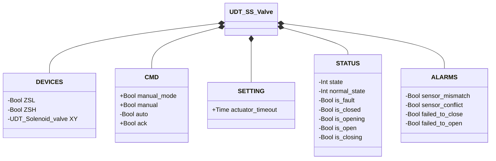
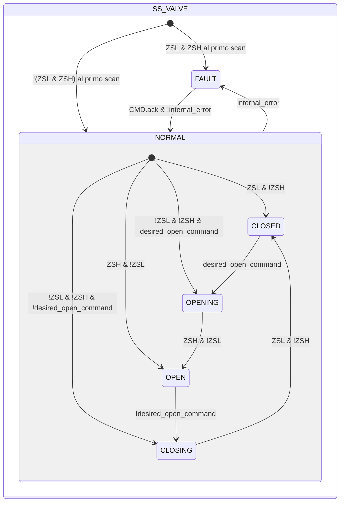

# Valvola a Farfalla — Singolo Solenoide (SS)

## Panoramica

**Livello 2.** `SS_valve` gestisce una valvola a farfalla pneumatica con singolo solenoide (`XY`, monostabile) e retroazione di posizione a doppio finecorsa (`ZSL` chiuso, `ZSH` aperto).

---

## Interfaccia

### Composizione

| Tag | Tipo | Ruolo |
|-----|------|-------|
| `XY` | Elettrovalvola (Livello 1) | Attuatore — eccitato durante l'apertura e mantenuto eccitato in OPEN contro la molla |

Arbitraggio manuale/automatico secondo lo schema comune — vedere [Libreria — Panoramica](../../../index.md).

### Struttura dati



`+` = scrivibile da DCS/HMI, `-` = sola lettura.

### Segnali di controllo

| Segnale | Tipo | Direzione | Descrizione |
|---------|------|-----------|-------------|
| `DEVICES.ZSL` | Bool | IN | Finecorsa posizione chiusa |
| `DEVICES.ZSH` | Bool | IN | Finecorsa posizione aperta |
| `DEVICES.XY` | UDT_Solenoid_valve | OUT | Elettrovalvola attuatore — comandata, il proprio stato non viene riletto da questo blocco |
| `CMD.manual_mode` | Bool | IN | TRUE = modalità manuale HMI |
| `CMD.manual` | Bool | IN | Comando di apertura in modalità manuale |
| `CMD.auto` | Bool | IN | Comando di apertura in modalità automatica |
| `CMD.ack` | Bool | IN | Conferma allarmi e ripristino da FAULT |

### Parametri

| Parametro | Default | Descrizione |
|-----------|---------|-------------|
| `SETTING.actuator_timeout` | T#2s | Vedi la convenzione in [Valvole — Panoramica](../../index.md) |

---

## Comportamento

### Funzionamento

L'attuatore è monostabile: l'eccitazione di `XY` lo spinge verso l'apertura, mentre la molla riporta il disco nell'unica posizione di riposo (chiuso) non appena `XY` si diseccita.

Al primo ciclo PLC, il blocco legge `ZSL` e `ZSH` per determinare lo stato iniziale: `ZSL AND NOT ZSH` → NORMAL/CLOSED, `ZSH AND NOT ZSL` → NORMAL/OPEN, nessuno dei due attivo (valvola a metà corsa) → NORMAL/OPENING o NORMAL/CLOSING secondo `desired_open_command`, `ZSL AND ZSH` → FAULT (condizione ambigua).

Il comando desiderato è risolto ad ogni scan, stesso schema di [Elettrovalvola](../../solenoid/index.md):

```
desired_open_command := manual_mode ? manual : auto
```

### Allarmi

- [`XV-E01`](../../index.md#allarmi-delle-valvole) — stato stabile corrente non confermato dal finecorsa atteso (`CLOSED` ma `!ZSL`, o `OPEN` ma `!ZSH`)
- [`XV-E02`](../../index.md#allarmi-delle-valvole) — `ZSL AND ZSH` contemporaneamente TRUE
- [`XV-E03`](../../index.md#allarmi-delle-valvole) — `CLOSING` non completato entro `actuator_timeout`
- [`XV-E04`](../../index.md#allarmi-delle-valvole) — `OPENING` non completato entro `actuator_timeout`

### Diagramma di stato



```Pascal
internal_error := ALARMS.sensor_mismatch OR ALARMS.sensor_conflict OR ALARMS.failed_to_close OR ALARMS.failed_to_open;
```

| Stato | `XY` | Descrizione |
|-------|------|-------------|
| CLOSED | FALSE | Disco chiuso; molla in posizione |
| OPENING | TRUE | Attuatore spinge il disco verso apertura |
| OPEN | TRUE | Disco aperto; l'elettrovalvola mantiene contro la molla |
| CLOSING | FALSE | Molla riporta il disco in chiusura |
| FAULT | FALSE | Guasto; attende `ack` con sensori validi |

| Stato | Valore Int |
|---|---|
| NORMAL.CLOSED | 1 |
| NORMAL.OPENING | 2 |
| NORMAL.OPEN | 3 |
| NORMAL.CLOSING | 4 |
| FAULT | 0 |

### Timer

| Timer | Stato in cui è attivo | Soglia (parametro) |
|-------|------------------------|---------------------|
| `movement_timer` | `OPENING` o `CLOSING` (in `NORMAL`) | `SETTING.actuator_timeout` |
