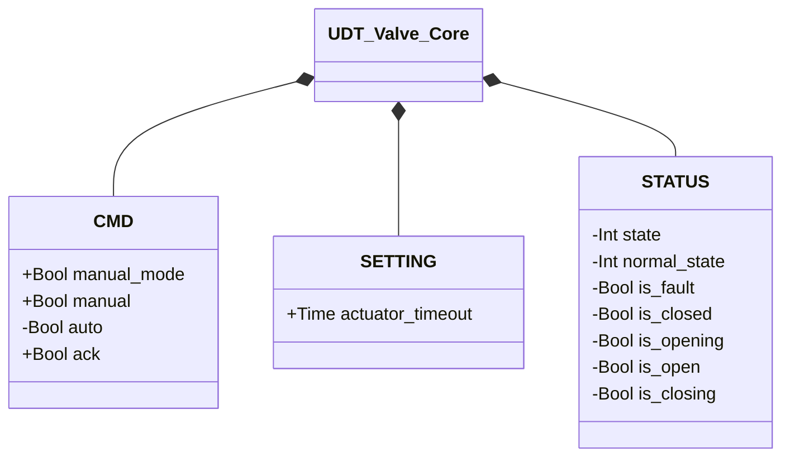

# Valvole

Valvole controllate pneumaticamente per isolamento, attuazione e controllo di processo.

Il parametro `SETTING.actuator_timeout` (default `T#2s`, tempo massimo consentito per completare una manovra di apertura o chiusura) è lo stesso, con lo stesso significato, su ogni valvola dotata di un proprio `movement_timer` — Manicotto, Farfalla SS, Farfalla DS. I moduli che ne incorporano una (Sigillata, Deviatore a Manicotto, Propulsore) non possiedono un `actuator_timeout` proprio: inoltrano il valore ricevuto all'istanza interna ad ogni scan.

## Core

`UDT_Valve_Core` raccoglie il contratto `CMD`/`STATUS`/`SETTING` comune a tutta la famiglia
valvole, incorporato come campo `CORE` in tutte e quattro (Manicotto, Farfalla SS, Farfalla
DS, Sigillata) — identico campo per campo. `DEVICES` e `ALARMS` restano fuori da `CORE`: sono
il punto in cui la famiglia diverge (sensori diversi tra Manicotto e Farfalla, allarmi
assenti sulla Sigillata).

`+` = scrivibile da DCS/HMI, `-` = sola lettura. Un campo `CORE` tipizzato genericamente
permette a un orchestratore di comporre una valvola qualsiasi di questa famiglia senza
sapere in anticipo quale — è il meccanismo di dependency injection usato da [Valvola
Sigillata](sealed/index.md) per avvolgere qualunque valvola iniettata nel proprio parametro
`XV`, e lo stesso schema (`UDT_Filter_Core`) usato dai filtri — vedi [Filtri —
Panoramica](../filters/index.md#core).

## Allarmi delle valvole

Condivisi da tutte le voci di questa categoria che dispongono di retroazione di posizione.

| ID | Titolo | Condizione | Applicabile a |
|----|--------|------------|----------------|
| `XV-E01` | Disallineamento sensore | Lo stato stabile corrente (CLOSED/OPEN) non è confermato dal sensore di posizione atteso | Manicotto, Farfalla SS, Farfalla DS |
| `XV-E02` | Conflitto sensori | Entrambi i finecorsa di posizione risultano TRUE contemporaneamente | Farfalla SS, Farfalla DS |
| `XV-E03` | Mancata chiusura | Movimento di chiusura non confermato entro `actuator_timeout` | Manicotto, Farfalla SS, Farfalla DS |
| `XV-E04` | Mancata apertura | Movimento di apertura non confermato entro `actuator_timeout` | Manicotto, Farfalla SS, Farfalla DS |

Tutti e quattro concorrono a `internal_error`, variabile interna al blocco (non esposta tramite UDT) che determina la transizione a `FAULT`. La valvola a manicotto ha un solo sensore di posizione (`PSL`) e non può generare `XV-E02`.

## Moduli

| Modulo | Livello | Descrizione |
|--------|------|-------------|
| [Elettrovalvola](solenoid/index.md) | 1 | Attuatore atomico on/off; nessuna retroazione di posizione |
| [Valvola a Manicotto](pinch/index.md) | 2 | Comprime un tubo flessibile; un pressostato conferma la posizione chiusa |
| [Valvola a Farfalla — Singolo Solenoide (SS)](butterfly/single_solenoid/index.md) | 2 | Ritorno a molla in chiusura; retroazione di posizione via ZSL/ZSH |
| [Valvola a Farfalla — Doppio Solenoide (DS)](butterfly/double_solenoid/index.md) | 2 | Bistabile, doppio effetto; retroazione di posizione via ZSL/ZSH |
| [Valvola Sigillata](sealed/index.md) | 3 | Avvolge una valvola qualsiasi della famiglia (`CORE`) con un'elettrovalvola di tenuta dedicata |
