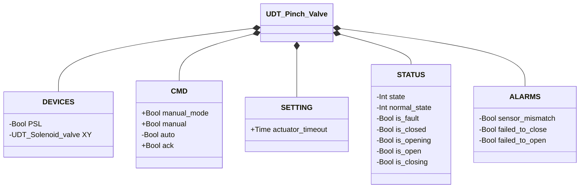
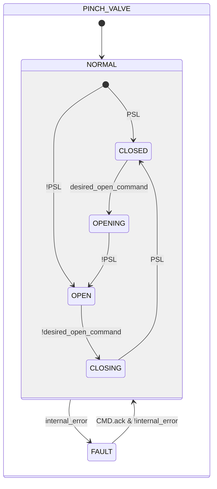

# Valvola a Manicotto

## Panoramica

**Livello 2.** La valvola a manicotto controlla il flusso comprimendo meccanicamente un tubo flessibile, tramite un'elettrovalvola interna (`XY`) come attuatore e un pressostato (`PSL`) come unico sensore di posizione.

---

## Interfaccia

### Composizione

| Tag | Tipo | Ruolo |
|-----|------|-------|
| `XY` | Elettrovalvola (Livello 1) | Attuatore — eccitato = chiuso |

L'arbitraggio manuale/automatico (`manual_mode`/`manual`/`auto`) segue lo schema comune descritto in [Libreria — Panoramica](../../index.md).

### Struttura dati



`+` = scrivibile da DCS/HMI, `-` = sola lettura.

### Segnali di controllo

| Segnale | Tipo | Direzione | Descrizione |
|---------|------|-----------|-------------|
| `DEVICES.PSL` | Bool | IN | Pressostato: TRUE = valvola chiusa (tubo schiacciato) |
| `DEVICES.XY` | UDT_Solenoid_valve | OUT | Elettrovalvola attuatore — comandata, il proprio stato non viene riletto da questo blocco |
| `CMD.manual_mode` | Bool | IN | TRUE = modalità manuale HMI |
| `CMD.manual` | Bool | IN | Comando di chiusura in modalità manuale |
| `CMD.auto` | Bool | IN | Comando di chiusura in modalità automatica |
| `CMD.ack` | Bool | IN | Conferma allarmi e ripristino da FAULT |

### Parametri

| Parametro | Default | Descrizione |
|-----------|---------|-------------|
| `SETTING.actuator_timeout` | T#2s | Vedi la convenzione in [Valvole — Panoramica](../index.md) |

---

## Comportamento

### Funzionamento

L'eccitazione di `XY` aziona l'attuatore pneumatico che schiaccia il tubo chiudendolo; la diseccitazione rilascia il tubo ripristinando il flusso. La valvola è normalmente aperta: richiede eccitazione attiva per rimanere chiusa. `PSL` conferma la posizione chiusa.

Il comando desiderato è risolto ad ogni scan, stesso schema di [Elettrovalvola](../solenoid/index.md):

```
desired_open_command := manual_mode ? manual : auto
```

La valvola a manicotto risolve l'arbitraggio manuale/automatico al proprio livello ed espone solo il comando già risolto a `XY.CMD.auto` — l'elettrovalvola interna non arbitra in autonomia.

Al rientro da `FAULT`, il blocco rilegge `PSL` per determinare lo stato stabile (`CLOSED` se TRUE, altrimenti `OPEN`) — stesso meccanismo del primo scan.

In `FAULT`, `XY` viene deliberatamente diseccitata (tubo aperto), indipendentemente da come era comandata prima del guasto: lasciare il tubo schiacciato a tempo indefinito ne accelererebbe l'usura del materiale.

### Allarmi

- [`XV-E01`](../index.md#allarmi-delle-valvole) — stato stabile corrente (`CLOSED`/`OPEN`) non confermato da `PSL`
- [`XV-E03`](../index.md#allarmi-delle-valvole) — `CLOSING` non completato entro `actuator_timeout`
- [`XV-E04`](../index.md#allarmi-delle-valvole) — `OPENING` non completato entro `actuator_timeout`
- Non applicabile: `XV-E02` (conflitto sensori) — la valvola a manicotto ha un solo sensore di posizione

### Diagramma di stato



```Pascal
internal_error := ALARMS.sensor_mismatch OR ALARMS.failed_to_close OR ALARMS.failed_to_open;
```

| Stato | `XY` | Descrizione |
|-------|------|-------------|
| CLOSED | TRUE | Tubo schiacciato, flusso bloccato |
| OPENING | FALSE | Attuatore rilascia il tubo |
| OPEN | FALSE | Tubo libero, flusso consentito |
| CLOSING | TRUE | Attuatore schiaccia il tubo |
| FAULT | FALSE | `XY` deliberatamente diseccitata (tubo aperto) — evita di lasciare il tubo schiacciato durante il guasto, prevenendo l'usura del materiale; richiede conferma operatore |

| Stato | Valore Int |
|---|---|
| NORMAL.CLOSED | 1 |
| NORMAL.OPENING | 2 |
| NORMAL.OPEN | 3 |
| NORMAL.CLOSING | 4 |
| FAULT | 0 |

### Timer

| Timer | Stato in cui è attivo | Soglia (parametro) |
|-------|------------------------|---------------------|
| `movement_timer` | `OPENING` o `CLOSING` (in `NORMAL`) | `SETTING.actuator_timeout` |
