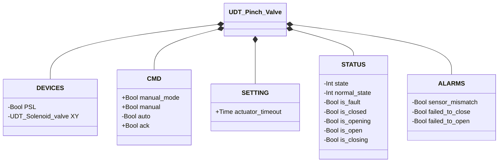
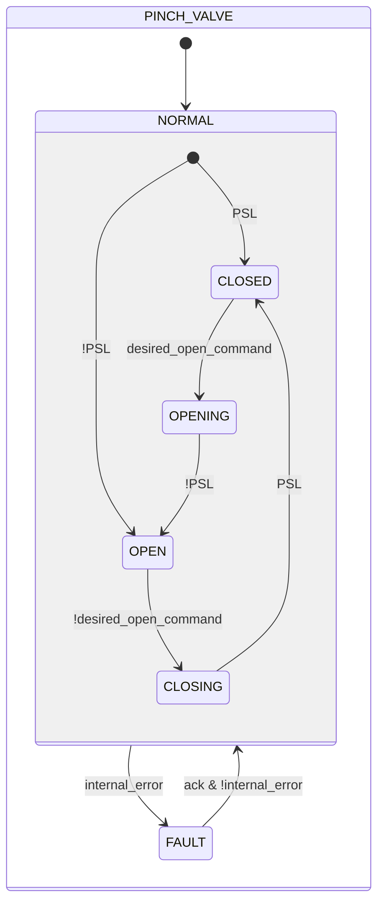

# Valvola a Manicotto

## Panoramica

**Livello 2.** La valvola a manicotto controlla il flusso comprimendo meccanicamente un tubo flessibile. L'eccitazione dell'elettrovalvola interna (`XY`) aziona l'attuatore pneumatico che schiaccia il tubo chiudendolo; la diseccitazione rilascia il tubo ripristinando il flusso. Un pressostato (`PSL`) conferma la posizione chiusa — è l'unico sensore di posizione del dispositivo. La valvola è normalmente aperta: richiede eccitazione attiva per rimanere chiusa.

---

## Composizione

| Tag | Tipo | Ruolo |
|-----|------|-------|
| `XY` | Elettrovalvola (Livello 1) | Attuatore — eccitato = chiuso |

L'arbitraggio manuale/automatico (`manual_mode`/`manual`/`auto`) segue lo stesso schema descritto in [Elettrovalvola](../solenoid/index.md).

---

## Struttura dati



`+` = scrivibile da DCS/HMI, `-` = sola lettura (`ReadOnly := External` nel sorgente).

---

## Segnali di controllo

| Segnale | Tipo | Direzione | Descrizione |
|---------|------|-----------|-------------|
| `DEVICES.PSL` | Bool | IN | Pressostato: TRUE = valvola chiusa (tubo schiacciato) |
| `DEVICES.XY` | UDT_Solenoid_valve | OUT | Elettrovalvola attuatore — comandata, il proprio stato non viene riletto da questo blocco |
| `CMD.manual_mode` | Bool | IN | TRUE = modalità manuale HMI |
| `CMD.manual` | Bool | IN | Comando di chiusura in modalità manuale |
| `CMD.auto` | Bool | IN | Comando di chiusura dall'automazione |
| `CMD.ack` | Bool | IN | Conferma allarmi e ripristino da FAULT |

---

## Parametri

| Parametro | Default | Descrizione |
|-----------|---------|-------------|
| `SETTING.actuator_timeout` | T#2s | Tempo massimo consentito per completare una manovra di apertura o chiusura |

---

## Funzionamento

Il comando desiderato è risolto ad ogni scan, stesso schema di [Elettrovalvola](../solenoid/index.md):

```
desired_open_command := manual_mode ? manual : auto
```

La valvola a manicotto risolve l'arbitraggio manuale/automatico al proprio livello ed espone solo il comando già risolto a `XY.CMD.auto` — l'elettrovalvola interna non arbitra in autonomia.

Al rientro da `FAULT`, il blocco rilegge `PSL` per determinare lo stato stabile (`CLOSED` se TRUE, altrimenti `OPEN`) — stesso meccanismo del primo scan.

[`XV-E01`](../index.md#allarmi-delle-valvole) scatta quando lo stato stabile corrente (`CLOSED`/`OPEN`) non è confermato da `PSL`; [`XV-E03`](../index.md#allarmi-delle-valvole)/[`XV-E04`](../index.md#allarmi-delle-valvole) scattano se `CLOSING`/`OPENING` non si completano entro `actuator_timeout`. Non applicabile: `XV-E02` (conflitto sensori) — la valvola a manicotto ha un solo sensore di posizione.

---

## Macchina a stati



```Pascal
internal_error := sensor_mismatch OR failed_to_close OR failed_to_open;
```

| Stato | `XY` | Descrizione |
|-------|------|-------------|
| CLOSED | TRUE | Tubo schiacciato, flusso bloccato |
| OPENING | FALSE | Attuatore rilascia il tubo |
| OPEN | FALSE | Tubo libero, flusso consentito |
| CLOSING | TRUE | Attuatore schiaccia il tubo |
| FAULT | — | Uscite congelate; richiede conferma operatore |
