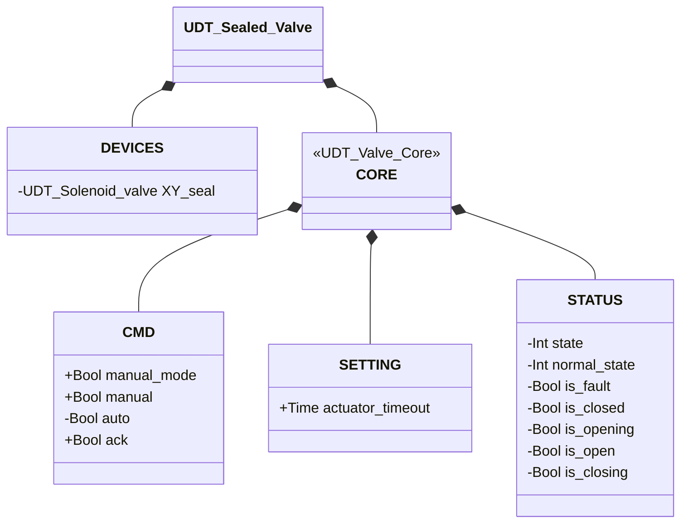

# Valvola Sigillata

## Panoramica

**Livello 3 — composito.** `Sealed_valve` avvolge una valvola qualsiasi della famiglia — iniettata tramite un parametro `XV` tipizzato genericamente `UDT_Valve_Core` — aggiungendo un'elettrovalvola di tenuta dedicata (`XY_seal`, Livello 1). Il sigillo viene eccitato automaticamente quando la valvola interna è confermata `CLOSED`, garantendo tenuta pneumatica in stato di riposo; si diseccita non appena la valvola inizia ad aprirsi.

Il composition root istanzia la valvola concreta (Manicotto, Farfalla SS, Farfalla DS...) e ne inietta il solo `CORE` nel parametro `XV` — vedere [Valvole — Panoramica](../index.md#core) per il razionale. `Sealed_valve` delega interamente la logica di apertura/chiusura, il rilevamento allarmi e la macchina a stati alla valvola iniettata; non possiede una propria macchina a stati né un proprio `ALARMS` — la propria `CORE.STATUS` è una copia diretta di `XV.STATUS` ad ogni scan.

---

## Interfaccia

### Composizione

| Tag | Tipo | Direzione | Ruolo |
|-----|------|-----------|-------|
| `XV` (parametro iniettato) | `UDT_Valve_Core` | IN/OUT | Contratto CMD/STATUS/SETTING della valvola interna — quale valvola concreta lo riempie è deciso da chi compone questo blocco, non da `Sealed_valve` stessa |
| `sealed_XV.DEVICES.XY_seal` | Elettrovalvola (Livello 1) | OUT | Elettrovalvola di tenuta — eccitata ↔ valvola interna in `CLOSED` |

`XV` è IN/OUT: il blocco scrive `XV.CMD.ack`/`CMD.auto`/`SETTING.actuator_timeout` e rilegge `XV.STATUS` a specchio in `sealed_XV.CORE.STATUS`. `XY_seal` è OUT-only: comandata da `XV.STATUS.is_closed`, il proprio stato non viene mai riletto.

### Struttura dati



`+` = scrivibile da DCS/HMI, `-` = sola lettura. Nessuna classe `ALARMS` — questo UDT non ne ha una propria: gli allarmi restano leggibili solo sulla valvola iniettata (la sua `ALARMS` concreta dipende da quale valvola riempie `XV`). Il parametro `XV : UDT_Valve_Core` iniettato dal composition root **non è un campo di `UDT_Sealed_Valve`** — è un secondo parametro `VAR_IN_OUT`, a fianco di `sealed_XV`, nella firma di `Sealed_valve`.

### Segnali di controllo

| Segnale | Tipo | Direzione | Descrizione |
|---------|------|-----------|-------------|
| `XV` (iniettato) | UDT_Valve_Core | IN/OUT | Valvola interna — CMD scritto, STATUS riletto |
| `sealed_XV.DEVICES.XY_seal` | UDT_Solenoid_valve | OUT | Elettrovalvola di tenuta |
| `sealed_XV.CORE.CMD.manual_mode` | Bool | IN | TRUE = modalità manuale HMI |
| `sealed_XV.CORE.CMD.manual` | Bool | IN | Comando di apertura in modalità manuale |
| `sealed_XV.CORE.CMD.auto` | Bool | IN | Comando di apertura in modalità automatica |
| `sealed_XV.CORE.CMD.ack` | Bool | IN | Conferma allarmi — inoltrato a `XV.CMD.ack` |

### Parametri

| Parametro | Default | Descrizione |
|-----------|---------|-------------|
| `sealed_XV.CORE.SETTING.actuator_timeout` | T#2s | Inoltrato a `XV.SETTING.actuator_timeout` ad ogni scan |

---

## Comportamento

### Funzionamento

Il comando desiderato è risolto da questo blocco e scritto in `XV.CMD.auto`:

```
XV.CMD.auto := sealed_XV.CORE.CMD.manual_mode ? sealed_XV.CORE.CMD.manual : sealed_XV.CORE.CMD.auto
```

Il sigillo segue una singola regola:

```
sealed_XV.DEVICES.XY_seal.CMD.auto := XV.STATUS.is_closed
```

### Allarmi

Nessun allarme proprio — questo blocco non possiede un proprio `ALARMS`. Gli allarmi restano visibili esclusivamente tramite la valvola iniettata: vedere [Allarmi delle valvole](../index.md#allarmi-delle-valvole).

### Diagramma di stato

La macchina a stati è interamente gestita dalla valvola iniettata tramite `XV` — quale pagina consultare dipende da quale valvola concreta la riempie (es. [Valvola a Farfalla SS](../butterfly/single_solenoid/index.md#diagramma-di-stato)). Questo blocco aggiunge solo la logica del sigillo, senza stati propri.

| Stato (da `XV`) | `XY_seal` |
|------------------|-----------|
| CLOSED | TRUE (sigillato) |
| OPENING / OPEN / CLOSING | FALSE |
| FAULT | FALSE |
