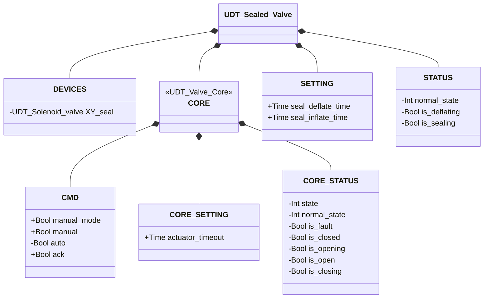
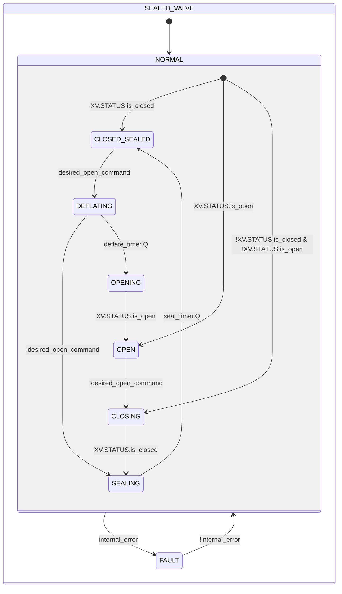

# Valvola Sigillata

## Panoramica

**Livello 3 — composito.** `Sealed_valve` compone una valvola qualsiasi della famiglia — iniettata tramite un parametro `XV` tipizzato genericamente `UDT_Valve_Core`, Livello 2 — con un'elettrovalvola di tenuta dedicata (`XY_seal`, Livello 1) sotto una propria macchina a stati di sequenziamento deflate/seal. Il sigillo si diseccita e attende (`DEFLATING`) prima che la valvola interna riceva il comando di apertura, e si reinflate e attende (`SEALING`) dopo che la valvola interna conferma la chiusura, prima di considerare l'insieme nuovamente sigillato — un interlock a due tempi, non una regola combinatoria istantanea.

Il composition root istanzia la valvola concreta (Manicotto, Farfalla SS, Farfalla DS...) e ne inietta il solo `CORE` nel parametro `XV` — vedere [Valvole — Panoramica](../index.md#core) per il razionale. La propria `CORE.STATUS` **non** è una copia di `XV.STATUS`: è una proiezione sul contratto a 4 fasi condiviso dalla famiglia valvole, dove `DEFLATING` confluisce in `is_opening` e `SEALING` in `is_closing` — vedere Funzionamento per il perché. `Sealed_valve` non possiede un proprio `ALARMS`: `UDT_Valve_Core` non ne incorpora uno di proposito, quindi l'unica sorgente di guasto possibile resta `XV.STATUS.is_fault` — vedere [Allarmi delle valvole](../index.md#allarmi-delle-valvole) per la sorgente effettiva, che dipende da quale valvola concreta riempie `XV`.

---

## Interfaccia

### Composizione

| Tag | Tipo | Direzione | Ruolo |
|-----|------|-----------|-------|
| `XV` (parametro iniettato) | `UDT_Valve_Core` | IN/OUT | Contratto CMD/STATUS/SETTING della valvola interna — quale valvola concreta lo riempie è deciso da chi compone questo blocco, non da `Sealed_valve` stessa |
| `sealed_XV.DEVICES.XY_seal` | Elettrovalvola (Livello 1) | OUT | Elettrovalvola di tenuta — comandata dalla propria macchina a stati (`CLOSED_SEALED`/`SEALING` → eccitata), non da una singola regola combinatoria |

`XV` è IN/OUT: il blocco scrive `XV.CMD.ack`/`CMD.auto`/`SETTING.actuator_timeout` e rilegge `XV.STATUS` per derivarne la propria macchina a stati e la proiezione `CORE.STATUS`. `XY_seal` è OUT-only: comandata dallo stato corrente, il proprio stato non viene mai riletto.

### Struttura dati



`+` = scrivibile da DCS/HMI, `-` = sola lettura. `CORE_SETTING`/`CORE_STATUS` sono le classi annidate sotto `CORE` (il `SETTING`/`STATUS` di `UDT_Valve_Core`, quello della valvola iniettata); `SETTING`/`STATUS` senza prefisso sono i campi propri di `UDT_Sealed_Valve` per il proprio interlock deflate/seal — `UDT_Sealed_Valve` è il primo UDT della libreria con due contratti CMD/STATUS/SETTING distinti (proprio + `CORE`), da cui la doppia nomenclatura. Il parametro `XV : UDT_Valve_Core` iniettato dal composition root **non è un campo di `UDT_Sealed_Valve`** — è un secondo parametro `VAR_IN_OUT`, a fianco di `sealed_XV`, nella firma di `Sealed_valve`.

### Segnali di controllo

| Segnale | Tipo | Direzione | Descrizione |
|---------|------|-----------|-------------|
| `XV` (iniettato) | UDT_Valve_Core | IN/OUT | Valvola interna — CMD scritto, STATUS riletto |
| `sealed_XV.DEVICES.XY_seal` | UDT_Solenoid_valve | OUT | Elettrovalvola di tenuta |
| `sealed_XV.CORE.CMD.manual_mode` | Bool | IN | TRUE = modalità manuale HMI |
| `sealed_XV.CORE.CMD.manual` | Bool | IN | Comando di apertura in modalità manuale |
| `sealed_XV.CORE.CMD.auto` | Bool | IN | Comando di apertura in modalità automatica |
| `sealed_XV.CORE.CMD.ack` | Bool | IN | Conferma allarmi — inoltrato a `XV.CMD.ack` |

### Parametri

| Parametro | Default | Descrizione |
|-----------|---------|-------------|
| `sealed_XV.CORE.SETTING.actuator_timeout` | T#2s | Inoltrato a `XV.SETTING.actuator_timeout` ad ogni scan |
| `sealed_XV.SETTING.seal_deflate_time` | T#2s | Durata dell'attesa in `DEFLATING` prima di comandare l'apertura della valvola interna |
| `sealed_XV.SETTING.seal_inflate_time` | T#2s | Durata dell'attesa in `SEALING` prima di considerare l'insieme nuovamente sigillato |

---

## Comportamento

### Funzionamento

Il sigillo non ha un proprio sensore di conferma — non c'è alcun feedback fisico che indichi che si è effettivamente ritirato o gonfiato. `DEFLATING` e `SEALING` esistono proprio per questo: sono attese sensorless, temporizzate a parametro (`seal_deflate_time`/`seal_inflate_time`), usate come unica conferma disponibile prima di fidarsi che sia sicuro muovere la valvola interna o considerare l'insieme di nuovo a tenuta. L'interlock è quello che impedisce alla valvola di aprirsi mentre il sigillo è ancora inflated: `XV.CMD.auto` diventa TRUE solo in `OPENING`, mai in `DEFLATING`, quindi la valvola interna resta ferma per l'intera durata dell'attesa.

Se il comando di apertura viene ritirato mentre si è ancora in `DEFLATING`, il blocco torna direttamente in `SEALING` invece di completare un ciclo apertura/chiusura completo e inutile — il sigillo non si è mai effettivamente ritirato abbastanza a lungo da richiedere un nuovo deflate.

`sealed_XV.CORE.STATUS` non è una copia di `XV.STATUS`, ma una proiezione sul contratto a 4 fasi condiviso dalla famiglia valvole: `DEFLATING` confluisce in `CORE.STATUS.is_opening` e `SEALING` in `CORE.STATUS.is_closing`, quindi `CORE.STATUS.is_closed` risulta TRUE solo quando il disco è chiuso **e** il sigillo ha finito di gonfiarsi. `UDT_Sealed_Valve.CORE` è a sua volta iniettabile (es. un futuro slot di Propulsore): una copia diretta lascerebbe che un consumatore a valle veda `is_closed` mentre il sigillo è ancora a metà del proprio ciclo di inflate, un falso positivo che la proiezione evita per costruzione.

In `FAULT`, `XY_seal.CMD.auto` segue direttamente `XV.STATUS.is_closed` invece di essere forzato incondizionatamente a TRUE — gonfiare il sigillo contro un disco parzialmente aperto di una valvola iniettata di tipo sconosciuto potrebbe estruderlo o danneggiarlo. `XV.CMD.auto` resta FALSE per tutta la durata di `FAULT`, quindi una valvola recuperabile deriva verso la chiusura da sola e si risigilla non appena la raggiunge. Il recupero da `FAULT` non richiede `CMD.ack`, a differenza di ogni altra macchina a stati valvola/deviatore di questa libreria — questo blocco non ha un proprio latch: `CORE.CMD.ack` viene inoltrato a `XV` ad ogni scan e la valvola iniettata possiede il latch effettivo, quindi qui il recupero segue esclusivamente l'azzeramento di `XV.STATUS.is_fault`.

Non esiste una guardia "ambigua al primo scan" come nelle altre macchine a stati valvola di questa libreria: la valvola iniettata viene chiamata dal composition root prima di `Sealed_valve`, quindi `XV.STATUS.is_closed`/`is_open` sono già risolti in modo affidabile quando questo blocco li legge, anche al primo scan.

### Allarmi

Nessun allarme proprio — `UDT_Valve_Core` non incorpora un proprio `ALARMS` di proposito, quindi l'unica sorgente di guasto possibile per `internal_error` è `XV.STATUS.is_fault`. Gli allarmi restano visibili esclusivamente tramite la valvola iniettata: vedere [Allarmi delle valvole](../index.md#allarmi-delle-valvole).

### Diagramma di stato



```Pascal
internal_error := XV.STATUS.is_fault;
```

| Stato | `XV` | `XY_seal` | Descrizione |
|-------|------|-----------|-------------|
| NORMAL.CLOSED_SEALED | closed | TRUE | Valvola chiusa e sigillo eccitato — stato di riposo, completamente sigillato |
| NORMAL.DEFLATING | closed | FALSE | Sigillo diseccitato, in attesa di `seal_deflate_time` prima che la valvola venga comandata in apertura |
| NORMAL.OPENING | open | FALSE | Valvola comandata in apertura |
| NORMAL.OPEN | open | FALSE | Valvola aperta, sigillo non necessario |
| NORMAL.CLOSING | closed | FALSE | Valvola comandata in chiusura, sigillo non ancora eccitato |
| NORMAL.SEALING | closed | TRUE | Valvola confermata chiusa, sigillo eccitato e in attesa di `seal_inflate_time` prima di considerare l'insieme nuovamente sigillato |
| FAULT | — | segue `XV.STATUS.is_closed` | Guasto; il sigillo non ha un valore fisso — vedi Funzionamento |

| Stato | Valore Int |
|---|---|
| NORMAL | 1 |
| NORMAL.CLOSED_SEALED | 1 |
| NORMAL.DEFLATING | 2 |
| NORMAL.OPENING | 3 |
| NORMAL.OPEN | 4 |
| NORMAL.CLOSING | 5 |
| NORMAL.SEALING | 6 |
| FAULT | 0 |

`CORE.STATUS.normal_state` proietta i sei stati propri sul contratto condiviso a 4 fasi della famiglia valvole:

| CORE.STATUS.normal_state | Valore Int | Deriva da |
|---|---|---|
| CORE_CLOSED | 1 | CLOSED_SEALED |
| CORE_OPENING | 2 | DEFLATING, OPENING |
| CORE_OPEN | 3 | OPEN |
| CORE_CLOSING | 4 | CLOSING, SEALING |

### Timer

| Timer | Stato in cui è attivo | Soglia (parametro) |
|-------|------------------------|---------------------|
| `deflate_timer` | NORMAL.DEFLATING | `SETTING.seal_deflate_time` |
| `seal_timer` | NORMAL.SEALING | `SETTING.seal_inflate_time` |
