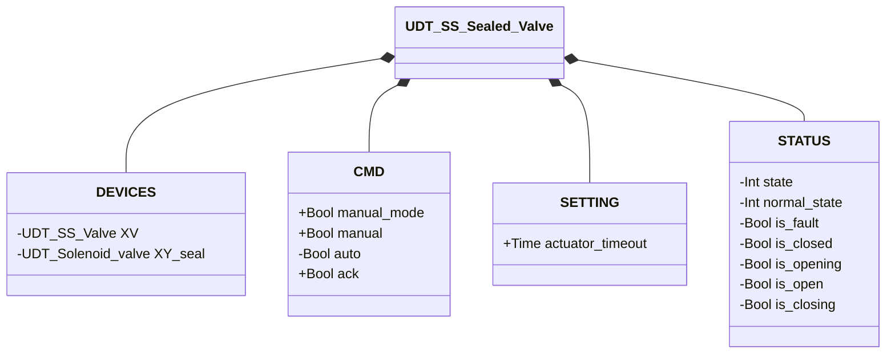

# Valvola Sigillata — Singolo Solenoide (SS Sealed)

## Panoramica

**Livello 3 — composito.** `SS_Sealed_valve` avvolge un'istanza di Valvola a Farfalla SS (Livello 2, monostabile — vedere [Valvola a Farfalla SS](../../butterfly/single_solenoid/index.md)) aggiungendo un'elettrovalvola di sigillo dedicata (`XY_seal`, Livello 1). Il sigillo viene eccitato automaticamente quando la valvola interna è confermata `CLOSED`, garantendo tenuta pneumatica in stato di riposo; si diseccita non appena la valvola inizia ad aprirsi.

Il blocco delega interamente la logica di apertura/chiusura, il rilevamento allarmi e la macchina a stati all'istanza interna `XV`; non possiede una propria macchina a stati né un proprio `ALARMS` — `STATUS` è una copia diretta di `XV.STATUS` ad ogni scan.

---

## Interfaccia

### Composizione

| Tag | Tipo | Direzione | Ruolo |
|-----|------|-----------|-------|
| `XV` | Valvola a Farfalla SS (Livello 2) | IN/OUT | Valvola principale — vedere [Valvola a Farfalla SS](../../butterfly/single_solenoid/index.md) |
| `XY_seal` | Elettrovalvola (Livello 1) | OUT | Elettrovalvola di tenuta — eccitata ↔ `XV` in `CLOSED` |

`XV` è IN/OUT: il blocco esterno scrive `XV.CMD.ack`/`CMD.auto`/`SETTING.actuator_timeout` e rilegge `XV.STATUS` a specchio. `XY_seal` è OUT-only: comandata da `XV.STATUS.is_closed`, il proprio stato non viene mai riletto.

### Struttura dati



`+` = scrivibile da DCS/HMI, `-` = sola lettura (`ReadOnly := External` nel sorgente). Nessuna classe `ALARMS` — a differenza di altri dispositivi compositi, questo UDT non ne ha nemmeno una a specchio: gli allarmi restano leggibili solo su `DEVICES.XV.ALARMS`.

### Segnali di controllo

| Segnale | Tipo | Direzione | Descrizione |
|---------|------|-----------|-------------|
| `DEVICES.XV` | UDT_SS_Valve | IN/OUT | Valvola a farfalla SS interna |
| `DEVICES.XY_seal` | UDT_Solenoid_valve | OUT | Elettrovalvola di sigillo |
| `CMD.manual_mode` | Bool | IN | TRUE = modalità manuale HMI |
| `CMD.manual` | Bool | IN | Comando di apertura in modalità manuale |
| `CMD.auto` | Bool | IN | Comando di apertura in modalità automatica |
| `CMD.ack` | Bool | IN | Conferma allarmi — inoltrato a `XV.CMD.ack` |

### Parametri

| Parametro | Default | Descrizione |
|-----------|---------|-------------|
| `SETTING.actuator_timeout` | T#2s | Inoltrato a `XV.SETTING.actuator_timeout` ad ogni scan |

---

## Comportamento

### Funzionamento

Il comando desiderato è risolto dal blocco esterno e scritto in `XV.CMD.auto`:

```
XV.CMD.auto := manual_mode ? manual : auto
```

Il sigillo segue una singola regola:

```
XY_seal.CMD.auto := XV.STATUS.is_closed
```

### Allarmi

Nessun allarme proprio — questo blocco non possiede un proprio `ALARMS`. Gli allarmi restano visibili esclusivamente tramite l'istanza interna `XV`: vedere [Allarmi delle valvole](../../index.md#allarmi-delle-valvole).

### Diagramma di stato

La macchina a stati è interamente gestita dall'istanza interna `XV` — vedere [Valvola a Farfalla SS](../../butterfly/single_solenoid/index.md#diagramma-di-stato). Questo blocco aggiunge solo la logica del sigillo, senza stati propri.

| Stato (da `XV`) | `XY_seal` |
|------------------|-----------|
| CLOSED | TRUE (sigillato) |
| OPENING / OPEN / CLOSING | FALSE |
| FAULT | FALSE |
