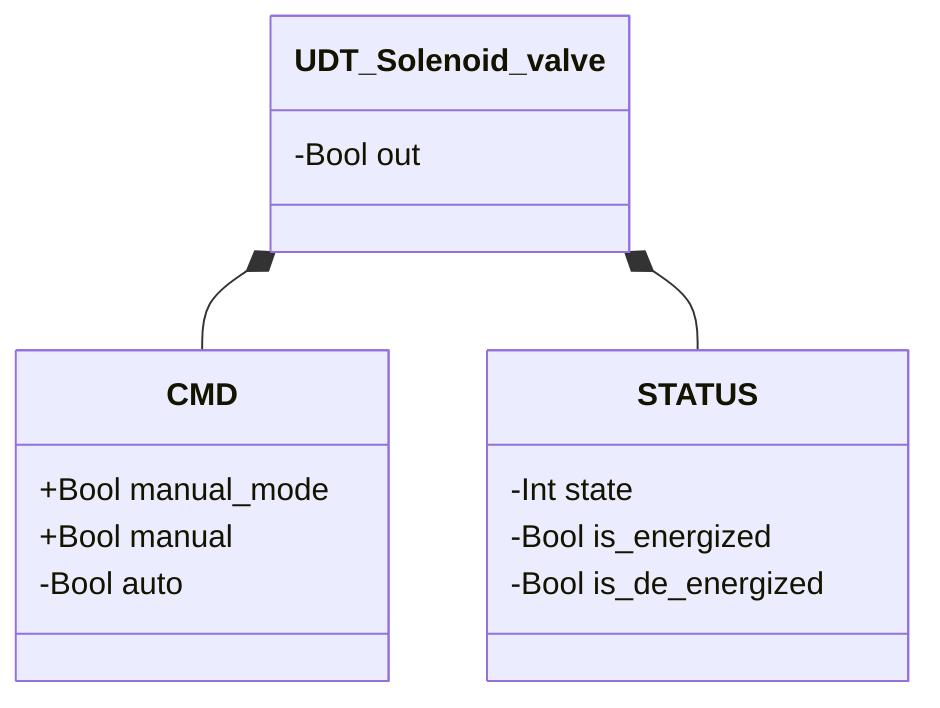
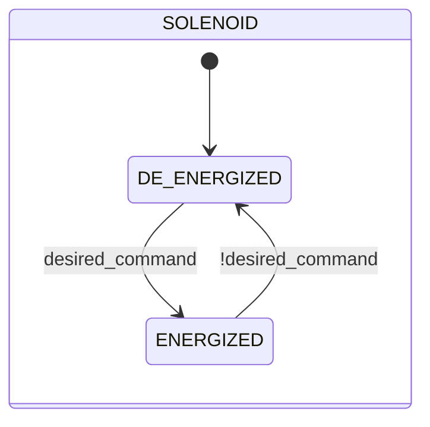

# Elettrovalvola

## Panoramica

**Livello 1 — atomico.** L'elettrovalvola è l'attuatore pneumatico di base della libreria: una bobina elettromagnetica eccita o diseccita una singola uscita fisica (`out`). Non ha feedback di posizione proprio — il proprio stato (`ENERGIZED`/`DE_ENERGIZED`) riflette solo il comando ricevuto, non una conferma fisica. È il componente più riutilizzato della libreria: ogni valvola di livello superiore (Manicotto, Farfalla SS/DS, Sigillata) ne incorpora una o più istanze come proprio attuatore.

Nessun parametro configurabile. Non genera allarmi propri — nessun sensore di posizione disponibile su cui basare una rilevazione di guasto.

---

## Struttura dati



`+` = scrivibile da DCS/HMI, `-` = sola lettura (`ReadOnly := External` nel sorgente).

---

## Segnali di controllo

| Segnale | Tipo | Direzione | Descrizione |
|---------|------|-----------|-------------|
| `CMD.manual_mode` | Bool | IN | TRUE = sorgente comando manuale invece che automatica |
| `CMD.manual` | Bool | IN | Comando di eccitazione in modalità manuale |
| `CMD.auto` | Bool | IN | Comando di eccitazione dall'automazione — scritto dal blocco chiamante, letto da questo blocco |
| `out` | Bool | OUT | Uscita fisica bobina: TRUE = eccitata |

---

## Funzionamento

Il comando desiderato è risolto ad ogni scan:

```
desired_command := manual_mode ? manual : auto
```

`out` segue `desired_command` senza ritardo — non c'è conferma fisica da attendere, quindi la transizione di stato è immediata.

---

## Macchina a stati



| Stato | `out` | Descrizione |
|-------|-------|-------------|
| `DE_ENERGIZED` | FALSE | Bobina diseccitata |
| `ENERGIZED` | TRUE | Bobina eccitata |
