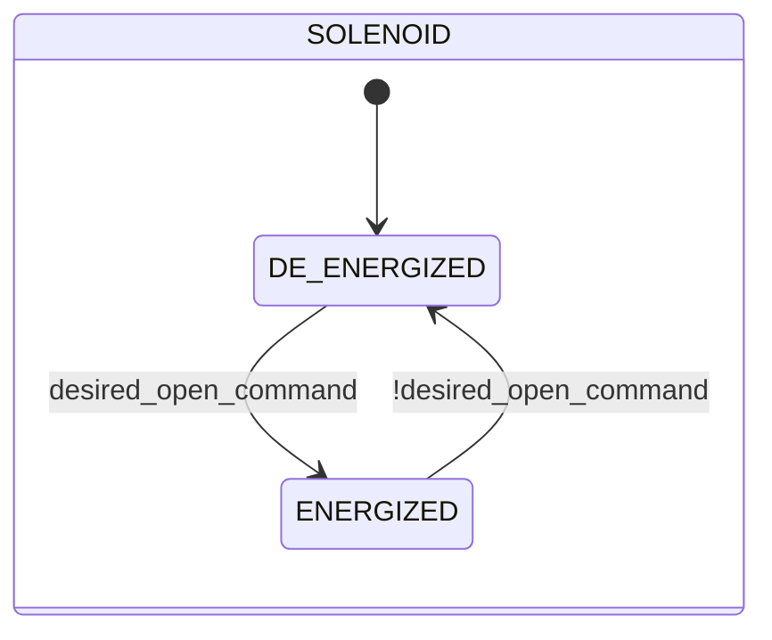

# Elettrovalvola

## Panoramica

**Livello 1 — atomico.** L'elettrovalvola è l'attuatore pneumatico di base della libreria: una bobina elettromagnetica eccita o diseccita una singola uscita fisica (`out`). Non ha feedback di posizione proprio — il proprio stato (`ENERGIZED`/`DE_ENERGIZED`) riflette solo il comando ricevuto, non una conferma fisica. È il componente più riutilizzato della libreria: ogni valvola di livello superiore (Manicotto, Farfalla SS/DS, Sigillata) ne incorpora una o più istanze come proprio attuatore.

L'arbitraggio `manual_mode`/`manual`/`auto` di questo blocco è lo schema canonico riutilizzato — con la stessa logica, anche se non sempre con lo stesso nome di campo — da ogni dispositivo di questa libreria che incorpora un'istanza di Elettrovalvola.

---

## Segnali di controllo

| Segnale | Tipo | Descrizione |
|---------|------|-------------|
| `CMD.manual_mode` | Bool | TRUE = sorgente comando manuale invece che automatica |
| `CMD.manual` | Bool | Comando di eccitazione in modalità manuale |
| `CMD.auto` | Bool | Comando di eccitazione dall'automazione (ReadOnly external) |
| `out` | Bool | Uscita fisica bobina: TRUE = eccitata |

```
desired_open_command := manual_mode ? manual : auto
```

---

## Parametri di regolazione

Nessun parametro configurabile.

---

## Stati e output

| Stato | Valore | `out` | Descrizione |
|-------|--------|-------|-------------|
| `DE_ENERGIZED` | 1 | FALSE | Bobina diseccitata |
| `ENERGIZED` | 3 | TRUE | Bobina eccitata |

---

## Diagramma di stato



---

## Allarmi

Questo modulo non genera allarmi propri — nessun sensore di posizione disponibile su cui basare una rilevazione di guasto.

---

## Struttura dati


