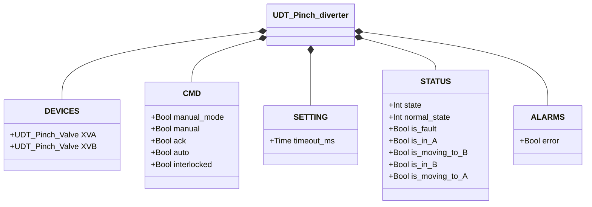
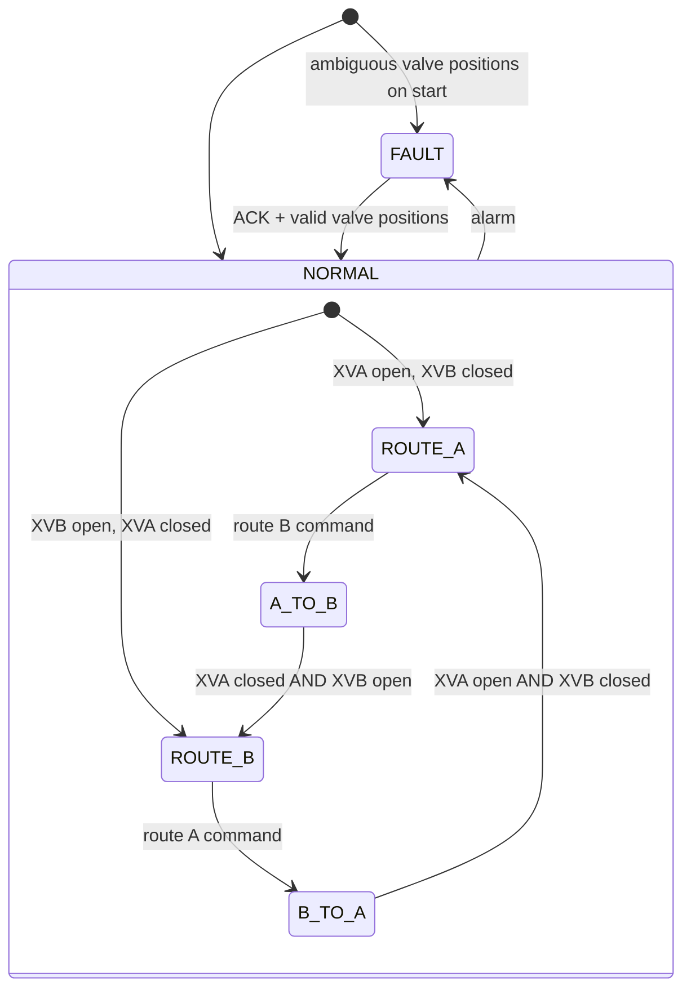

# Pinch Diverter

## Overview

The pinch diverter routes material flow between two lines (A and B) using two internally managed pinch valves (`XVA`, `XVB`). Only one line is open at a time. The command `TRUE` selects Route B; `FALSE` selects Route A. No direct physical sensors — routing state is derived from the sub-valve position feedback.

---

## Main Components

- **Two flexible tubes** — Line A and Line B flow paths
- **Two pinch valve sub-assemblies** (`XVA`, `XVB`) — each with pneumatic actuator, solenoid, and pressure switch
- See [Pinch Valve](../../valves/pinch/index.en.md) for sub-valve detail

---

## I/O Signals

Signals are accessed through the sub-valve UDTs (`XVA` and `XVB`). There are no signals at the diverter level beyond sub-valve passthrough.

| Signal | Location | Description |
|--------|----------|-------------|
| `XVA.DEVICES.PSL` | Sub-valve A | Pressure switch: TRUE = line A tube pinched (closed) |
| `XVA.DEVICES.XY.out` | Sub-valve A | Solenoid output for line A |
| `XVB.DEVICES.PSL` | Sub-valve B | Pressure switch: TRUE = line B tube pinched (closed) |
| `XVB.DEVICES.XY.out` | Sub-valve B | Solenoid output for line B |

---

## Operating Routine

In **Route A**, valve A is open (tube A free, flow permitted) and valve B is closed (tube B pinched). In **Route B**, the states are reversed.

When a route change is commanded, both sub-valves transition simultaneously — one opens while the other closes. The diverter confirms the new route only when the completing sub-valve has reached its target position.

In **manual mode** (`manual_mode = TRUE`), the operator selects the route from HMI via `manual` (TRUE = Route B). In **automatic mode**, the selection comes from the process via `auto`. If `interlocked = TRUE`, the diverter holds its current route.

Faults from either sub-valve propagate to the diverter's `ALARMS.error`. Confirm with `ack`, which is forwarded to both sub-valves.

---

## Alarms

| ID | Condition | Cause |
|----|-----------|-------|
| PD-E01 | Sub-valve error (XVA or XVB) | See [Pinch Valve alarms](../../valves/pinch/index.en.md#alarms) |
| PD-E02 | Route state doesn't match sub-valve positions | Sub-valve fault, mechanical issue, sensor problem |

---

## Settings

| Parameter | Default | Description |
|-----------|---------|-------------|
| `timeout_ms` | T#2s | Actuator timeout forwarded to both sub-valves |

---

## Data Structure

---

## State Machine

### State and Output Table

| State | XVA command | XVB command | Description |
|-------|------------|------------|-------------|
| ROUTE_A | open (auto=TRUE) | closed (auto=FALSE) | Flow through line A |
| A_TO_B | closed (auto=FALSE) | open (auto=TRUE) | XVA closing, XVB opening |
| ROUTE_B | closed (auto=FALSE) | open (auto=TRUE) | Flow through line B |
| B_TO_A | open (auto=TRUE) | closed (auto=FALSE) | XVB closing, XVA opening |
| FAULT | — | — | Sub-valve outputs frozen; operator ACK required |

### State Transition Table

| Current State | Condition | Next State | Action |
|---------------|-----------|------------|--------|
| ROUTE_A | route B command | A_TO_B | XVA.auto → FALSE; XVB.auto → TRUE |
| A_TO_B | XVA.is_closed AND XVB.is_open | ROUTE_B | — |
| A_TO_B | Sub-valve alarm | FAULT | Raise PD-E01 |
| ROUTE_B | route A command | B_TO_A | XVB.auto → FALSE; XVA.auto → TRUE |
| B_TO_A | XVA.is_open AND XVB.is_closed | ROUTE_A | — |
| B_TO_A | Sub-valve alarm | FAULT | Raise PD-E01 |
| ROUTE_A or ROUTE_B | Position mismatch | FAULT | Raise PD-E02 |
| FAULT | ACK=TRUE, valid positions | ROUTE_A or ROUTE_B | Re-read sub-valve states; clear alarms |
