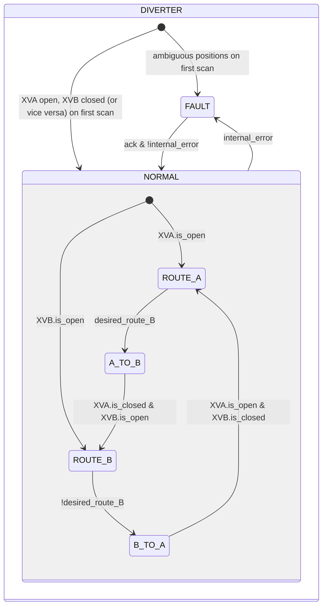
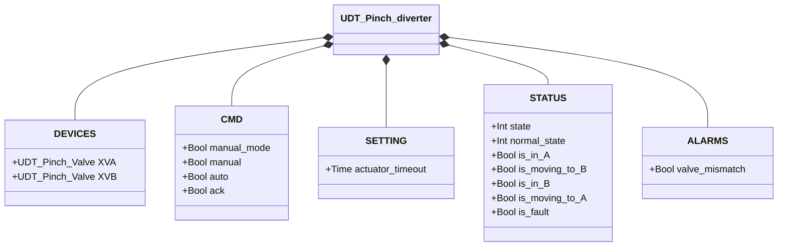

# Pinch Diverter

## Overview

**Tier 3 — composite.** The pinch diverter routes material flow between two lines (A and B), embedding two Pinch Valve (Tier 2) instances, `XVA` and `XVB`. Only one line is open at a time. The diverter has no sensors of its own — routing state is derived entirely from the two sub-valves' position feedback.

---

## Composition

| Tag | Type | Role |
|-----|------|------|
| `XVA` | Pinch Valve (Tier 2) | Toward path A |
| `XVB` | Pinch Valve (Tier 2) | Toward path B |

A single manual/automatic decision (`manual_mode`/`manual`/`auto`, resolved into `desired_route_B`: FALSE = route A, TRUE = route B) determines which valve opens; the other is always commanded closed — the two instances never arbitrate independently. See [Pinch Valve](../../valves/pinch/index.en.md) for sub-valve detail.

---

## Control Signals

| Signal | Type | Description |
|--------|------|-------------|
| `DEVICES.XVA` | UDT_Pinch_Valve | Sub-valve toward path A |
| `DEVICES.XVB` | UDT_Pinch_Valve | Sub-valve toward path B |
| `CMD.manual_mode` | Bool | TRUE = HMI manual mode |
| `CMD.manual` | Bool | Route selection in manual mode (TRUE = route B) |
| `CMD.auto` | Bool | Route selection from automation (ReadOnly external) |
| `CMD.ack` | Bool | Acknowledges alarms — forwarded to both sub-valves |

`CMD.ack` is forwarded to both `XVA.CMD.ack` and `XVB.CMD.ack` every scan.

---

## Settings

| Parameter | Default | Description |
|-----------|---------|-------------|
| `SETTING.actuator_timeout` | T#2s | Forwarded to `XVA.SETTING.actuator_timeout` and `XVB.SETTING.actuator_timeout` |

---

## States and Outputs

| State | `XVA` (commanded) | `XVB` (commanded) | Description |
|-------|---------------------|---------------------|-------------|
| ROUTE_A | open | closed | Route A established |
| A_TO_B | closed | open | Transitioning from A to B |
| ROUTE_B | closed | open | Route B established |
| B_TO_A | open | closed | Transitioning from B to A |
| FAULT | closed | closed | Fault; neither valve gets an explicit open command (fail-safe) |

---

## State Machine



```Pascal
internal_error := valve_mismatch OR XVA.is_fault OR XVB.is_fault;
```

On return from `FAULT`, the block re-reads both sub-valves' state to determine the stable route — the same mechanism used on the first scan.

---

## Alarms

| ID | Device-specific condition |
|----|----------------------------|
| [`DIV-E01`](../index.en.md#diverter-alarms) | Current stable state (`ROUTE_A`/`ROUTE_B`) not confirmed by `XVA.STATUS.is_open`/`XVB.STATUS.is_open` |

A fault on `XVA` or `XVB` feeds into `internal_error` (drives `FAULT`) but doesn't raise its own ID at this level — see [Pinch Valve alarms](../../valves/pinch/index.en.md#alarms).

---

## Data Structure



`internal_error` is internal to the function block, not exposed via the UDT.
