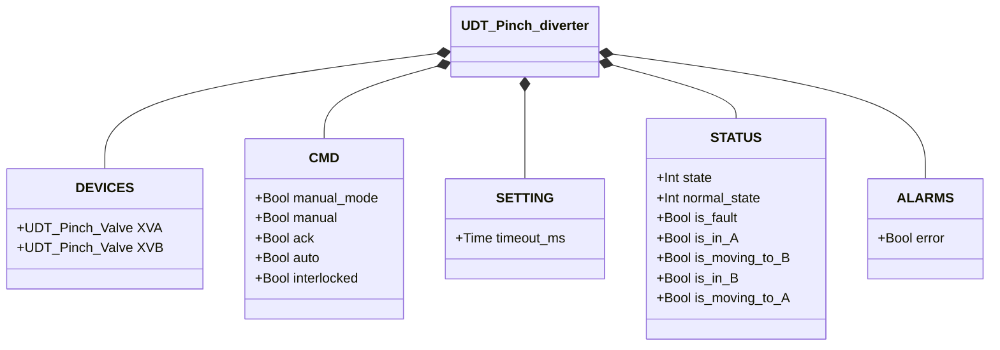
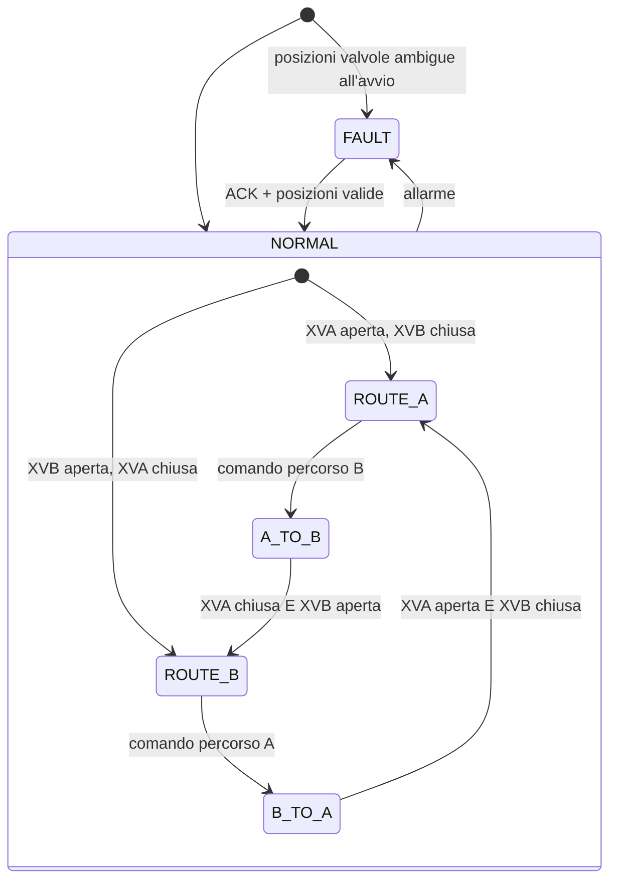

# Deviatore a Manicotto

## Panoramica

Il deviatore a manicotto indirizza il flusso di materiale tra due linee (A e B) tramite due valvole a manicotto gestite internamente (`XVA`, `XVB`). Solo una linea è aperta alla volta. Il comando `TRUE` seleziona il percorso B; `FALSE` seleziona il percorso A. Non ci sono sensori fisici diretti — lo stato di instradamento è derivato dal feedback di posizione delle sotto-valvole.

---

## Componenti principali

- **Due tubi flessibili** — percorsi del flusso Linea A e Linea B
- **Due sotto-assiemi valvola a manicotto** (`XVA`, `XVB`) — ciascuno con attuatore pneumatico, solenoide e pressostato
- Vedere [Valvola a Manicotto](../../valves/pinch/index.it.md) per il dettaglio delle sotto-valvole

---

## Segnali I/O

I segnali sono accessibili tramite le UDT delle sotto-valvole (`XVA` e `XVB`). Non ci sono segnali a livello di deviatore oltre al passthrough delle sotto-valvole.

| Segnale | Posizione | Descrizione |
|---------|-----------|-------------|
| `XVA.DEVICES.PSL` | Sotto-valvola A | Pressostato: TRUE = tubo linea A schiacciato (chiuso) |
| `XVA.DEVICES.XY.out` | Sotto-valvola A | Uscita solenoide linea A |
| `XVB.DEVICES.PSL` | Sotto-valvola B | Pressostato: TRUE = tubo linea B schiacciato (chiuso) |
| `XVB.DEVICES.XY.out` | Sotto-valvola B | Uscita solenoide linea B |

---

## Funzionamento

In **Percorso A**, la valvola A è aperta (tubo A libero, flusso consentito) e la valvola B è chiusa (tubo B schiacciato). In **Percorso B**, gli stati sono invertiti.

Quando viene comandato un cambio di percorso, entrambe le sotto-valvole transitano simultaneamente — una si apre mentre l'altra si chiude. Il deviatore conferma il nuovo percorso solo quando la sotto-valvola di destinazione ha raggiunto la posizione target.

In **modalità manuale** (`manual_mode = TRUE`), l'operatore seleziona il percorso dall'HMI tramite `manual` (TRUE = Percorso B). In **modalità automatica**, la selezione arriva dal processo tramite `auto`. Se `interlocked = TRUE`, il deviatore mantiene il percorso corrente.

I guasti di una delle due sotto-valvole si propagano a `ALARMS.error` del deviatore. Confermare con `ack`, che viene inoltrato a entrambe le sotto-valvole.

---

## Allarmi

| ID | Condizione | Causa |
|----|------------|-------|
| PD-E01 | Errore sotto-valvola (XVA o XVB) | Vedere [allarmi Valvola a Manicotto](../../valves/pinch/index.it.md#allarmi) |
| PD-E02 | Stato percorso non corrisponde alle posizioni delle sotto-valvole | Guasto sotto-valvola, problema meccanico, guasto sensore |

---

## Parametri

| Parametro | Default | Descrizione |
|-----------|---------|-------------|
| `timeout_ms` | T#2s | Timeout attuatore inoltrato a entrambe le sotto-valvole |

---

## Struttura dati

---

## Macchina a stati (FSM)

### Tabella stati e uscite

| Stato | Comando XVA | Comando XVB | Descrizione |
|-------|------------|------------|-------------|
| ROUTE_A | apertura (auto=TRUE) | chiusura (auto=FALSE) | Flusso attraverso linea A |
| A_TO_B | chiusura (auto=FALSE) | apertura (auto=TRUE) | XVA si chiude, XVB si apre |
| ROUTE_B | chiusura (auto=FALSE) | apertura (auto=TRUE) | Flusso attraverso linea B |
| B_TO_A | apertura (auto=TRUE) | chiusura (auto=FALSE) | XVB si chiude, XVA si apre |
| FAULT | — | — | Uscite sotto-valvole congelate; richiesta conferma operatore |

### Tabella transizioni di stato

| Stato attuale | Condizione | Stato successivo | Azione |
|---------------|------------|-----------------|--------|
| ROUTE_A | Comando percorso B | A_TO_B | XVA.auto → FALSE; XVB.auto → TRUE |
| A_TO_B | XVA.is_closed E XVB.is_open | ROUTE_B | — |
| A_TO_B | Allarme sotto-valvola | FAULT | Genera PD-E01 |
| ROUTE_B | Comando percorso A | B_TO_A | XVB.auto → FALSE; XVA.auto → TRUE |
| B_TO_A | XVA.is_open E XVB.is_closed | ROUTE_A | — |
| B_TO_A | Allarme sotto-valvola | FAULT | Genera PD-E01 |
| ROUTE_A o ROUTE_B | Disallineamento posizione | FAULT | Genera PD-E02 |
| FAULT | ACK=TRUE, posizioni valide | ROUTE_A o ROUTE_B | Rilegge stati sotto-valvole; azzera allarmi |
