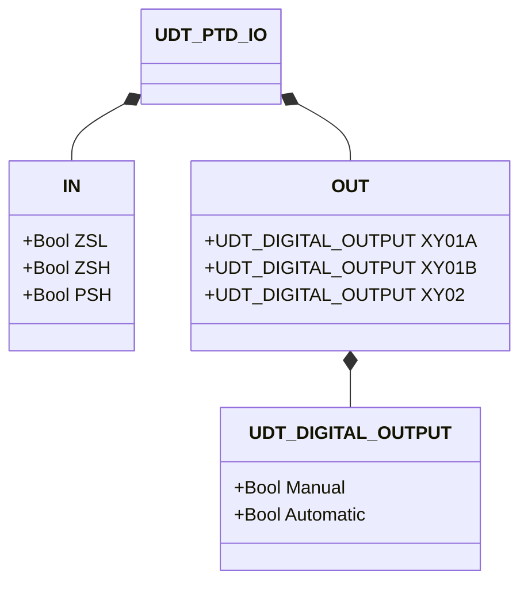
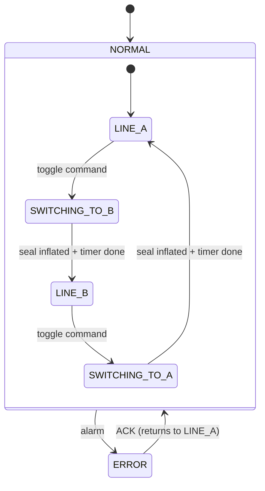

# Plug-Type Diverter

## Overview

The plug-type diverter routes a single material inlet to one of two discharge lines using a pneumatically actuated plug element. An inflatable seal (`XY02`) creates a pressure-tight closure around the plug during operation. To change routes, the seal is first deflated, the plug moves, then the seal is re-inflated. This sequence minimises leakage and wear, making it suitable for abrasive powders and granular materials under pressure.

---

## Main Components

- **Housing** — flanged inlet and two outlet ports; wear-resistant lining
- **Plug element** — rotary or sliding; seals one outlet while opening the other
- **Pneumatic actuator** — cylinder driving plug motion
- **Solenoid `XY01A`** — commands plug to position A
- **Solenoid `XY01B`** — commands plug to position B
- **Solenoid `XY02`** — inflates / deflates the sealing gasket
- **Limit switch `ZSL`** — TRUE when plug is in position A (low)
- **Limit switch `ZSH`** — TRUE when plug is in position B (high)
- **Pressure switch `PSH`** — TRUE when seal is inflated to operating pressure

---

## I/O Signals

| Signal | Type | Description |
|--------|------|-------------|
| `ZSL` | Input — Bool | Limit switch: TRUE = plug at position A |
| `ZSH` | Input — Bool | Limit switch: TRUE = plug at position B |
| `PSH` | Input — Bool | Pressure switch: TRUE = seal inflated |
| `XY01A` | Output — Bool | Solenoid: TRUE = move plug toward position A |
| `XY01B` | Output — Bool | Solenoid: TRUE = move plug toward position B |
| `XY02` | Output — Bool | Solenoid: TRUE = inflate seal |

---

## Operating Routine

**Normal operation (Line A selected):** seal inflated (`XY02 = TRUE`), plug at position A (`XY01A = TRUE`, `XY01B = FALSE`), flow routed to line A.

**Route change sequence (A → B):**
1. Deflate seal: `XY02 = FALSE`, wait for seal deflate time
2. Move plug: `XY01A = FALSE`, `XY01B = TRUE`
3. Inflate seal: `XY02 = TRUE`, wait for seal inflate time and `PSH = TRUE`
4. Flow now routed to line B

The reverse sequence applies for B → A. The seal is always inflated when the plug is stationary.

In **error state**, the seal is inflated for safety (`XY02 = TRUE`). After operator acknowledgment, the diverter returns to Line A by default.

---

## Alarms

| ID | Condition | Cause |
|----|-----------|-------|
| A001 | `XY02 = TRUE` but `PSH = FALSE` after timeout | Seal leak, no air supply, faulty pressure switch, solenoid fault |
| A002 | `XY02 = FALSE` but `PSH = TRUE` | Pressure switch not adjusted, solenoid stuck |
| A003 | `XY01A = TRUE` but `ZSH = TRUE` and `ZSL = FALSE` | No air to solenoid, solenoid fault, cylinder blocked |
| A004 | `XY01B = TRUE` but `ZSL = TRUE` and `ZSH = FALSE` | No air to solenoid, solenoid fault, cylinder blocked |
| A005 | `ZSL = TRUE` and `ZSH = TRUE` simultaneously | Proximity switch fault, cable fault |

---

## Settings

| Parameter | Default | Description |
|-----------|---------|-------------|
| `t_Seal_deflating_time` | T#500ms | Time to wait for seal to deflate before moving plug |
| `t_Seal_inflating_time` | T#500ms | Time to wait for seal to inflate after plug moves |

---

## Data Structure

---

## State Machine

### State and Output Table

| State | `XY01A` | `XY01B` | `XY02` | Description |
|-------|---------|---------|--------|-------------|
| LINE_A | TRUE | FALSE | TRUE | Plug at A, seal inflated, flow on line A |
| SWITCHING_TO_B | FALSE → FALSE | FALSE → TRUE | FALSE → TRUE | Deflate, move to B, re-inflate |
| LINE_B | FALSE | TRUE | TRUE | Plug at B, seal inflated, flow on line B |
| SWITCHING_TO_A | FALSE → TRUE | FALSE → FALSE | FALSE → TRUE | Deflate, move to A, re-inflate |
| ERROR | FALSE | FALSE | TRUE | Seal inflated for safety; operator ACK required |

### State Transition Table

| Current State | Condition | Next State | Action |
|---------------|-----------|------------|--------|
| LINE_A | toggle command | SWITCHING_TO_B | `XY02` → FALSE; start deflate timer |
| SWITCHING_TO_B | Deflate timer done | (moving) | `XY01A` → FALSE, `XY01B` → TRUE, `XY02` → TRUE; start inflate timer |
| SWITCHING_TO_B | Inflate timer done | LINE_B | — |
| LINE_B | toggle command | SWITCHING_TO_A | `XY02` → FALSE; start deflate timer |
| SWITCHING_TO_A | Deflate timer done | (moving) | `XY01B` → FALSE, `XY01A` → TRUE, `XY02` → TRUE; start inflate timer |
| SWITCHING_TO_A | Inflate timer done | LINE_A | — |
| Any | Alarm detected | ERROR | `XY02` → TRUE (safety) |
| ERROR | ACK = TRUE | LINE_A | Reset to Line A default |
