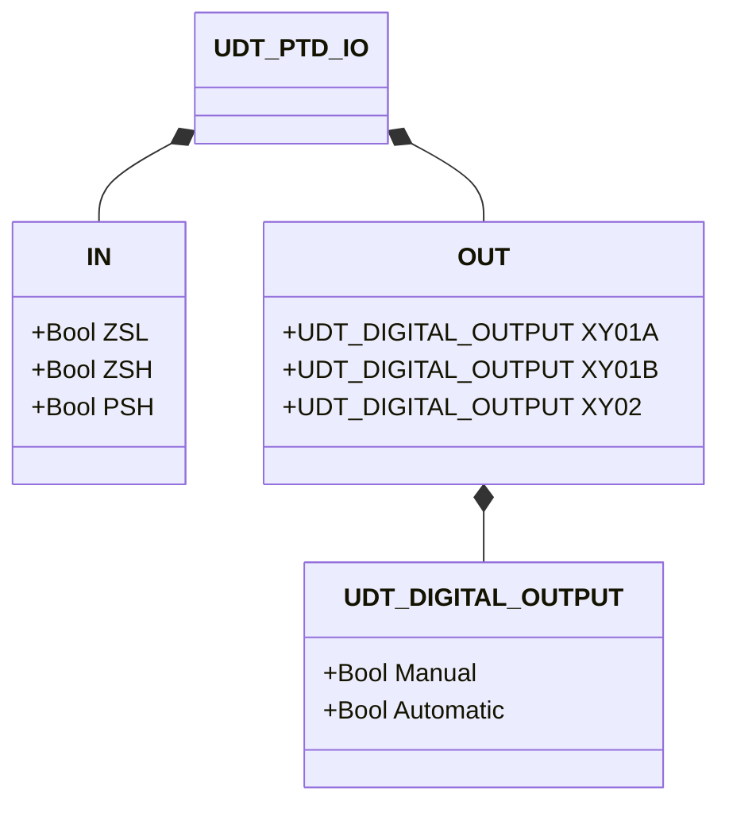
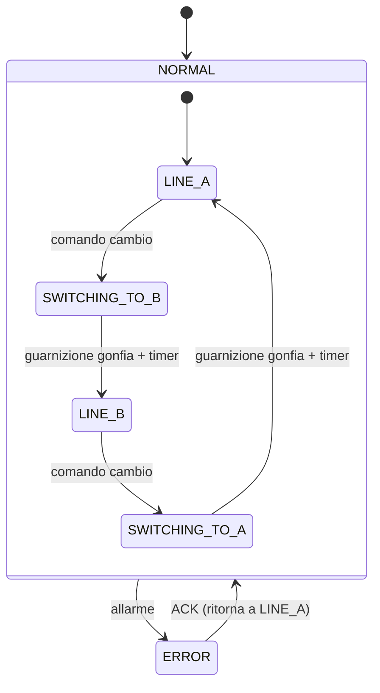

# Deviatore Tipo Plug

## Panoramica

Il deviatore tipo plug indirizza un singolo ingresso di materiale verso una delle due linee di scarico tramite un elemento plug azionato pneumaticamente. Una guarnizione gonfiabile (`XY02`) crea una chiusura a tenuta di pressione attorno al plug durante il funzionamento. Per cambiare percorso, la guarnizione viene prima sgonfiata, il plug si sposta, poi la guarnizione viene rigonfiata. Questa sequenza minimizza perdite e usura, rendendolo adatto per polveri abrasive e materiali granulari in pressione.

---

## Componenti principali

- **Corpo** — ingresso e due uscite flangiati; rivestimento resistente all'usura
- **Elemento plug** — rotante o scorrevole; sigilla una uscita mentre apre l'altra
- **Attuatore pneumatico** — cilindro che aziona il movimento del plug
- **Solenoide `XY01A`** — comanda il plug verso la posizione A
- **Solenoide `XY01B`** — comanda il plug verso la posizione B
- **Solenoide `XY02`** — gonfia / sgonfia la guarnizione di tenuta
- **Finecorsa `ZSL`** — TRUE quando il plug è in posizione A (basso)
- **Finecorsa `ZSH`** — TRUE quando il plug è in posizione B (alto)
- **Pressostato `PSH`** — TRUE quando la guarnizione è gonfia alla pressione operativa

---

## Segnali I/O

| Segnale | Tipo | Descrizione |
|---------|------|-------------|
| `ZSL` | Ingresso — Bool | Finecorsa: TRUE = plug in posizione A |
| `ZSH` | Ingresso — Bool | Finecorsa: TRUE = plug in posizione B |
| `PSH` | Ingresso — Bool | Pressostato: TRUE = guarnizione gonfia |
| `XY01A` | Uscita — Bool | Solenoide: TRUE = sposta plug verso posizione A |
| `XY01B` | Uscita — Bool | Solenoide: TRUE = sposta plug verso posizione B |
| `XY02` | Uscita — Bool | Solenoide: TRUE = gonfia guarnizione |

---

## Funzionamento

**Funzionamento normale (Linea A selezionata):** guarnizione gonfia (`XY02 = TRUE`), plug in posizione A (`XY01A = TRUE`, `XY01B = FALSE`), flusso instradato sulla linea A.

**Sequenza cambio percorso (A → B):**
1. Sgonfiare guarnizione: `XY02 = FALSE`, attendere tempo di sgonfiaggio
2. Muovere plug: `XY01A = FALSE`, `XY01B = TRUE`
3. Gonfiare guarnizione: `XY02 = TRUE`, attendere tempo di gonfiaggio e `PSH = TRUE`
4. Il flusso è ora instradato sulla linea B

La sequenza inversa si applica per B → A. La guarnizione è sempre gonfia quando il plug è fermo.

In **stato di errore**, la guarnizione viene gonfiata per sicurezza (`XY02 = TRUE`). Dopo la conferma dell'operatore, il deviatore torna alla Linea A per default.

---

## Allarmi

| ID | Condizione | Causa |
|----|------------|-------|
| A001 | `XY02 = TRUE` ma `PSH = FALSE` dopo timeout | Perdita guarnizione, assenza aria, pressostato difettoso, guasto solenoide |
| A002 | `XY02 = FALSE` ma `PSH = TRUE` | Pressostato non tarato, solenoide bloccato |
| A003 | `XY01A = TRUE` ma `ZSH = TRUE` e `ZSL = FALSE` | Assenza aria al solenoide, guasto solenoide, cilindro bloccato |
| A004 | `XY01B = TRUE` ma `ZSL = TRUE` e `ZSH = FALSE` | Assenza aria al solenoide, guasto solenoide, cilindro bloccato |
| A005 | `ZSL = TRUE` e `ZSH = TRUE` simultaneamente | Guasto interruttore di prossimità, guasto cavo |

---

## Parametri

| Parametro | Default | Descrizione |
|-----------|---------|-------------|
| `t_Seal_deflating_time` | T#500ms | Tempo di attesa per sgonfiaggio guarnizione prima di muovere il plug |
| `t_Seal_inflating_time` | T#500ms | Tempo di attesa per gonfiaggio guarnizione dopo il movimento del plug |

---

## Struttura dati

---

## Macchina a stati (FSM)

### Tabella stati e uscite

| Stato | `XY01A` | `XY01B` | `XY02` | Descrizione |
|-------|---------|---------|--------|-------------|
| LINE_A | TRUE | FALSE | TRUE | Plug in A, guarnizione gonfia, flusso su linea A |
| SWITCHING_TO_B | FALSE → FALSE | FALSE → TRUE | FALSE → TRUE | Sgonfia, sposta in B, rigonfia |
| LINE_B | FALSE | TRUE | TRUE | Plug in B, guarnizione gonfia, flusso su linea B |
| SWITCHING_TO_A | FALSE → TRUE | FALSE → FALSE | FALSE → TRUE | Sgonfia, sposta in A, rigonfia |
| ERROR | FALSE | FALSE | TRUE | Guarnizione gonfia per sicurezza; richiesta conferma operatore |

### Tabella transizioni di stato

| Stato attuale | Condizione | Stato successivo | Azione |
|---------------|------------|-----------------|--------|
| LINE_A | Comando cambio | SWITCHING_TO_B | `XY02` → FALSE; avvia timer sgonfiaggio |
| SWITCHING_TO_B | Timer sgonfiaggio scaduto | (in movimento) | `XY01A` → FALSE, `XY01B` → TRUE, `XY02` → TRUE; avvia timer gonfiaggio |
| SWITCHING_TO_B | Timer gonfiaggio scaduto | LINE_B | — |
| LINE_B | Comando cambio | SWITCHING_TO_A | `XY02` → FALSE; avvia timer sgonfiaggio |
| SWITCHING_TO_A | Timer sgonfiaggio scaduto | (in movimento) | `XY01B` → FALSE, `XY01A` → TRUE, `XY02` → TRUE; avvia timer gonfiaggio |
| SWITCHING_TO_A | Timer gonfiaggio scaduto | LINE_A | — |
| Qualsiasi | Allarme rilevato | ERROR | `XY02` → TRUE (sicurezza) |
| ERROR | ACK = TRUE | LINE_A | Reset al default Linea A |
