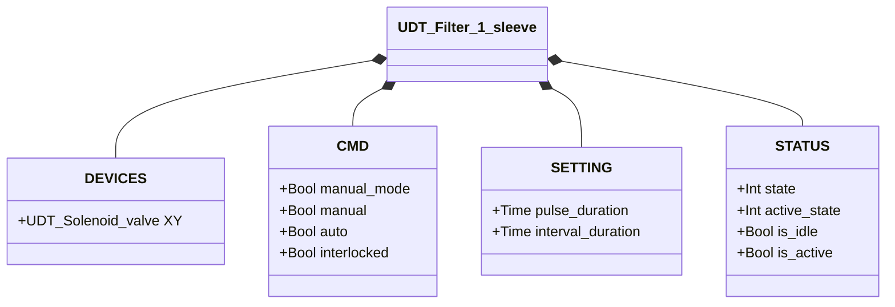
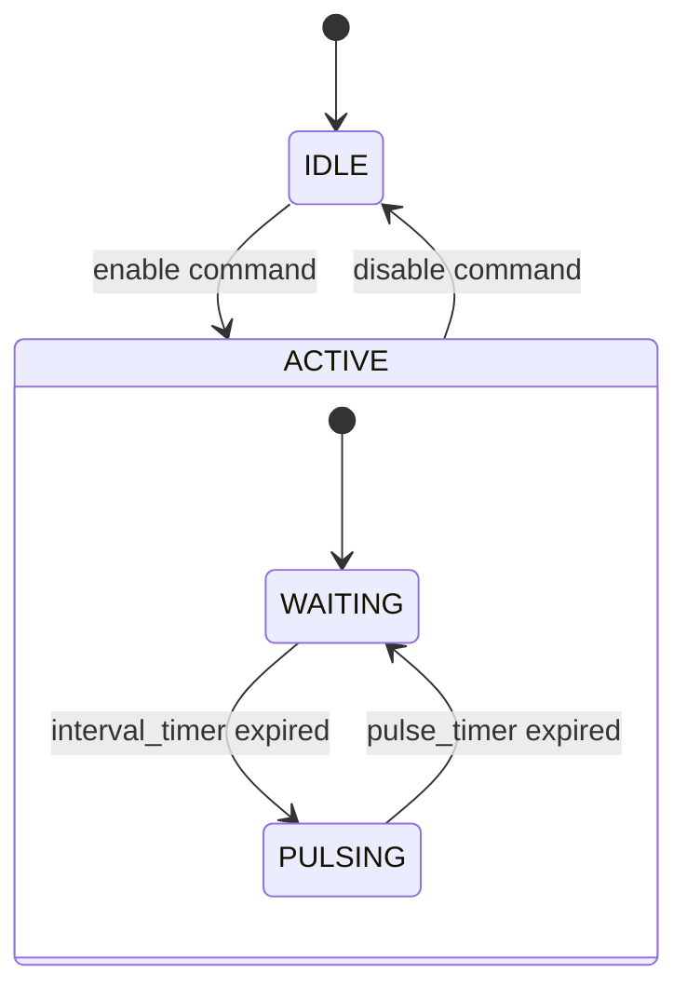

# Filter Cleaner — 1 Sleeve

## Overview

The 1-sleeve filter cleaner drives periodic compressed air pulses through a single solenoid valve (`XY`) to dislodge accumulated dust from a filter sleeve. When enabled, the cycle always begins with a waiting interval (`interval_duration`) before the first pulse, then alternates waiting and pulsing indefinitely. There is no position feedback — the system is open-loop.

---

## Main Components

- **Solenoid valve `XY`** — injects compressed air into the sleeve during each cleaning pulse
- **Pulse timer** — sets the duration of each individual pulse (`pulse_duration`)
- **Interval timer** — sets the rest time between successive pulses (`interval_duration`)

---

## I/O Signals

| Signal | Type | Description |
|--------|------|-------------|
| `DEVICES.XY` | UDT_Solenoid_valve | OUTPUT — Cleaning pulse solenoid |
| `CMD.manual_mode` | Bool | COMMAND — TRUE = manual mode |
| `CMD.manual` | Bool | COMMAND — Enable in manual mode |
| `CMD.auto` | Bool | COMMAND — Enable in automatic mode |
| `CMD.interlocked` | Bool | GUARD — TRUE = validated command frozen at last value |
| `STATUS.state` | Int | STATE — 1=Idle, 2=Active |
| `STATUS.active_state` | Int | SUB-STATE — 1=Pulsing, 2=Waiting |
| `STATUS.is_idle` | Bool | STATE — Filter waiting for enable command |
| `STATUS.is_active` | Bool | STATE — Cleaning cycle running |

---

## Operating Routine

**IDLE** — Filter inactive. `XY` de-energised. When an enable command arrives (manual or auto) and not interlocked, state transitions to ACTIVE with `active_state = WAITING`.

**ACTIVE / WAITING** — Filter active but resting between pulses. `XY` de-energised. Interval timer (`interval_duration`) running. When the timer expires, internal state transitions to PULSING.

**ACTIVE / PULSING** — `XY` energised for the duration of the pulse (`pulse_duration`). When the pulse timer expires, internal state returns to WAITING.

The WAITING → PULSING → WAITING cycle repeats as long as the enable command remains active. Removing the enable command at any point returns the filter to IDLE.

In **manual mode** (`manual_mode = TRUE`), the command comes from `CMD.manual`. In **automatic mode**, from `CMD.auto`. If `interlocked = TRUE`, the validated command is frozen at its last value — interlock does not force closure, but prevents changes.

---

## Alarms

`UDT_Filter_1_sleeve` has no `ALARMS` struct.

---

## Settings

| Parameter | Default | Description |
|-----------|---------|-------------|
| `pulse_duration` | T#500ms | Duration of each cleaning pulse |
| `interval_duration` | T#3s | Rest time between successive pulses |

---

## Data Structure

---

## State Machine (FSM)

### State and Output Table

| State | Sub-state | XY.CMD.auto | Description |
|-------|-----------|-------------|-------------|
| IDLE | — | FALSE | Filter inactive |
| ACTIVE | WAITING | FALSE | Resting between pulses; interval_timer running |
| ACTIVE | PULSING | TRUE | Cleaning pulse active; pulse_timer running |

### State Transition Table

| State | Condition | Next state | Action |
|-------|-----------|------------|--------|
| IDLE | Enable command | ACTIVE / WAITING | Start interval_timer |
| ACTIVE | Disable command | IDLE | Stop timers, XY → FALSE |
| ACTIVE / WAITING | interval_timer.Q | ACTIVE / PULSING | XY → TRUE; start pulse_timer |
| ACTIVE / PULSING | pulse_timer.Q | ACTIVE / WAITING | XY → FALSE; start interval_timer |
