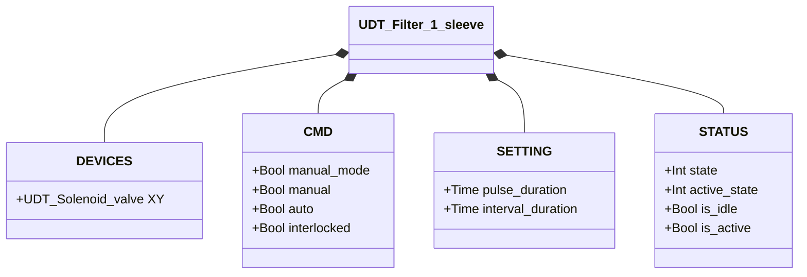
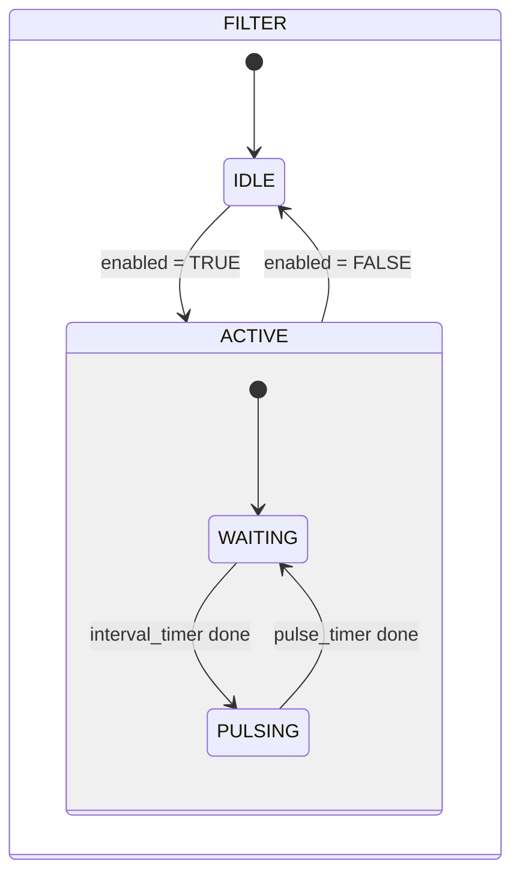

# Filter Cleaner — 1 Sleeve

## Overview

The 1-sleeve filter cleaner drives periodic compressed air pulses through a single solenoid valve (`XY`) to dislodge accumulated dust from a filter sleeve. When enabled, the cycle always begins with a waiting interval (`interval_duration`) before the first pulse, then alternates waiting and pulsing indefinitely. There is no position feedback — the system is open-loop.

---

## Main Components

- **Filter housing** — contains the filter sleeve (sock, cartridge, or screen)
- **Compressed air supply / accumulator** — provides pulse pressure
- **Solenoid valve `XY`** — releases each air pulse into the sleeve

---

## I/O Signals

| Signal | Type | Description |
|--------|------|-------------|
| `XY` | Output — Bool | Solenoid command: TRUE = pulse active (air released into sleeve) |

---

## Operating Routine

When the enable command is active (`auto = TRUE` or `manual = TRUE` in manual mode), the system transitions to ACTIVE and starts the cleaning cycle. The cycle always follows this sequence:

1. **WAITING** — `XY` de-energized for `interval_duration` (tank re-pressurizes, sleeve settles)
2. **PULSING** — `XY` energized for `pulse_duration` (air blast into sleeve)
3. Return to WAITING — repeat until command is removed

Removing the command at any point returns the system to **IDLE** (`XY = FALSE`). If `interlocked = TRUE`, the validated command freezes and pulsing pauses in the current phase.

---

## Alarms

No alarms — no feedback sensors.

---

## Settings

| Parameter | Default | Description |
|-----------|---------|-------------|
| `pulse_duration` | T#500ms | Duration of each air pulse (solenoid energized) |
| `interval_duration` | T#3s | Wait time between pulses |

---

## Data Structure

---

## State Machine

### State and Output Table

| `state` | `active_state` | `XY` | Description |
|---------|---------------|------|-------------|
| IDLE (1) | — | FALSE | Standby, no cleaning |
| ACTIVE (2) | WAITING (2) | FALSE | Between pulses — interval timer running |
| ACTIVE (2) | PULSING (1) | TRUE | Pulse active — air blast into sleeve |

### State Transition Table

| Current State | Condition | Next State | Action |
|---------------|-----------|------------|--------|
| IDLE | enable command | ACTIVE/WAITING | `XY` → FALSE; start interval timer |
| WAITING | interval timer done | PULSING | `XY` → TRUE; start pulse timer |
| WAITING | command removed | IDLE | `XY` → FALSE |
| PULSING | pulse timer done | WAITING | `XY` → FALSE; start interval timer |
| PULSING | command removed | IDLE | `XY` → FALSE |
