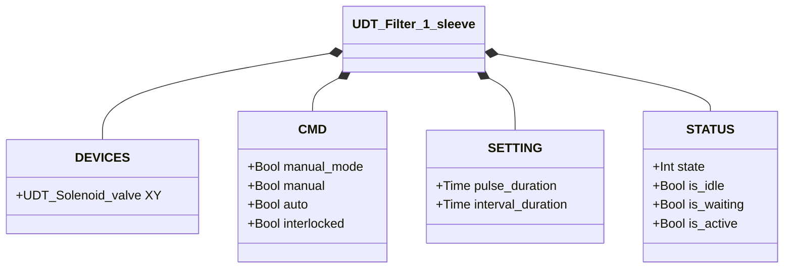
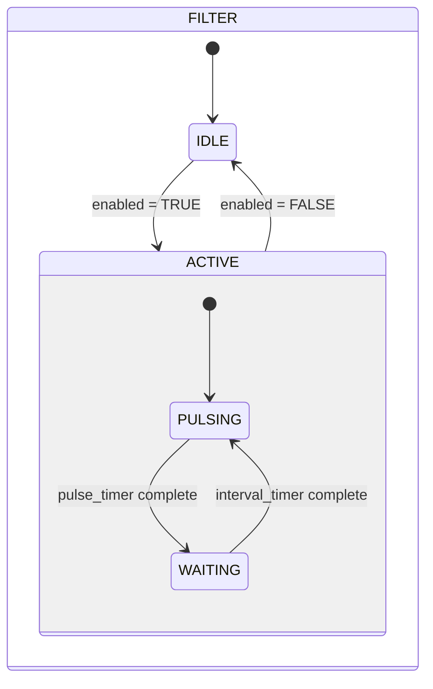

# Pulitore Filtro — 1 Manica

## Panoramica

Il pulitore filtro a 1 manica genera impulsi periodici di aria compressa tramite una singola elettrovalvola (`XY`) per rimuovere la polvere accumulata da una manica filtrante. Il ciclo di pulizia funziona automaticamente finché il comando di abilitazione è attivo, alternando un impulso attivo e un intervallo di attesa. Non è presente alcun feedback di posizione — il sistema è ad anello aperto.

---

## Componenti principali

- **Corpo filtro** — contiene la manica filtrante (sacco, cartuccia o schermo)
- **Alimentazione aria compressa / accumulatore** — fornisce la pressione degli impulsi
- **Elettrovalvola `XY`** — rilascia ogni impulso d'aria nella manica

---

## Segnali I/O

| Segnale | Tipo | Descrizione |
|---------|------|-------------|
| `XY` | Uscita — Bool | Comando solenoide: TRUE = impulso attivo (aria rilasciata nella manica) |

---

## Funzionamento

Quando viene ricevuto il comando di abilitazione (`auto = TRUE` o `manual = TRUE` in modalità manuale), il sistema inizia immediatamente a pulsare. Ogni ciclo:

1. **ACTIVE** — `XY` eccitato per `pulse_duration` (scarica d'aria nella manica)
2. **WAITING** — `XY` diseccitato per `interval_duration` (la manica si recupera, il serbatoio si ripressurizza)
3. Ripetere fino alla rimozione del comando

La rimozione del comando in qualsiasi momento riporta il sistema in **IDLE** (`XY = FALSE`) al termine della fase corrente. Se `interlocked = TRUE`, il comando validato si blocca e la pulsazione si mette in pausa.

---

## Allarmi

Nessun allarme — nessun sensore di feedback.

---

## Parametri

| Parametro | Default | Descrizione |
|-----------|---------|-------------|
| `pulse_duration` | T#500ms | Durata di ogni impulso d'aria (solenoide eccitato) |
| `interval_duration` | T#3s | Tempo di attesa tra gli impulsi |

---

## Struttura dati

---

## Macchina a stati (FSM)

### Tabella stati e uscite

| Stato | `XY` | Descrizione |
|-------|------|-------------|
| IDLE (1) | FALSE | Standby, nessuna pulizia |
| WAITING (2) | FALSE | Tra impulsi — timer intervallo in esecuzione |
| ACTIVE (3) | TRUE | Impulso attivo — scarica d'aria nella manica |

### Tabella transizioni di stato

| Stato attuale | Condizione | Stato successivo | Azione |
|---------------|------------|-----------------|--------|
| IDLE | Comando abilitazione | ACTIVE | `XY` → TRUE; avvia timer impulso |
| ACTIVE | Timer impulso scaduto | WAITING | `XY` → FALSE; avvia timer intervallo |
| ACTIVE | Comando rimosso | IDLE | `XY` → FALSE |
| WAITING | Timer intervallo scaduto E comando attivo | ACTIVE | `XY` → TRUE; avvia timer impulso |
| WAITING | Comando rimosso | IDLE | — |
| WAITING | Timer intervallo scaduto E comando inattivo | IDLE | — |
