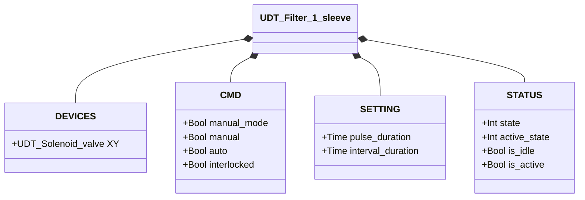
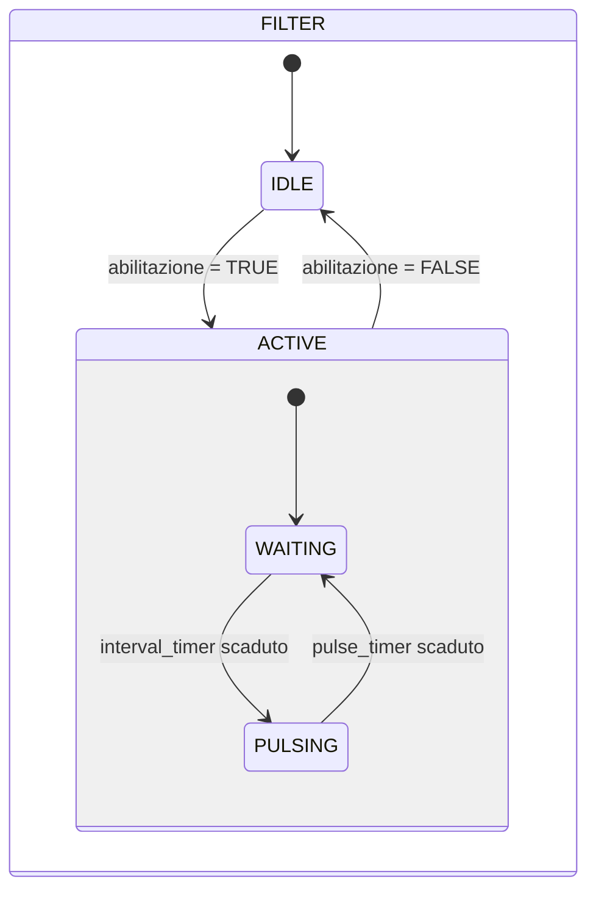

# Pulitore Filtro — 1 Manica

## Panoramica

Il pulitore filtro a 1 manica genera impulsi periodici di aria compressa tramite una singola elettrovalvola (`XY`) per rimuovere la polvere accumulata da una manica filtrante. Quando abilitato, il ciclo parte sempre da un intervallo di attesa (`interval_duration`) prima del primo impulso, e poi alterna attesa e impulso indefinitamente. Non è presente alcun feedback di posizione — il sistema è ad anello aperto.

---

## Componenti principali

- **Corpo filtro** — contiene la manica filtrante (sacco, cartuccia o schermo)
- **Alimentazione aria compressa / accumulatore** — fornisce la pressione degli impulsi
- **Elettrovalvola `XY`** — rilascia ogni impulso d'aria nella manica

---

## Segnali I/O

| Segnale | Tipo | Descrizione |
|---------|------|-------------|
| `XY` | Uscita — Bool | Comando solenoide: TRUE = impulso attivo (aria rilasciata nella manica) |

---

## Funzionamento

Quando il comando di abilitazione è attivo (`auto = TRUE` o `manual = TRUE` in modalità manuale), il sistema transisce in ACTIVE e avvia il ciclo di pulizia. Il ciclo segue sempre questa sequenza:

1. **WAITING** — `XY` diseccitato per `interval_duration` (il serbatoio si ripressurizza, la manica si assesta)
2. **PULSING** — `XY` eccitato per `pulse_duration` (scarica d'aria nella manica)
3. Ritorno a WAITING — ripetere fino alla rimozione del comando

La rimozione del comando in qualsiasi momento riporta il sistema in **IDLE** (`XY = FALSE`). Se `interlocked = TRUE`, il comando validato si blocca e la pulsazione si mette in pausa nella fase corrente.

---

## Allarmi

Nessun allarme — nessun sensore di feedback.

---

## Parametri

| Parametro | Default | Descrizione |
|-----------|---------|-------------|
| `pulse_duration` | T#500ms | Durata di ogni impulso d'aria (solenoide eccitato) |
| `interval_duration` | T#3s | Tempo di attesa tra gli impulsi |

---

## Struttura dati

---

## Macchina a stati (FSM)

### Tabella stati e uscite

| `state` | `active_state` | `XY` | Descrizione |
|---------|---------------|------|-------------|
| IDLE (1) | — | FALSE | Standby, nessuna pulizia |
| ACTIVE (2) | WAITING (2) | FALSE | Attesa tra impulsi — interval_timer in esecuzione |
| ACTIVE (2) | PULSING (1) | TRUE | Impulso attivo — scarica d'aria nella manica |

### Tabella transizioni di stato

| Stato attuale | Condizione | Stato successivo | Azione |
|---------------|------------|-----------------|--------|
| IDLE | Comando abilitazione | ACTIVE/WAITING | `XY` → FALSE; avvia interval_timer |
| WAITING | interval_timer scaduto | PULSING | `XY` → TRUE; avvia pulse_timer |
| WAITING | Comando rimosso | IDLE | `XY` → FALSE |
| PULSING | pulse_timer scaduto | WAITING | `XY` → FALSE; avvia interval_timer |
| PULSING | Comando rimosso | IDLE | `XY` → FALSE |
