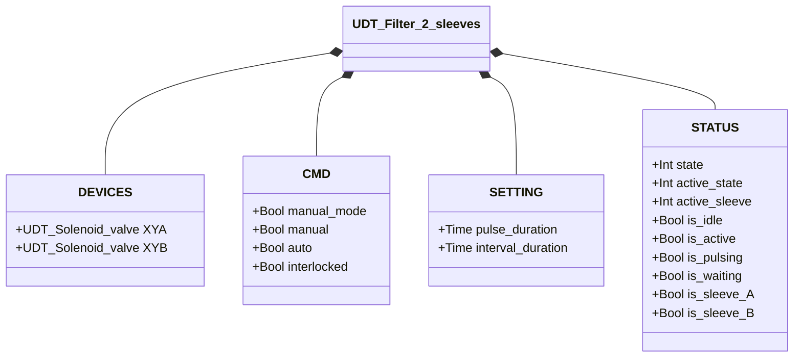
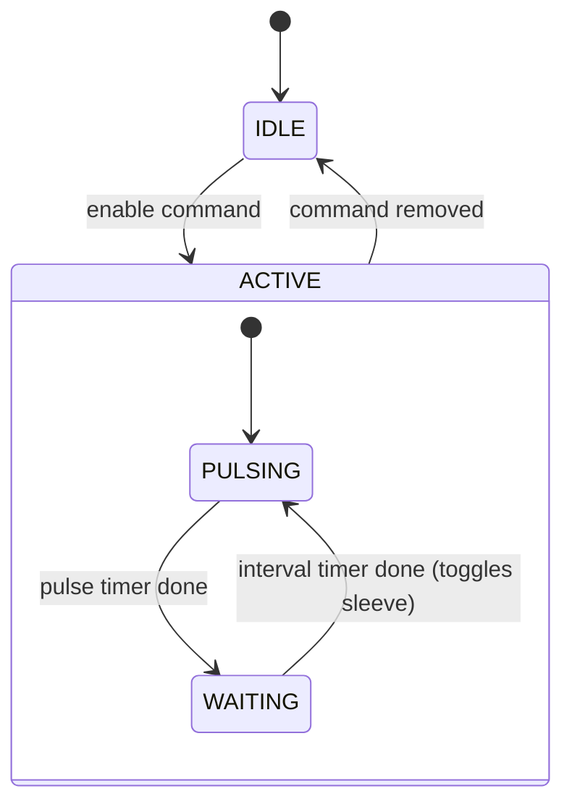

# Filter Cleaner — 2 Sleeves

## Overview

The 2-sleeve filter cleaner drives alternating compressed air pulses through two solenoid valves (`XYA`, `XYB`) to clean a dual-sleeve filter. The sleeves are pulsed in sequence — never simultaneously — to minimize pressure drop on the accumulator and ensure effective cleaning of each sleeve. There is no position feedback — the system is open-loop.

---

## Main Components

- **Filter housing** — contains two filter sleeves (A and B)
- **Compressed air supply / accumulator** — sized for sequential pulse demand
- **Solenoid valve `XYA`** — releases pulse into sleeve A
- **Solenoid valve `XYB`** — releases pulse into sleeve B

---

## I/O Signals

| Signal | Type | Description |
|--------|------|-------------|
| `XYA` | Output — Bool | Solenoid A: TRUE = pulse active on sleeve A |
| `XYB` | Output — Bool | Solenoid B: TRUE = pulse active on sleeve B |

---

## Operating Routine

When enabled, the system alternates between sleeves A and B in a continuous loop:

1. **PULSING sleeve A** — `XYA` energized for `pulse_duration`
2. **WAITING** — both solenoids off for `interval_duration`
3. **PULSING sleeve B** — `XYB` energized for `pulse_duration`
4. **WAITING** — both solenoids off for `interval_duration`
5. Repeat from step 1

The active sleeve is tracked by `STATUS.active_sleeve` (0 = A, 1 = B). Removing the enable command at any point returns the system to **IDLE**.

In **manual mode** (`manual_mode = TRUE`), the operator enables cleaning via `manual`. In **automatic mode**, the command comes from the process via `auto`. If `interlocked = TRUE`, the cleaning cycle pauses.

---

## Alarms

No alarms — no feedback sensors.

---

## Settings

| Parameter | Default | Description |
|-----------|---------|-------------|
| `pulse_duration` | T#500ms | Duration of each air pulse per sleeve |
| `interval_duration` | T#3s | Wait time between pulses |

---

## Data Structure

---

## State Machine

### State and Output Table

| State | `active_sleeve` | `XYA` | `XYB` | Description |
|-------|----------------|-------|-------|-------------|
| IDLE | — | FALSE | FALSE | Standby, no cleaning |
| ACTIVE / PULSING | 0 (A) | TRUE | FALSE | Air pulse into sleeve A |
| ACTIVE / PULSING | 1 (B) | FALSE | TRUE | Air pulse into sleeve B |
| ACTIVE / WAITING | any | FALSE | FALSE | Interval between pulses |

### State Transition Table

| Current State | Condition | Next State | Action |
|---------------|-----------|------------|--------|
| IDLE | Enable command | ACTIVE/PULSING | Start with sleeve A; `XYA` → TRUE; start pulse timer |
| ACTIVE/PULSING | Pulse timer done | ACTIVE/WAITING | `XYA`/`XYB` → FALSE; start interval timer |
| ACTIVE/WAITING | Interval timer done | ACTIVE/PULSING | Toggle sleeve (A→B or B→A); energize next solenoid; start pulse timer |
| ACTIVE (any) | Command removed | IDLE | `XYA` → FALSE, `XYB` → FALSE |
