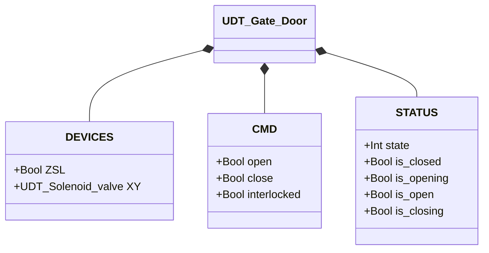
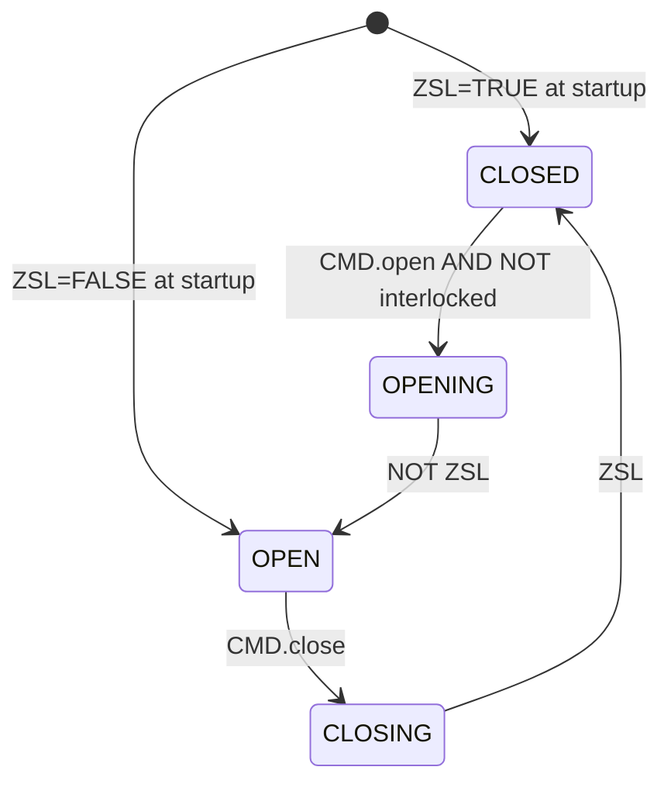

# Gate / Door

## Overview

`Gate_door` controls a single-acting pneumatic gate. The solenoid (`XY`) drives opening: energised = gate opening or held open; de-energised = spring returns gate to closed position. `ZSL` provides closed-position feedback. The orchestrator controls the gate via `CMD.open` and `CMD.close`; `CMD.interlocked` prevents the CLOSED → OPENING transition when active.

No `ALARMS` struct or fault state exists — the block is a four-state Moore sequencer with no built-in error detection.

---

## Main Components

- **Pneumatic actuator** — single-acting, spring-return to closed
- **Solenoid valve `XY`** — controls air to the actuator: energised = pushes gate open or holds it open
- **Limit switch `ZSL`** — TRUE = gate physically in closed position
- **CMD.interlocked** — active-high guard: TRUE = CLOSED → OPENING transition blocked

---

## I/O Signals

| Signal | Type | Description |
|--------|------|-------------|
| `DEVICES.ZSL` | Bool | INPUT — Closed-position limit switch: TRUE = gate closed |
| `DEVICES.XY` | UDT_Solenoid_valve | OUTPUT — Actuator solenoid valve |
| `CMD.open` | Bool | COMMAND — Open request |
| `CMD.close` | Bool | COMMAND — Close request |
| `CMD.interlocked` | Bool | GUARD — TRUE = opening blocked by orchestrator |
| `STATUS.state` | Int | STATE — 1=Closed, 2=Opening, 3=Open, 4=Closing |
| `STATUS.is_closed` | Bool | STATE — Gate stationary in closed position |
| `STATUS.is_opening` | Bool | STATE — Actuator moving toward open |
| `STATUS.is_open` | Bool | STATE — Gate fully open |
| `STATUS.is_closing` | Bool | STATE — Spring returning gate to closed |

---

## Operating Routine

**CLOSED** — Gate is at rest with `ZSL = TRUE`. Solenoid de-energised. `CMD.open` with `NOT CMD.interlocked` transitions to OPENING. If `interlocked = TRUE`, the command is ignored.

**OPENING** — Solenoid energises (`XY.CMD.auto = TRUE`) and the actuator pushes the gate toward the open position. When `ZSL` falls to FALSE, the gate has left the closed position → transitions to OPEN.

**OPEN** — Solenoid remains energised to hold the gate open against the return spring. `CMD.close` transitions to CLOSING.

**CLOSING** — Solenoid de-energises (`XY.CMD.auto = FALSE`); the spring returns the gate to closed. When `ZSL` rises to TRUE, the gate has reached the closed position → transitions to CLOSED.

**Initialisation** — On first PLC scan, state is derived from `ZSL`: TRUE → CLOSED, FALSE → OPEN.

`CMD.interlocked` only blocks the CLOSED → OPENING transition. A gate already open or in motion is not affected.

---

## Alarms

`UDT_Gate_Door` has no `ALARMS` struct. Solenoid faults are visible via `DEVICES.XY.ALARMS` (see [Solenoid valve](../../valves/solenoid/index.en.md#alarms)).

---

## Settings

No configurable parameters in `UDT_Gate_Door`.

---

## Data Structure

---

## State Machine (FSM)

### State and Output Table

| State | Value | XY.CMD.auto | Description |
|-------|-------|-------------|-------------|
| CLOSED | 1 | FALSE | Gate closed, spring at rest |
| OPENING | 2 | TRUE | Actuator pushing gate toward open |
| OPEN | 3 | TRUE | Gate fully open, solenoid holding against spring |
| CLOSING | 4 | FALSE | Spring returning gate to closed position |

### State Transition Table

| Current state | Condition | Next state | Action |
|---------------|-----------|------------|--------|
| CLOSED | `CMD.open` AND NOT `interlocked` | OPENING | `XY.CMD.auto` → TRUE |
| OPENING | NOT `ZSL` | OPEN | — |
| OPEN | `CMD.close` | CLOSING | `XY.CMD.auto` → FALSE |
| CLOSING | `ZSL` | CLOSED | — |
