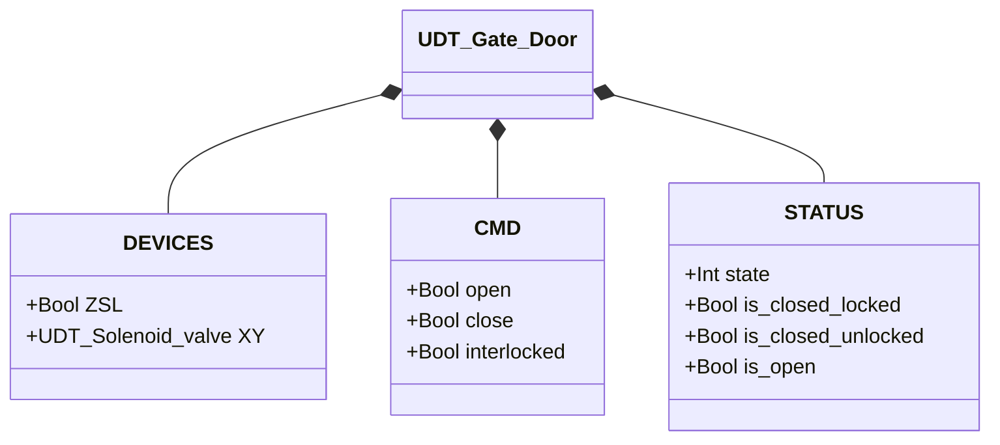
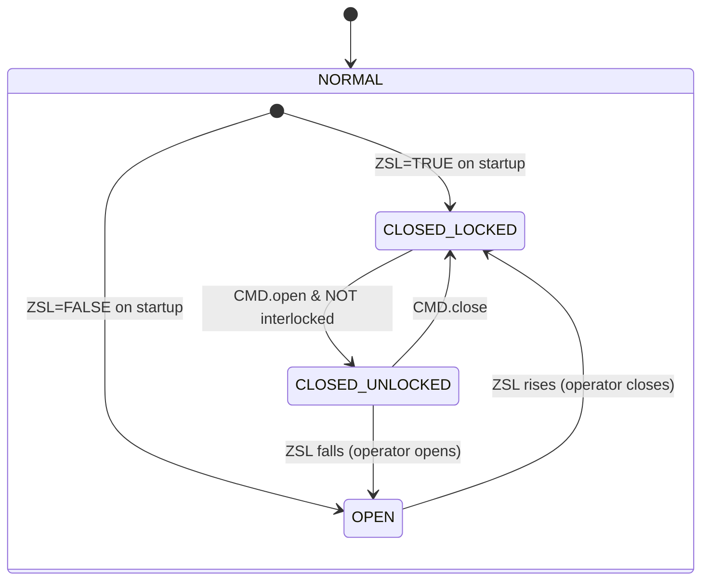

# Gate Door

## Overview

`Gate_door` manages a pneumatically latched door in three states. The solenoid (`XY`) controls the latch: energised = locked, de-energised = released. The door itself is opened and closed physically by the operator — there is no opening actuator. `ZSL` confirms the physical closed position.

The gate door has no standard manual/automatic mode or separate `ALARMS` structure — behaviour is driven by Orchestrator commands (`CMD.open`, `CMD.close`, `CMD.interlocked`).

---

## Main Components

- **Pneumatic latch** (`XY`) — solenoid that locks the gate: energised = locked (CLOSED_LOCKED), de-energised = released (CLOSED_UNLOCKED)
- **Limit switch `ZSL`** — TRUE = gate physically closed; FALSE = gate open
- **CMD.interlocked** — active-low guard: FALSE = Orchestrator permits opening; TRUE = opening blocked

---

## I/O Signals

| Signal | Type | Description |
|--------|------|-------------|
| `DEVICES.ZSL` | Bool | INPUT — Closed position limit switch: TRUE = gate closed |
| `DEVICES.XY` | UDT_Solenoid_valve | OUTPUT — Latch solenoid |
| `CMD.open` | Bool | COMMAND — Request latch release (open) |
| `CMD.close` | Bool | COMMAND — Request latch engagement (close) |
| `CMD.interlocked` | Bool | COMMAND — TRUE = opening blocked by Orchestrator |
| `STATUS.state` | Int | STATE — 1=ClosedLocked, 2=ClosedUnlocked, 3=Open |
| `STATUS.is_closed_locked` | Bool | STATUS — Gate closed and locked |
| `STATUS.is_closed_unlocked` | Bool | STATUS — Gate closed but unlocked |
| `STATUS.is_open` | Bool | STATUS — Gate open |

---

## Operating Routine

**CLOSED_LOCKED** — Latch engaged (`XY.CMD.auto = TRUE`). `CMD.open` with `NOT interlocked` de-energises solenoid → CLOSED_UNLOCKED. If `interlocked = TRUE`, the open command is ignored.

**CLOSED_UNLOCKED** — Latch released (`XY.CMD.auto = FALSE`). Two transitions: `CMD.close` re-engages the latch → CLOSED_LOCKED; or the operator physically pushes the gate open → `ZSL` drops to FALSE → OPEN.

**OPEN** — Gate fully open. No solenoid action. When operator pushes gate back to closed position → `ZSL` rises to TRUE → CLOSED_LOCKED (latch auto-engages).

**Initialisation** — On first PLC scan, state is derived from physical position: `ZSL = TRUE` → CLOSED_LOCKED; `ZSL = FALSE` → OPEN.

---

## Alarms

`UDT_Gate_Door` does not include a separate `ALARMS` struct. Solenoid faults (`XY`) are visible via `DEVICES.XY.ALARMS`.

---

## Settings

No configurable parameters in `UDT_Gate_Door`. The simulator exposes `SIM_TRAVEL_TIME` (default `T#2S`) for the simulated travel duration.

---

## Data Structure

<!-- AUTO-GENERATED: do not edit manually -->

---

## State Machine (FSM)

<!-- AUTO-GENERATED: do not edit manually -->

### State and Output Table

| State | Value | XY.CMD.auto | Description |
|-------|-------|-------------|-------------|
| CLOSED_LOCKED | 1 | TRUE | Solenoid energised — latch engaged |
| CLOSED_UNLOCKED | 2 | FALSE | Solenoid de-energised — operator can push open |
| OPEN | 3 | FALSE | Gate physically open |

### State Transition Table

| Current State | Condition | Next State | Action |
|---------------|-----------|------------|--------|
| CLOSED_LOCKED | `CMD.open` AND NOT `interlocked` | CLOSED_UNLOCKED | `XY.CMD.auto` → FALSE |
| CLOSED_UNLOCKED | `CMD.close` | CLOSED_LOCKED | `XY.CMD.auto` → TRUE |
| CLOSED_UNLOCKED | NOT `ZSL` | OPEN | — |
| OPEN | `ZSL` | CLOSED_LOCKED | `XY.CMD.auto` → TRUE |
