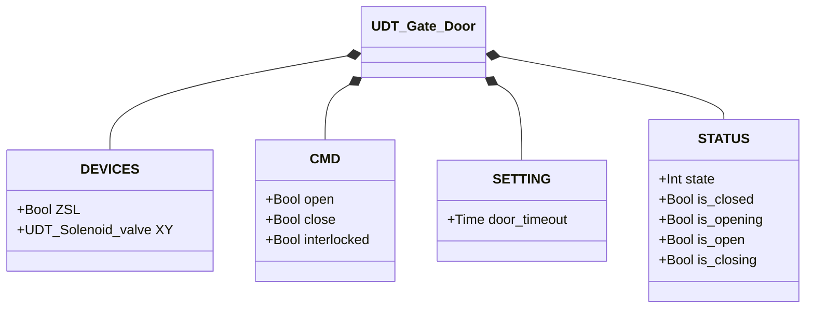
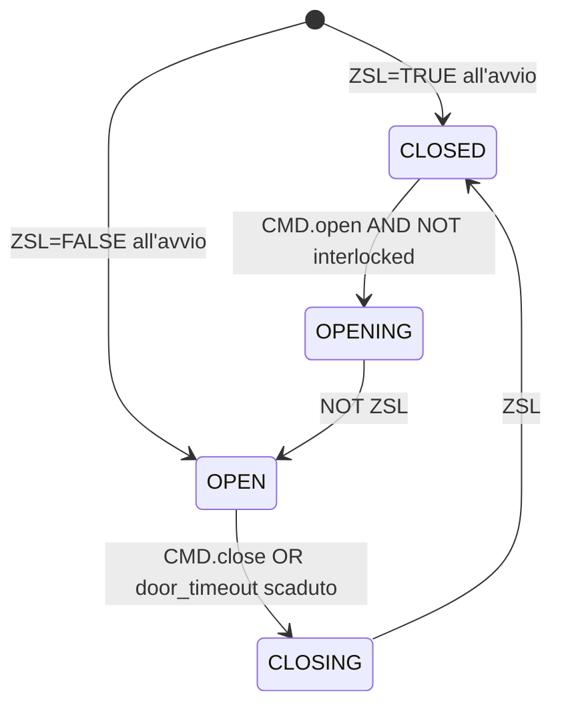

# Portello

## Panoramica

`Gate_door` gestisce un portello pneumatico a singolo effetto. Il solenoide (`XY`) comanda l'apertura: eccitato = portello in apertura o aperto; diseccitato = molla riporta il portello in chiusura. `ZSL` fornisce il feedback della posizione chiusa. L'orchestratore controlla il portello tramite `CMD.open` e `CMD.close`; `CMD.interlocked` blocca la transizione verso l'apertura quando attivo.

Non esiste struttura `ALARMS` separata né stato di guasto — il blocco è un Moore sequencer a quattro stati senza rilevamento d'errore proprio.

---

## Componenti principali

- **Attuatore pneumatico** — singolo effetto, ritorno a molla in chiusura
- **Elettrovalvola `XY`** — controlla l'aria all'attuatore: eccitata = porta verso apertura o mantiene aperta
- **Finecorsa `ZSL`** — TRUE = portello fisicamente in posizione chiusa
- **CMD.interlocked** — guardia attiva-alta: TRUE = transizione CLOSED → OPENING bloccata

---

## Segnali I/O

| Segnale | Tipo | Descrizione |
|---------|------|-------------|
| `DEVICES.ZSL` | Bool | INPUT — Finecorsa posizione chiusa: TRUE = portello chiuso |
| `DEVICES.XY` | UDT_Solenoid_valve | OUTPUT — Elettrovalvola attuatore |
| `CMD.open` | Bool | COMANDO — Richiesta apertura |
| `CMD.close` | Bool | COMANDO — Richiesta chiusura |
| `CMD.interlocked` | Bool | GUARDIA — TRUE = apertura bloccata dall'orchestratore |
| `STATUS.state` | Int | STATO — 1=Chiuso, 2=In apertura, 3=Aperto, 4=In chiusura |
| `STATUS.is_closed` | Bool | STATO — Portello fermo in posizione chiusa |
| `STATUS.is_opening` | Bool | STATO — Attuatore in movimento verso apertura |
| `STATUS.is_open` | Bool | STATO — Portello completamente aperto |
| `STATUS.is_closing` | Bool | STATO — Molla in rientro verso chiusura |

---

## Funzionamento

**CLOSED** — Il portello è fermo in posizione chiusa con `ZSL = TRUE`. Il solenoide è diseccitato. `CMD.open` con `NOT CMD.interlocked` transita verso OPENING. Se `interlocked = TRUE`, il comando viene ignorato.

**OPENING** — Il solenoide viene eccitato (`XY.CMD.auto = TRUE`) e l'attuatore spinge il portello verso l'apertura. Quando `ZSL` scende a FALSE, il portello non è più in posizione chiusa → transizione verso OPEN.

**OPEN** — Il solenoide rimane eccitato per mantenere il portello aperto contro la molla. `CMD.close` transita verso CLOSING.

**CLOSING** — Il solenoide viene diseccitato (`XY.CMD.auto = FALSE`); la molla riporta il portello in chiusura. Quando `ZSL` sale a TRUE, il portello ha raggiunto la posizione chiusa → transizione verso CLOSED.

**Inizializzazione** — Al primo ciclo PLC, lo stato viene derivato da `ZSL`: TRUE → CLOSED, FALSE → OPEN.

`CMD.interlocked` blocca solo la transizione CLOSED → OPENING. Non ha effetto sugli altri stati: un portello già aperto o in movimento non viene fermato dall'interblocco.

---

## Allarmi

`UDT_Gate_Door` non include una struttura `ALARMS`. Guasti dell'elettrovalvola sono visibili tramite `DEVICES.XY.ALARMS` (vedere [Elettrovalvola](../../valves/solenoid/index.it.md#allarmi)).

---

## Parametri

| Parametro | Default | Descrizione |
|-----------|---------|-------------|
| `SETTING.door_timeout` | T#3M | Tempo massimo in stato OPEN prima di avviare automaticamente la chiusura |

---

## Struttura dati

---

## Macchina a stati (FSM)

### Tabella stati e uscite

| Stato | Valore | XY.CMD.auto | Descrizione |
|-------|--------|-------------|-------------|
| CLOSED | 1 | FALSE | Portello chiuso, molla in posizione |
| OPENING | 2 | TRUE | Attuatore spinge il portello verso apertura |
| OPEN | 3 | TRUE | Portello aperto, solenoide mantiene contro la molla |
| CLOSING | 4 | FALSE | Molla riporta il portello in posizione chiusa |

### Tabella transizioni di stato

| Stato attuale | Condizione | Stato successivo | Azione |
|---------------|------------|-----------------|--------|
| CLOSED | `CMD.open` AND NOT `interlocked` | OPENING | `XY.CMD.auto` → TRUE |
| OPENING | NOT `ZSL` | OPEN | Avvia door_timer |
| OPEN | `CMD.close` OR `door_timer.Q` | CLOSING | `XY.CMD.auto` → FALSE |
| CLOSING | `ZSL` | CLOSED | — |
