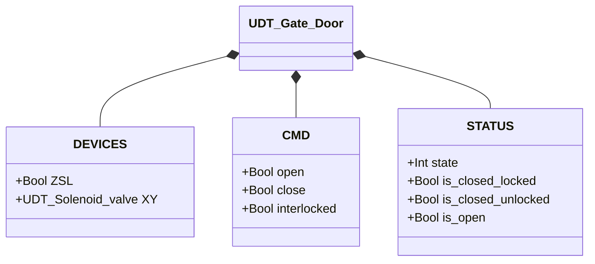
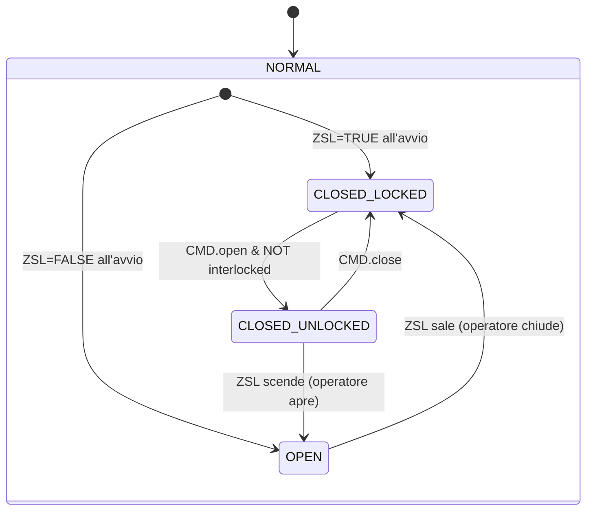

# Portello

## Panoramica

`Gate_door` gestisce un portello a blocco pneumatico in tre stati. Il solenoide (`XY`) controlla il chiavistello: eccitato = bloccato, diseccitato = rilasciato. Il portello viene aperto e chiuso fisicamente dall'operatore — non c'è attuatore di apertura. `ZSL` conferma la posizione fisica chiusa.

Il portello non ha modalità manuale/automatica standard né struttura `ALARMS` separata — il comportamento è determinato dai comandi dell'orchestratore (`CMD.open`, `CMD.close`, `CMD.interlocked`).

---

## Componenti principali

- **Chiavistello pneumatico** (`XY`) — solenoide che blocca il portello: eccitato = bloccato (CLOSED_LOCKED), diseccitato = rilasciato (CLOSED_UNLOCKED)
- **Finecorsa `ZSL`** — TRUE = portello fisicamente chiuso; FALSE = portello aperto
- **CMD.interlocked** — guardia attiva-bassa: FALSE = apertura consentita dall'orchestratore; TRUE = apertura bloccata

---

## Segnali I/O

| Segnale | Tipo | Descrizione |
|---------|------|-------------|
| `DEVICES.ZSL` | Bool | INPUT — Finecorsa posizione chiusa: TRUE = portello chiuso |
| `DEVICES.XY` | UDT_Solenoid_valve | OUTPUT — Solenoide chiavistello |
| `CMD.open` | Bool | COMANDO — Richiesta apertura (rilascio chiavistello) |
| `CMD.close` | Bool | COMANDO — Richiesta chiusura/blocco |
| `CMD.interlocked` | Bool | COMANDO — TRUE = apertura bloccata dall'orchestratore |
| `STATUS.state` | Int | STATO — 1=ClosedLocked, 2=ClosedUnlocked, 3=Open |
| `STATUS.is_closed_locked` | Bool | STATO — Portello chiuso e bloccato |
| `STATUS.is_closed_unlocked` | Bool | STATO — Portello chiuso ma sbloccato |
| `STATUS.is_open` | Bool | STATO — Portello aperto |

---

## Funzionamento

**CLOSED_LOCKED** — Il chiavistello è inserito (`XY.CMD.auto = TRUE`). `CMD.open` con `NOT interlocked` diseccita il solenoide → CLOSED_UNLOCKED. Se `interlocked = TRUE`, il comando `open` viene ignorato.

**CLOSED_UNLOCKED** — Il chiavistello è rilasciato (`XY.CMD.auto = FALSE`). Due transizioni possibili: `CMD.close` re-inserisce il chiavistello → CLOSED_LOCKED; oppure l'operatore spinge fisicamente il portello aperto → `ZSL` scende a FALSE → OPEN.

**OPEN** — Portello completamente aperto. Nessuna azione sul solenoide. Quando l'operatore riporta il portello in posizione chiusa → `ZSL` sale a TRUE → CLOSED_LOCKED (chiavistello si reinserisce automaticamente).

**Inizializzazione** — Al primo ciclo PLC, lo stato viene derivato dalla posizione fisica: `ZSL = TRUE` → CLOSED_LOCKED; `ZSL = FALSE` → OPEN.

---

## Allarmi

Il blocco `UDT_Gate_Door` non include una struttura `ALARMS` separata. Guasti del solenoide (`XY`) sono visibili tramite `DEVICES.XY.ALARMS`.

---

## Parametri

Nessun parametro configurabile in `UDT_Gate_Door`. Il simulatore espone `SIM_TRAVEL_TIME` (default `T#2S`) per la durata della corsa simulata.

---

## Struttura dati

<!-- AUTO-GENERATED: do not edit manually -->

---

## Macchina a stati (FSM)

<!-- AUTO-GENERATED: do not edit manually -->

### Tabella stati e uscite

| Stato | Valore | XY.CMD.auto | Descrizione |
|-------|--------|-------------|-------------|
| CLOSED_LOCKED | 1 | TRUE | Solenoide eccitato — chiavistello inserito |
| CLOSED_UNLOCKED | 2 | FALSE | Solenoide diseccitato — operatore può aprire |
| OPEN | 3 | FALSE | Portello fisicamente aperto |

### Tabella transizioni di stato

| Stato attuale | Condizione | Stato successivo | Azione |
|---------------|------------|-----------------|--------|
| CLOSED_LOCKED | `CMD.open` AND NOT `interlocked` | CLOSED_UNLOCKED | `XY.CMD.auto` → FALSE |
| CLOSED_UNLOCKED | `CMD.close` | CLOSED_LOCKED | `XY.CMD.auto` → TRUE |
| CLOSED_UNLOCKED | NOT `ZSL` | OPEN | — |
| OPEN | `ZSL` | CLOSED_LOCKED | `XY.CMD.auto` → TRUE |
