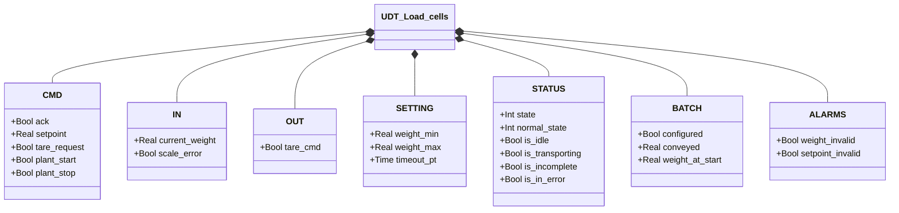
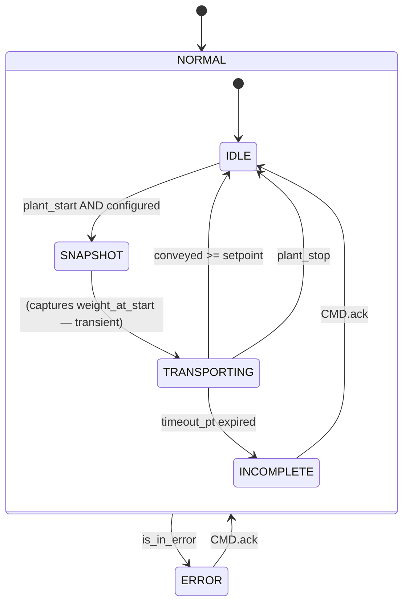

# Load Cells

## Overview

`Load_cells` controls a weight-based batch transport cycle. The FB reads the current weight from the transmitter, validates configuration conditions (weight within scale range, setpoint coherent with current weight), then monitors the quantity transported during the active cycle. Transport ends when the weight difference reaches the setpoint or when the orchestrator issues a stop command.

The block exposes `BATCH.configured` as a ready flag for the orchestrator: only when this is TRUE can the transport cycle start.

---

## Main Components

- **Load cells** — physical sensors generating the raw weight signal
- **Weight transmitter** — converts cell signal into `IN.current_weight` [kg]; publishes `IN.scale_error` on hardware fault
- **Orchestrator** — sends `CMD.plant_start` / `CMD.plant_stop`; reads `BATCH.configured`
- **Operator** — sets `CMD.setpoint`, sends `CMD.tare_request` if needed, acknowledges with `CMD.ack`

---

## I/O Signals

### Commands (`CMD` — from HMI/orchestrator)

| Signal | Type | Description |
|--------|------|-------------|
| `CMD.ack` | Bool | Operator acknowledgement for INCOMPLETE or ERROR |
| `CMD.setpoint` | Real | Weight to transport in the cycle [kg] |
| `CMD.tare_request` | Bool | Tare request to external transmitter |
| `CMD.plant_start` | Bool | Transport start from orchestrator |
| `CMD.plant_stop` | Bool | Immediate transport stop from orchestrator |

### Inputs (`IN` — from transmitter)

| Signal | Type | Description |
|--------|------|-------------|
| `IN.current_weight` | Real | Current weight in engineering units [kg] |
| `IN.scale_error` | Bool | Hardware fault from transmitter |

### Outputs (`OUT` — to transmitter)

| Signal | Type | Description |
|--------|------|-------------|
| `OUT.tare_cmd` | Bool | Tare command to external transmitter |

### Batch (`BATCH`)

| Signal | Type | Description |
|--------|------|-------------|
| `BATCH.configured` | Bool | TRUE when weight and setpoint are valid — ready for transport |
| `BATCH.conveyed` | Real | kg transported in the current cycle (computed every scan) |
| `BATCH.weight_at_start` | Real | Weight captured on TRANSPORTING entry [kg] |

### Status (`STATUS`)

| Signal | Type | Description |
|--------|------|-------------|
| `STATUS.state` | Int | Top-level FSM state: 1=NORMAL, 0=ERROR |
| `STATUS.normal_state` | Int | Sub-state: 1=IDLE, 2=SNAPSHOT, 3=TRANSPORTING, 0=INCOMPLETE |
| `STATUS.is_idle` | Bool | TRUE when state=NORMAL and normal_state=IDLE |
| `STATUS.is_transporting` | Bool | TRUE during active transport |
| `STATUS.is_incomplete` | Bool | TRUE when batch timed out without completing |
| `STATUS.is_in_error` | Bool | TRUE when state=ERROR |

### Alarms (`ALARMS`)

| Signal | Type | Description |
|--------|------|-------------|
| `ALARMS.weight_invalid` | Bool | Weight out of scale: `current_weight < weight_min` or `> weight_max` |
| `ALARMS.setpoint_invalid` | Bool | Invalid setpoint: ≤ 0 or ≥ current weight |

---

## Operating Routine

`BATCH.configured` is updated every scan from the condition:

```
configured = NOT weight_invalid AND NOT setpoint_invalid
```

`weight_invalid` triggers if weight is outside the range `[weight_min, weight_max]`. `setpoint_invalid` triggers if setpoint is ≤ 0 or ≥ current weight. While either is active, `configured = FALSE` and the orchestrator cannot start transport.

When `CMD.plant_start = TRUE` and `BATCH.configured = TRUE`, the FB enters **SNAPSHOT** (transient state) where it captures `weight_at_start := current_weight`, then advances immediately to **TRANSPORTING**.

In **TRANSPORTING**, every scan computes:

```
conveyed := weight_at_start − current_weight   (clamped to 0 to avoid negative display on sensor drift)
```

Transport ends when:
- `conveyed ≥ setpoint` → IDLE (completed)
- `CMD.plant_stop` → IDLE (stopped by orchestrator)
- `timeout_pt` expires → INCOMPLETE (timed out, waits for `ack`)

In **INCOMPLETE**, the batch failed due to timeout. The operator must acknowledge with `CMD.ack` to return to IDLE.

In **ERROR**, all normal operation is blocked. `CMD.ack` returns the block to NORMAL/IDLE.

---

## Alarms

| ID | Condition | Cause |
|----|-----------|-------|
| LC-A01 | `ALARMS.weight_invalid` | Weight out of hardware scale range (`weight_min` / `weight_max`) — check cells, wiring, transmitter |
| LC-A02 | `ALARMS.setpoint_invalid` | Setpoint not physically achievable — verify setpoint < current_weight and > 0 |
| LC-W01 | `STATUS.is_incomplete` | Transport timed out without reaching setpoint (`timeout_pt`) |

---

## Settings

| Parameter | Default | Description |
|-----------|---------|-------------|
| `SETTING.weight_min` | 10.0 kg | Lower valid weight threshold |
| `SETTING.weight_max` | 1000.0 kg | Upper valid weight threshold — physical scale limit |
| `SETTING.timeout_pt` | T#2M | Maximum TRANSPORTING cycle duration before INCOMPLETE |

---

## Data Structure



---

## State Machine (FSM)



### State and Output Table

| State | Value | Description |
|-------|-------|-------------|
| ERROR | state=0 | Operation blocked; waits for ack |
| IDLE | normal_state=1 | Waiting for plant_start |
| SNAPSHOT | normal_state=2 | Captures initial weight (transient, 1 scan) |
| TRANSPORTING | normal_state=3 | Active transport; `conveyed` updated every scan |
| INCOMPLETE | normal_state=0 | Timeout; waits for operator acknowledgement |

### State Transition Table

| Current State | Condition | Next State |
|---------------|-----------|------------|
| IDLE | `plant_start` AND `BATCH.configured` | SNAPSHOT |
| SNAPSHOT | — (transient) | TRANSPORTING |
| TRANSPORTING | `conveyed >= setpoint` | IDLE |
| TRANSPORTING | `CMD.plant_stop` | IDLE |
| TRANSPORTING | `timeout_timer.Q` | INCOMPLETE |
| INCOMPLETE | `CMD.ack` | IDLE |
| ERROR | `CMD.ack` | NORMAL/IDLE |
