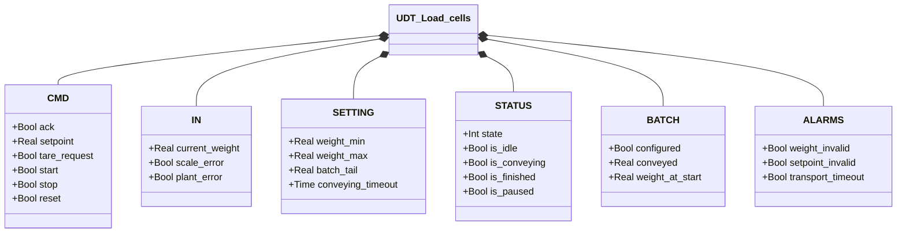
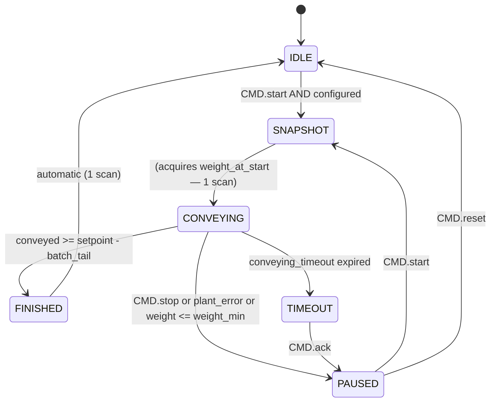

# Load Cells

## Overview

`Load_cells` controls a weight-based batch transport cycle. It validates scale and setpoint conditions, takes a weight snapshot at the start of each run, then tracks quantity transported until the batch is complete, stopped, or timed out. Pause and resume are supported without losing the already-transported count.

`BATCH.configured` is the ready flag for the orchestrator: the cycle can only start when TRUE.

The `Pavone_DAT_1400` function is an optional hardware adapter that converts raw Pavone DAT 1400 transmitter registers into the `IN` format expected by `UDT_Load_cells`.

---

## Main Components

- **Load cells** — physical sensors producing the raw weight signal
- **Transmitter** — converts signal to `IN.current_weight` [kg]; reports faults via `IN.scale_error` and `IN.plant_error`
- **`Pavone_DAT_1400`** — optional FC: scales `net_weight` and handles tare command for the Pavone DAT 1400 transmitter
- **Orchestrator** — sends `CMD.start` / `CMD.stop` / `CMD.reset`; reads `BATCH.configured`

---

## I/O Signals

### Commands (`CMD`)

| Signal | Type | Description |
|--------|------|-------------|
| `CMD.ack` | Bool | Acknowledge for TIMEOUT state |
| `CMD.setpoint` | Real | Weight to transport in this batch [kg] |
| `CMD.tare_request` | Bool | Request tare from transmitter |
| `CMD.start` | Bool | Start or resume batch |
| `CMD.stop` | Bool | Pause transport immediately |
| `CMD.reset` | Bool | Return to IDLE from PAUSED state |

### Inputs (`IN` — from transmitter)

| Signal | Type | Description |
|--------|------|-------------|
| `IN.current_weight` | Real | Current weight reading [kg] |
| `IN.scale_error` | Bool | Transmitter hardware fault |
| `IN.plant_error` | Bool | External plant error (e.g. material loss) |

### Status (`STATUS`)

| Signal | Type | Description |
|--------|------|-------------|
| `STATUS.state` | Int | FSM state: 1=IDLE, 2=SNAPSHOT, 3=CONVEYING, 4=PAUSED, 5=FINISHED, 0=TIMEOUT |
| `STATUS.is_idle` | Bool | TRUE in IDLE |
| `STATUS.is_conveying` | Bool | TRUE in CONVEYING |
| `STATUS.is_paused` | Bool | TRUE in PAUSED |
| `STATUS.is_finished` | Bool | TRUE in FINISHED (lasts 1 scan, then auto-IDLE) |

### Batch (`BATCH`)

| Signal | Type | Description |
|--------|------|-------------|
| `BATCH.configured` | Bool | TRUE when weight and setpoint are valid |
| `BATCH.conveyed` | Real | kg transported in current batch |
| `BATCH.weight_at_start` | Real | Weight snapshot taken at CONVEYING entry [kg] |

### Alarms (`ALARMS`)

| Signal | Type | Description |
|--------|------|-------------|
| `ALARMS.weight_invalid` | Bool | Weight outside `[weight_min, weight_max]` |
| `ALARMS.setpoint_invalid` | Bool | Setpoint ≤ 0 |
| `ALARMS.transport_timeout` | Bool | TRUE when state = TIMEOUT |

---

## Operating Routine

`BATCH.configured` is updated every scan:

```
configured = NOT weight_invalid AND NOT setpoint_invalid
```

`weight_invalid` trips if weight is outside `[weight_min, weight_max]`. `setpoint_invalid` trips if setpoint ≤ 0. The batch cannot start while either is active.

**IDLE** — Waiting for `CMD.start` with `BATCH.configured = TRUE`. `BATCH.conveyed` is reset to 0 on every re-entry to IDLE.

**SNAPSHOT** — Transient state (one scan). Acquires `weight_at_start`. On first start: `weight_at_start := current_weight`. On resume after pause: `weight_at_start := current_weight + conveyed` — this re-anchors the calculation so `conveyed` continues from the correct value.

**CONVEYING** — Transport active. Every scan computes `conveyed := weight_at_start - current_weight` (clamped to 0). Cycle ends on the first matching condition:
- `conveyed ≥ setpoint - batch_tail` → FINISHED
- `CMD.stop` OR `current_weight ≤ weight_min` OR `IN.plant_error` → PAUSED
- `conveying_timeout` expired → TIMEOUT

`batch_tail` cuts off transport slightly before the full setpoint to account for in-flight material.

**PAUSED** — Transport suspended; `BATCH.conveyed` frozen. `CMD.start` resumes (→ SNAPSHOT). `CMD.reset` cancels the batch (→ IDLE).

**FINISHED** — Setpoint reached. Active for exactly one scan, then the system returns to IDLE automatically.

**TIMEOUT** — `conveying_timeout` expired during transport. `ALARMS.transport_timeout = TRUE`. `CMD.ack` moves to PAUSED (batch can then be resumed or cancelled).

---

## Alarms

| ID | Condition | Cause |
|----|-----------|-------|
| LC-A01 | `ALARMS.weight_invalid` | Weight out of scale range — check load cells, wiring, transmitter |
| LC-A02 | `ALARMS.setpoint_invalid` | Setpoint ≤ 0 — set a positive value |
| LC-W01 | `ALARMS.transport_timeout` | CONVEYING cycle exceeded `conveying_timeout` — check plant, valve, or material supply |

---

## Settings

| Parameter | Default | Description |
|-----------|---------|-------------|
| `SETTING.weight_min` | 10.0 | Lower valid weight threshold [kg] |
| `SETTING.weight_max` | 1000.0 | Upper valid weight threshold [kg] |
| `SETTING.batch_tail` | — | Early cut-off before setpoint [kg] |
| `SETTING.conveying_timeout` | T#10M | Maximum CONVEYING duration before TIMEOUT |

---

## Data Structure



---

## State Machine (FSM)



### State and Output Table

| State | Value | Description |
|-------|-------|-------------|
| TIMEOUT | 0 | Timer expired; `transport_timeout=TRUE`; awaiting ACK |
| IDLE | 1 | Waiting for start with `configured=TRUE`; `conveyed=0` |
| SNAPSHOT | 2 | Acquires `weight_at_start` (transient, 1 scan) |
| CONVEYING | 3 | Transport active; `conveyed` updated every scan |
| PAUSED | 4 | Batch suspended; `conveyed` frozen |
| FINISHED | 5 | Setpoint reached; auto-transitions to IDLE |

### State Transition Table

| Current state | Condition | Next state |
|---------------|-----------|------------|
| IDLE | `CMD.start` AND `BATCH.configured` | SNAPSHOT |
| SNAPSHOT | — (transient) | CONVEYING |
| CONVEYING | `conveyed ≥ setpoint − batch_tail` | FINISHED |
| CONVEYING | `CMD.stop` OR `plant_error` OR `current_weight ≤ weight_min` | PAUSED |
| CONVEYING | `conveying_timeout` expired | TIMEOUT |
| FINISHED | — (automatic, 1 scan) | IDLE |
| PAUSED | `CMD.start` | SNAPSHOT |
| PAUSED | `CMD.reset` | IDLE |
| TIMEOUT | `CMD.ack` | PAUSED |
