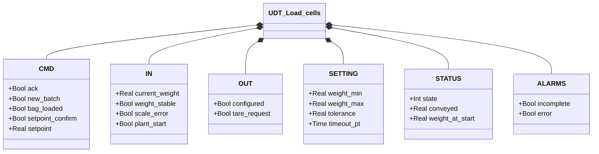
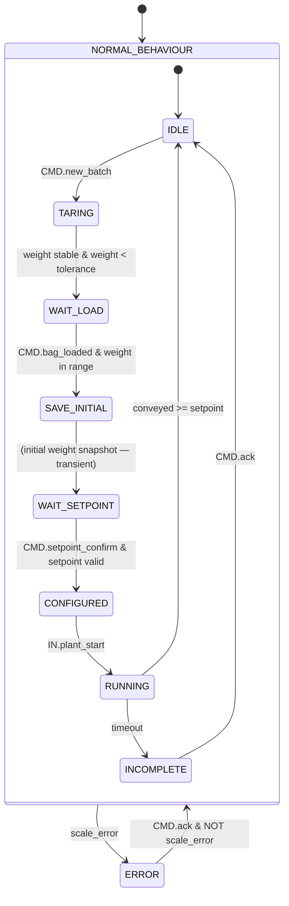

# Load Cells

## Overview

`Load_cells` manages a batch weighing cycle in an operator-guided sequence. The FB receives the current weight in engineering units, a stability flag, and a hardware error flag — the mapping from the physical transmitter (typically a DAT 1400 via PROFINET) is delegated to an external integration layer.

The full cycle follows the sequence: tare → load bag → snapshot initial weight → confirm setpoint → transport → complete. Any hardware error in any state forces an immediate transition to ERROR.

---

## Main Components

- **Load cells** — physical sensors generating the raw weight signal
- **Weight transmitter** — converts the cell signal into `IN.current_weight` [kg] and publishes `IN.weight_stable`, `IN.scale_error`
- **Operator HMI** — enters `CMD.setpoint` and sends `CMD.setpoint_confirm`, `CMD.bag_loaded`, `CMD.new_batch`
- **Orchestrator** — sends `IN.plant_start` when the system is ready to transport; reads `OUT.configured`

---

## I/O Signals

### Inputs (`IN` — from transmitter/system)

| Signal | Type | Description |
|--------|------|-------------|
| `IN.current_weight` | Real | Current weight in engineering units [kg] |
| `IN.weight_stable` | Bool | TRUE = scale is stable |
| `IN.scale_error` | Bool | Aggregated hardware fault (overload, underload, sensor error) |
| `IN.plant_start` | Bool | Transport start command from the Orchestrator |

### Commands (`CMD` — from HMI/Orchestrator)

| Signal | Type | Description |
|--------|------|-------------|
| `CMD.new_batch` | Bool | Start new batch cycle (IDLE → TARING) |
| `CMD.bag_loaded` | Bool | Operator confirms bag is loaded |
| `CMD.setpoint` | Real | Batch weight to convey [kg] |
| `CMD.setpoint_confirm` | Bool | Operator confirms the entered setpoint |
| `CMD.ack` | Bool | Operator acknowledgement for INCOMPLETE or ERROR |

### Outputs (`OUT` — to Orchestrator)

| Signal | Type | Description |
|--------|------|-------------|
| `OUT.configured` | Bool | FB in CONFIGURED state — ready to transport |
| `OUT.tare_request` | Bool | FB in TARING state — requests tare from transmitter |

### Alarms (`ALARMS`)

| Signal | Type | Description |
|--------|------|-------------|
| `ALARMS.incomplete` | Bool | Batch timed out without reaching setpoint |
| `ALARMS.error` | Bool | Active hardware fault (propagated from `IN.scale_error`) |

### Status (`STATUS`)

| Signal | Type | Description |
|--------|------|-------------|
| `STATUS.state` | Int | Current FSM state (see state table) |
| `STATUS.conveyed` | Real | kg conveyed so far in the current cycle |
| `STATUS.weight_at_start` | Real | Weight captured on RUNNING entry [kg] |

---

## Operating Routine

The batch cycle follows a one-way sequential state progression. Any hardware error (`IN.scale_error`) causes an immediate transition to ERROR from any state.

**IDLE** — Waits for `CMD.new_batch`. No active outputs. Initial state and return state after a completed batch.

**TARING** — Publishes `OUT.tare_request = TRUE` to request a tare from the transmitter. Advances to WAIT_LOAD when `IN.current_weight < SETTING.tolerance` and `IN.weight_stable` — the scale has accepted the tare and the net weight is stable at zero.

**WAIT_LOAD** — Waits for the operator to load the bag and send `CMD.bag_loaded`. Weight must be within `[SETTING.weight_min, SETTING.weight_max]`. Diagnostic `weight_out_of_range` is active while weight is out of range.

**SAVE_INITIAL** — Transient state: captures `weight_at_start := IN.current_weight` in a single PLC scan, then advances immediately to WAIT_SETPOINT.

**WAIT_SETPOINT** — Waits for the operator to enter `CMD.setpoint` and send `CMD.setpoint_confirm`. Setpoint must be > 0 and ≤ current weight. Diagnostic `setpoint_invalid` is active while setpoint is invalid.

**CONFIGURED** — Publishes `OUT.configured = TRUE`. Waits for `IN.plant_start` from the Orchestrator.

**RUNNING** — Computes `STATUS.conveyed := weight_at_start - IN.current_weight` every scan (clamped to zero for drift). Advances to IDLE when `conveyed ≥ setpoint`. Advances to INCOMPLETE when `SETTING.timeout_pt` expires.

**INCOMPLETE** — Publishes `ALARMS.incomplete = TRUE`. Waits for `CMD.ack` before returning to IDLE. Does not auto-retry.

**ERROR** — Publishes `ALARMS.error = TRUE`. Waits for `CMD.ack` with `IN.scale_error = FALSE` before returning to IDLE.

---

## Alarms

| ID | Condition | Cause |
|----|-----------|-------|
| LC-E01 | `ALARMS.error` | `IN.scale_error = TRUE` (hardware fault from transmitter) |
| LC-W01 | `ALARMS.incomplete` | Transport timed out without reaching `CMD.setpoint` |

---

## Settings

| Parameter | Default | Description |
|-----------|---------|-------------|
| `SETTING.weight_min` | 10.0 kg | Minimum valid weight for bag-loaded confirmation |
| `SETTING.weight_max` | 1000.0 kg | Maximum valid weight — hardware scale limit |
| `SETTING.tolerance` | 0.5 kg | Net weight threshold to confirm tare accepted |
| `SETTING.timeout_pt` | — | Maximum RUNNING cycle duration before INCOMPLETE |

---

## Data Structure

<!-- AUTO-GENERATED: do not edit manually -->

---

## State Machine (FSM)

<!-- AUTO-GENERATED: do not edit manually -->

### State and Output Table

| State | Value | Active Output | Description |
|-------|-------|---------------|-------------|
| ERROR | 0 | `ALARMS.error` | Hardware fault; waits for ack with fault cleared |
| IDLE | 1 | — | Waiting for new batch |
| TARING | 2 | `OUT.tare_request` | Requesting tare from transmitter |
| WAIT_LOAD | 3 | — | Waiting for operator to load bag |
| SAVE_INITIAL | 4 | — | Snapshot of initial weight (transient) |
| WAIT_SETPOINT | 5 | — | Waiting for operator setpoint |
| CONFIGURED | 6 | `OUT.configured` | Ready; waiting for plant_start from Orchestrator |
| RUNNING | 7 | — | Transport active; computes conveyed every scan |
| INCOMPLETE | 8 | `ALARMS.incomplete` | Timeout; awaiting operator acknowledgement |

### State Transition Table

| Current State | Condition | Next State |
|---------------|-----------|------------|
| IDLE | `CMD.new_batch` | TARING |
| TARING | `current_weight < tolerance` AND `weight_stable` | WAIT_LOAD |
| WAIT_LOAD | `CMD.bag_loaded` AND weight in range | SAVE_INITIAL |
| SAVE_INITIAL | — (transient) | WAIT_SETPOINT |
| WAIT_SETPOINT | `CMD.setpoint_confirm` AND setpoint valid | CONFIGURED |
| CONFIGURED | `IN.plant_start` | RUNNING |
| RUNNING | `conveyed >= setpoint` | IDLE |
| RUNNING | `timeout_timer.Q` | INCOMPLETE |
| INCOMPLETE | `CMD.ack` | IDLE |
| ERROR | `CMD.ack` AND NOT `scale_error` | IDLE |
| any | `IN.scale_error` | ERROR |
