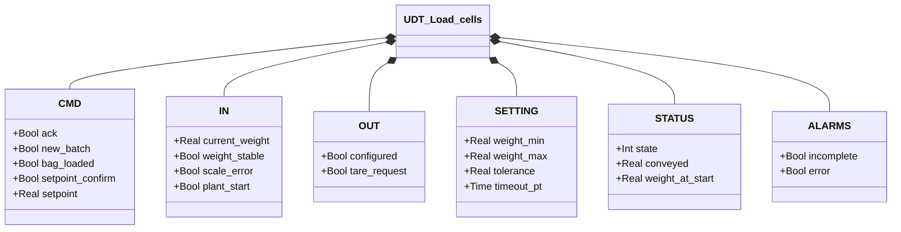
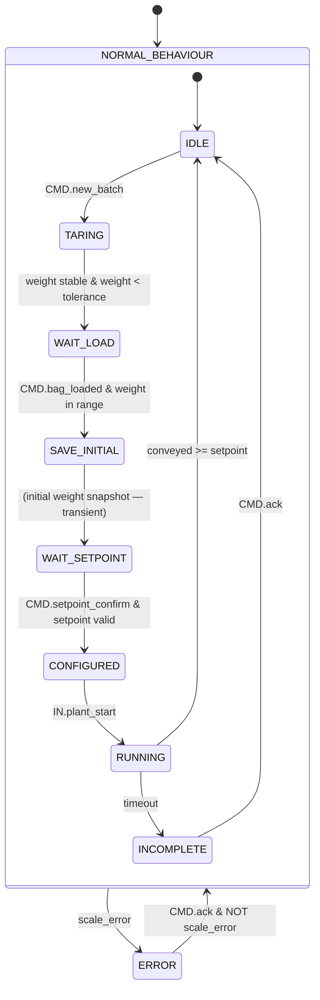

# Celle di Carico

## Panoramica

`Load_cells` gestisce un ciclo di pesatura batch in sequenza operatore-guidata. Il FB riceve il peso corrente in unità ingegneristiche, un flag di stabilità e un flag di errore hardware — il mapping dal trasmettitore fisico (tipicamente DAT 1400 via PROFINET) è delegato a un livello di integrazione esterno.

Il ciclo completo segue la sequenza: tara → carica sacco → acquisisce peso iniziale → conferma setpoint → trasporto → completato. Ogni errore hardware in qualsiasi stato forza la transizione immediata in ERROR.

---

## Componenti principali

- **Celle di carico** — sensori fisici che generano il segnale di peso grezzo
- **Trasmettitore peso** — converte il segnale celle in `IN.current_weight` [kg] e pubblica `IN.weight_stable`, `IN.scale_error`
- **HMI operatore** — inserisce `CMD.setpoint` e invia `CMD.setpoint_confirm`, `CMD.bag_loaded`, `CMD.new_batch`
- **Orchestratore** — invia `IN.plant_start` quando il sistema è pronto al trasporto; legge `OUT.configured`

---

## Segnali I/O

### Ingressi (`IN` — da trasmettitore/sistema)

| Segnale | Tipo | Descrizione |
|---------|------|-------------|
| `IN.current_weight` | Real | Peso corrente in unità ingegneristiche [kg] |
| `IN.weight_stable` | Bool | TRUE = bilancia stabile |
| `IN.scale_error` | Bool | Guasto hardware aggregato (sovraccarico, sottocarico, errore sensore) |
| `IN.plant_start` | Bool | Comando avvio trasporto dall'orchestratore |

### Comandi (`CMD` — da HMI/orchestratore)

| Segnale | Tipo | Descrizione |
|---------|------|-------------|
| `CMD.new_batch` | Bool | Avvia nuovo ciclo batch (IDLE → TARING) |
| `CMD.bag_loaded` | Bool | Operatore conferma che il sacco è caricato |
| `CMD.setpoint` | Real | Peso batch da trasportare [kg] |
| `CMD.setpoint_confirm` | Bool | Operatore conferma il setpoint inserito |
| `CMD.ack` | Bool | Conferma operatore per INCOMPLETE o ERROR |

### Uscite (`OUT` — verso orchestratore)

| Segnale | Tipo | Descrizione |
|---------|------|-------------|
| `OUT.configured` | Bool | FB in stato CONFIGURED — pronto al trasporto |
| `OUT.tare_request` | Bool | FB in stato TARING — richiede tara al trasmettitore |

### Allarmi (`ALARMS`)

| Segnale | Tipo | Descrizione |
|---------|------|-------------|
| `ALARMS.incomplete` | Bool | Batch scaduto senza raggiungere il setpoint |
| `ALARMS.error` | Bool | Guasto hardware attivo (propagato da `IN.scale_error`) |

### Stato (`STATUS`)

| Segnale | Tipo | Descrizione |
|---------|------|-------------|
| `STATUS.state` | Int | Stato FSM corrente (vedere tabella stati) |
| `STATUS.conveyed` | Real | kg trasportati finora nel ciclo corrente |
| `STATUS.weight_at_start` | Real | Peso acquisito all'ingresso di RUNNING [kg] |

---

## Funzionamento

Il ciclo batch segue una sequenza di stati in avanzamento unidirezionale. Qualsiasi errore hardware (`IN.scale_error`) causa transizione immediata in ERROR da qualsiasi stato.

**IDLE** — Attende `CMD.new_batch`. Nessuna uscita attiva. Stato iniziale e di ritorno a ciclo completato.

**TARING** — Pubblica `OUT.tare_request = TRUE` per richiedere la tara al trasmettitore. Avanza a WAIT_LOAD quando `IN.current_weight < SETTING.tolerance` e `IN.weight_stable` — la bilancia ha accettato la tara e il peso netto è stabile a zero.

**WAIT_LOAD** — Attende che l'operatore carichi il sacco e invii `CMD.bag_loaded`. Il peso deve rientrare in `[SETTING.weight_min, SETTING.weight_max]`. Diagnosi `weight_out_of_range` attiva mentre il peso è fuori range.

**SAVE_INITIAL** — Stato transiente: acquisisce `weight_at_start := IN.current_weight` in un singolo ciclo PLC, poi avanza immediatamente a WAIT_SETPOINT.

**WAIT_SETPOINT** — Attende che l'operatore inserisca `CMD.setpoint` e invii `CMD.setpoint_confirm`. Il setpoint deve essere > 0 e ≤ peso corrente. Diagnosi `setpoint_invalid` attiva mentre il setpoint non è valido.

**CONFIGURED** — Pubblica `OUT.configured = TRUE`. Attende `IN.plant_start` dall'orchestratore.

**RUNNING** — Calcola `STATUS.conveyed := weight_at_start - IN.current_weight` ad ogni ciclo (clampato a zero per deriva). Avanza a IDLE quando `conveyed ≥ setpoint`. Avanza a INCOMPLETE allo scadere di `SETTING.timeout_pt`.

**INCOMPLETE** — Pubblica `ALARMS.incomplete = TRUE`. Attende `CMD.ack` prima di tornare a IDLE. Non esegue tentativi automatici.

**ERROR** — Pubblica `ALARMS.error = TRUE`. Attende `CMD.ack` con `IN.scale_error = FALSE` prima di tornare a IDLE.

---

## Allarmi

| ID | Condizione | Causa |
|----|------------|-------|
| LC-E01 | `ALARMS.error` | `IN.scale_error = TRUE` (guasto hardware dal trasmettitore) |
| LC-W01 | `ALARMS.incomplete` | Trasporto scaduto senza raggiungere `CMD.setpoint` |

---

## Parametri

| Parametro | Default | Descrizione |
|-----------|---------|-------------|
| `SETTING.weight_min` | 10.0 kg | Peso minimo valido per considerare il sacco caricato |
| `SETTING.weight_max` | 1000.0 kg | Peso massimo valido — limite fisico bilancia |
| `SETTING.tolerance` | 0.5 kg | Soglia peso netto per confermare tara accettata |
| `SETTING.timeout_pt` | — | Durata massima del ciclo RUNNING prima di INCOMPLETE |

---

## Struttura dati

<!-- AUTO-GENERATED: do not edit manually -->

---

## Macchina a stati (FSM)

<!-- AUTO-GENERATED: do not edit manually -->

### Tabella stati e uscite

| Stato | Valore | Uscita attiva | Descrizione |
|-------|--------|---------------|-------------|
| ERROR | 0 | `ALARMS.error` | Guasto hardware; attende ack con fault cleared |
| IDLE | 1 | — | In attesa nuovo batch |
| TARING | 2 | `OUT.tare_request` | Richiesta tara al trasmettitore |
| WAIT_LOAD | 3 | — | Attende carico sacco dall'operatore |
| SAVE_INITIAL | 4 | — | Acquisisce peso iniziale (transiente) |
| WAIT_SETPOINT | 5 | — | Attende setpoint dall'operatore |
| CONFIGURED | 6 | `OUT.configured` | Pronto; attende plant_start dall'orchestratore |
| RUNNING | 7 | — | Trasporto attivo; calcola conveyed ogni ciclo |
| INCOMPLETE | 8 | `ALARMS.incomplete` | Timeout; attende conferma operatore |

### Tabella transizioni di stato

| Stato attuale | Condizione | Stato successivo |
|---------------|------------|-----------------|
| IDLE | `CMD.new_batch` | TARING |
| TARING | `current_weight < tolerance` AND `weight_stable` | WAIT_LOAD |
| WAIT_LOAD | `CMD.bag_loaded` AND peso in range | SAVE_INITIAL |
| SAVE_INITIAL | — (transiente) | WAIT_SETPOINT |
| WAIT_SETPOINT | `CMD.setpoint_confirm` AND setpoint valido | CONFIGURED |
| CONFIGURED | `IN.plant_start` | RUNNING |
| RUNNING | `conveyed >= setpoint` | IDLE |
| RUNNING | `timeout_timer.Q` | INCOMPLETE |
| INCOMPLETE | `CMD.ack` | IDLE |
| ERROR | `CMD.ack` AND NOT `scale_error` | IDLE |
| qualsiasi | `IN.scale_error` | ERROR |
