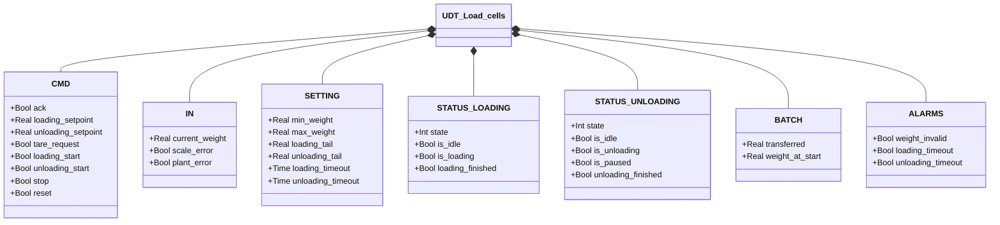
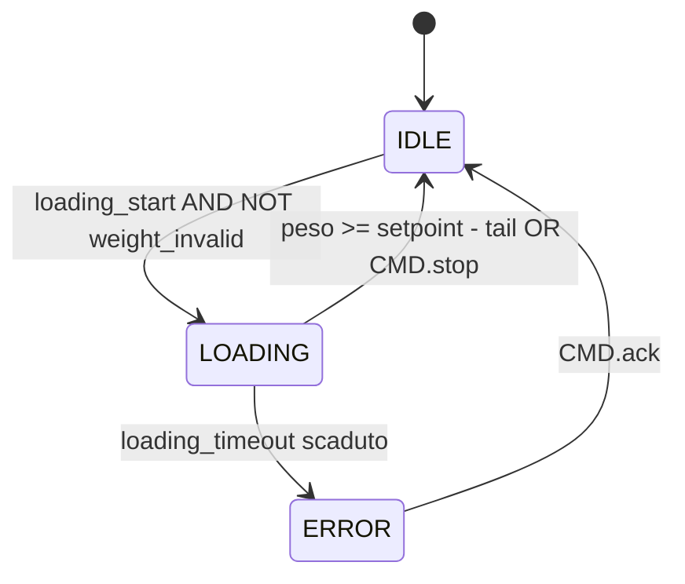
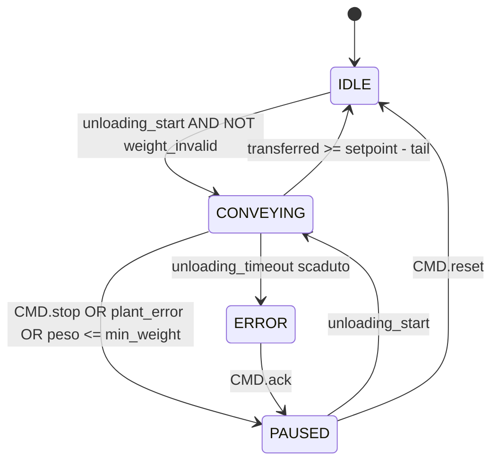

# Celle di Carico

## Panoramica

`UDT_Load_cells` è la struttura dati condivisa tra due blocchi funzionali indipendenti — `Loading` e `Unloading` — e l'adattatore hardware `Pavone_DAT_1400`. Ogni blocco gestisce la propria macchina a stati tramite i campi `STATUS.LOADING` e `STATUS.UNLOADING` della stessa istanza UDT.

`Loading` gestisce il riempimento di un contenitore a peso. `Unloading` gestisce lo svuotamento con possibilità di pausa e ripresa. `Pavone_DAT_1400` è un FC opzionale che converte i registri raw del trasmettitore Pavone DAT 1400 nei campi `IN` dell'UDT.

---

## Componenti principali

- **Celle di carico** — sensori fisici che generano il segnale di peso grezzo
- **Trasmettitore** — converte il segnale in `IN.current_weight` [kg]; segnala guasti tramite `IN.scale_error` e `IN.plant_error`
- **`Pavone_DAT_1400`** — FC opzionale: scala `net_weight` via decimali e gestisce il comando tara (bit `16#4` nel registro di comando)
- **`Loading`** — FB di carico: gestisce riempimento fino al setpoint con rilevamento timeout
- **`Unloading`** — FB di scarico: gestisce convogliamento con supporto pausa/ripresa

---

## Segnali I/O

### Comandi (`CMD`)

| Segnale | Tipo | Descrizione |
|---------|------|-------------|
| `CMD.ack` | Bool | Conferma per stato ERROR (Loading o Unloading) |
| `CMD.loading_setpoint` | Real | Peso target di carico [kg] |
| `CMD.unloading_setpoint` | Real | Peso da scaricare nel ciclo [kg] |
| `CMD.tare_request` | Bool | Richiesta tara al trasmettitore |
| `CMD.loading_start` | Bool | Avvio ciclo di carico |
| `CMD.unloading_start` | Bool | Avvio o ripresa ciclo di scarico |
| `CMD.stop` | Bool | Arresto del ciclo attivo |
| `CMD.reset` | Bool | Ritorno a IDLE da PAUSED (solo Unloading) |

### Ingressi (`IN` — dal trasmettitore)

| Segnale | Tipo | Descrizione |
|---------|------|-------------|
| `IN.current_weight` | Real | Peso corrente [kg] |
| `IN.scale_error` | Bool | Guasto hardware trasmettitore |
| `IN.plant_error` | Bool | Errore di impianto esterno (es. perdita materiale) |

### Stato Loading (`STATUS.LOADING`)

| Segnale | Tipo | Descrizione |
|---------|------|-------------|
| `STATUS.LOADING.state` | Int | Stato FSM: 0=ERROR, 1=IDLE, 2=LOADING |
| `STATUS.LOADING.is_idle` | Bool | TRUE in IDLE |
| `STATUS.LOADING.is_loading` | Bool | TRUE durante il carico |
| `STATUS.LOADING.loading_finished` | Bool | Impulso 1-scan all'ingresso in IDLE dopo un carico completato |

### Stato Unloading (`STATUS.UNLOADING`)

| Segnale | Tipo | Descrizione |
|---------|------|-------------|
| `STATUS.UNLOADING.state` | Int | Stato FSM: 0=ERROR, 1=IDLE, 2=CONVEYING, 3=PAUSED |
| `STATUS.UNLOADING.is_idle` | Bool | TRUE in IDLE |
| `STATUS.UNLOADING.is_unloading` | Bool | TRUE durante il convogliamento (CONVEYING) |
| `STATUS.UNLOADING.is_paused` | Bool | TRUE in PAUSED |
| `STATUS.UNLOADING.unloading_finished` | Bool | Impulso 1-scan all'ingresso in IDLE dopo scarico completato |

### Batch (`BATCH`)

| Segnale | Tipo | Descrizione |
|---------|------|-------------|
| `BATCH.transferred` | Real | Quantità elaborata nel ciclo corrente [kg] |
| `BATCH.weight_at_start` | Real | Peso acquisito all'ingresso della fase attiva [kg] |

### Allarmi (`ALARMS`)

| Segnale | Tipo | Descrizione |
|---------|------|-------------|
| `ALARMS.weight_invalid` | Bool | Peso fuori scala (carico: > max_weight; scarico: < min_weight o > max_weight) |
| `ALARMS.loading_timeout` | Bool | TRUE quando Loading è in ERROR |
| `ALARMS.unloading_timeout` | Bool | TRUE quando Unloading è in ERROR |

---

## Funzionamento

### FB Loading

**IDLE** — Attende `CMD.loading_start` con peso valido (`NOT weight_invalid`). All'ingresso in IDLE: `BATCH.transferred := 0`.

**LOADING** — Calcola ogni scan: `BATCH.transferred := current_weight − weight_at_start` (clampato a 0). Il carico termina quando:
- `current_weight ≥ loading_setpoint − loading_tail` → IDLE (loading_finished = TRUE per 1 scan)
- `CMD.stop` → IDLE
- `loading_timeout` scaduto → ERROR

`weight_at_start` viene acquisito all'ingresso in LOADING.

**ERROR** — `ALARMS.loading_timeout = TRUE`. `CMD.ack` riporta a IDLE.

### FB Unloading

**IDLE** — Attende `CMD.unloading_start` con peso valido. All'ingresso in IDLE: `BATCH.transferred := 0`.

**CONVEYING** — Calcola ogni scan: `BATCH.transferred := weight_at_start − current_weight` (clampato a 0). Termina quando:
- `BATCH.transferred ≥ unloading_setpoint − unloading_tail` → IDLE (unloading_finished = TRUE per 1 scan)
- `CMD.stop` OR `current_weight ≤ min_weight` OR `IN.plant_error` → PAUSED
- `unloading_timeout` scaduto → ERROR

Alla ripresa (PAUSED → CONVEYING): `weight_at_start := current_weight + transferred` — l'ancora viene ricalcolata così il contatore `transferred` prosegue senza scatti.

**PAUSED** — `BATCH.transferred` congelato. `CMD.unloading_start` riprende; `CMD.reset` torna a IDLE.

**ERROR** — `ALARMS.unloading_timeout = TRUE`. `CMD.ack` passa a PAUSED.

### FC Pavone_DAT_1400

Converte i dati grezzi del trasmettitore in ingresso:

```
scale.IN.scale_error := dat_IN.Status_register.weight_error
scale.IN.current_weight := DINT_TO_REAL(net_weight) × 10^(−decimals)
```

In output: `dat_OUT.Command_register := 16#4` se `CMD.tare_request`, altrimenti 0.

---

## Allarmi

| ID | Condizione | Causa |
|----|------------|-------|
| LC-A01 | `ALARMS.weight_invalid` | Peso fuori scala — verificare celle, cablaggio, trasmettitore |
| LC-E01 | `ALARMS.loading_timeout` | Ciclo di carico durato oltre `loading_timeout` — verificare l'impianto |
| LC-E02 | `ALARMS.unloading_timeout` | Ciclo di scarico durato oltre `unloading_timeout` — verificare l'impianto |

---

## Parametri

| Parametro | Default | Descrizione |
|-----------|---------|-------------|
| `SETTING.min_weight` | 0.0 | Soglia inferiore peso valido [kg] (usata da Unloading) |
| `SETTING.max_weight` | 1000.0 | Soglia superiore peso valido [kg] |
| `SETTING.loading_tail` | — | Anticipazione fine carico rispetto al setpoint [kg] |
| `SETTING.unloading_tail` | — | Anticipazione fine scarico rispetto al setpoint [kg] |
| `SETTING.loading_timeout` | T#10M | Durata massima ciclo LOADING prima di ERROR |
| `SETTING.unloading_timeout` | T#10M | Durata massima ciclo CONVEYING prima di ERROR |

---

## Struttura dati



---

## Macchine a stati (FSM)

### Loading



| Stato | Valore | Descrizione |
|-------|--------|-------------|
| ERROR | 0 | Timeout; `loading_timeout=TRUE`; attende ACK |
| IDLE | 1 | In attesa; `transferred=0` all'ingresso |
| LOADING | 2 | Carico attivo; `transferred` aggiornato ogni scan |

### Unloading



| Stato | Valore | Descrizione |
|-------|--------|-------------|
| ERROR | 0 | Timeout; `unloading_timeout=TRUE`; attende ACK → PAUSED |
| IDLE | 1 | In attesa; `transferred=0` all'ingresso |
| CONVEYING | 2 | Scarico attivo; `transferred` aggiornato ogni scan |
| PAUSED | 3 | Batch sospeso; `transferred` congelato |
