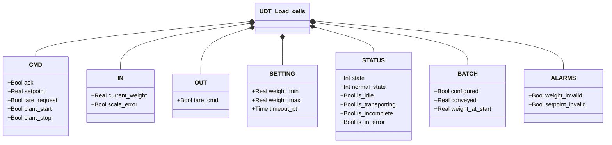
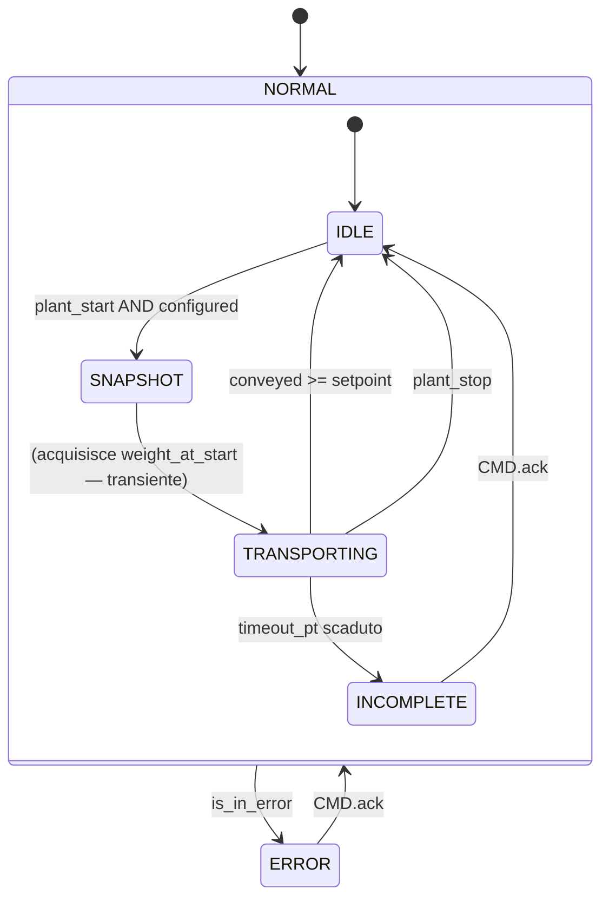

# Celle di Carico

## Panoramica

`Load_cells` controlla un ciclo di trasporto batch basato sul peso. Il FB legge il peso corrente dal trasmettitore, valida le condizioni di configurazione (peso nella scala, setpoint coerente), poi monitora la quantità trasportata durante il ciclo attivo. Il trasporto termina quando la differenza di peso raggiunge il setpoint o quando l'orchestratore emette il comando di stop.

Il blocco espone `BATCH.configured` come flag di pronto per l'orchestratore: solo quando questo è TRUE il ciclo di trasporto può partire.

---

## Componenti principali

- **Celle di carico** — sensori fisici che generano il segnale di peso grezzo
- **Trasmettitore peso** — converte il segnale celle in `IN.current_weight` [kg]; pubblica `IN.scale_error` in caso di guasto hardware
- **Orchestratore** — invia `CMD.plant_start` / `CMD.plant_stop`; legge `BATCH.configured`
- **Operatore** — imposta `CMD.setpoint`, invia `CMD.tare_request` se necessario, conferma con `CMD.ack`

---

## Segnali I/O

### Comandi (`CMD` — da HMI/orchestratore)

| Segnale | Tipo | Descrizione |
|---------|------|-------------|
| `CMD.ack` | Bool | Conferma operatore per INCOMPLETE o ERROR |
| `CMD.setpoint` | Real | Peso da trasportare nel ciclo [kg] |
| `CMD.tare_request` | Bool | Richiesta tara al trasmettitore esterno |
| `CMD.plant_start` | Bool | Avvio trasporto dall'orchestratore |
| `CMD.plant_stop` | Bool | Stop trasporto immediato dall'orchestratore |

### Ingressi (`IN` — dal trasmettitore)

| Segnale | Tipo | Descrizione |
|---------|------|-------------|
| `IN.current_weight` | Real | Peso corrente in unità ingegneristiche [kg] |
| `IN.scale_error` | Bool | Guasto hardware dal trasmettitore |

### Uscite (`OUT` — verso trasmettitore)

| Segnale | Tipo | Descrizione |
|---------|------|-------------|
| `OUT.tare_cmd` | Bool | Comando tara verso il trasmettitore esterno |

### Batch (`BATCH`)

| Segnale | Tipo | Descrizione |
|---------|------|-------------|
| `BATCH.configured` | Bool | TRUE quando peso e setpoint sono validi — pronto al trasporto |
| `BATCH.conveyed` | Real | kg trasportati nel ciclo corrente (calcolato ogni scan) |
| `BATCH.weight_at_start` | Real | Peso acquisito all'ingresso di TRANSPORTING [kg] |

### Stato (`STATUS`)

| Segnale | Tipo | Descrizione |
|---------|------|-------------|
| `STATUS.state` | Int | Stato FSM di alto livello: 1=NORMAL, 0=ERROR |
| `STATUS.normal_state` | Int | Sotto-stato: 1=IDLE, 2=SNAPSHOT, 3=TRANSPORTING, 0=INCOMPLETE |
| `STATUS.is_idle` | Bool | TRUE quando state=NORMAL e normal_state=IDLE |
| `STATUS.is_transporting` | Bool | TRUE durante il trasporto attivo |
| `STATUS.is_incomplete` | Bool | TRUE quando il batch è scaduto senza completarsi |
| `STATUS.is_in_error` | Bool | TRUE quando state=ERROR |

### Allarmi (`ALARMS`)

| Segnale | Tipo | Descrizione |
|---------|------|-------------|
| `ALARMS.weight_invalid` | Bool | Peso fuori scala: `current_weight < weight_min` o `> weight_max` |
| `ALARMS.setpoint_invalid` | Bool | Setpoint non valido: ≤ 0 o ≥ peso corrente |

---

## Funzionamento

`BATCH.configured` è aggiornato ogni scan dalla condizione:

```
configured = NOT weight_invalid AND NOT setpoint_invalid
```

`weight_invalid` scatta se il peso è fuori dall'intervallo `[weight_min, weight_max]`. `setpoint_invalid` scatta se il setpoint è ≤ 0 o ≥ al peso corrente. Finché uno dei due è attivo, `configured = FALSE` e l'orchestratore non può avviare il trasporto.

Quando `CMD.plant_start = TRUE` e `BATCH.configured = TRUE`, il FB entra in **SNAPSHOT** (stato transiente) dove acquisisce `weight_at_start := current_weight`, poi avanza immediatamente a **TRANSPORTING**.

In **TRANSPORTING**, ogni scan calcola:

```
conveyed := weight_at_start − current_weight   (clampato a 0 per deriva del sensore)
```

Il trasporto termina:
- `conveyed ≥ setpoint` → IDLE (completato)
- `CMD.plant_stop` → IDLE (fermato dall'orchestratore)
- `timeout_pt` scaduto → INCOMPLETE (incompleto, attende `ack`)

In **INCOMPLETE**, il batch è fallito per timeout. L'operatore deve confermare con `CMD.ack` per tornare a IDLE.

In **ERROR**, tutto il funzionamento normale è bloccato. `CMD.ack` riporta il blocco a NORMAL/IDLE.

---

## Allarmi

| ID | Condizione | Causa |
|----|------------|-------|
| LC-A01 | `ALARMS.weight_invalid` | Peso fuori scala hardware (`weight_min` / `weight_max`) — verificare celle, cablaggio, trasmettitore |
| LC-A02 | `ALARMS.setpoint_invalid` | Setpoint non fisicamente raggiungibile — verificare che setpoint < current_weight e > 0 |
| LC-W01 | `STATUS.is_incomplete` | Trasporto scaduto senza raggiungere il setpoint (`timeout_pt`) |

---

## Parametri

| Parametro | Default | Descrizione |
|-----------|---------|-------------|
| `SETTING.weight_min` | 10.0 kg | Soglia inferiore peso valido |
| `SETTING.weight_max` | 1000.0 kg | Soglia superiore peso valido — limite fisico della bilancia |
| `SETTING.timeout_pt` | T#2M | Durata massima del ciclo TRANSPORTING prima di INCOMPLETE |

---

## Struttura dati



---

## Macchina a stati (FSM)



### Tabella stati e uscite

| Stato | Valore | Descrizione |
|-------|--------|-------------|
| ERROR | state=0 | Funzionamento bloccato; attende ack |
| IDLE | normal_state=1 | In attesa di plant_start |
| SNAPSHOT | normal_state=2 | Acquisisce peso iniziale (transiente, 1 scan) |
| TRANSPORTING | normal_state=3 | Trasporto attivo; `conveyed` aggiornato ogni scan |
| INCOMPLETE | normal_state=0 | Timeout; attende conferma operatore |

### Tabella transizioni di stato

| Stato attuale | Condizione | Stato successivo |
|---------------|------------|-----------------|
| IDLE | `plant_start` AND `BATCH.configured` | SNAPSHOT |
| SNAPSHOT | — (transiente) | TRANSPORTING |
| TRANSPORTING | `conveyed >= setpoint` | IDLE |
| TRANSPORTING | `CMD.plant_stop` | IDLE |
| TRANSPORTING | `timeout_timer.Q` | INCOMPLETE |
| INCOMPLETE | `CMD.ack` | IDLE |
| ERROR | `CMD.ack` | NORMAL/IDLE |
