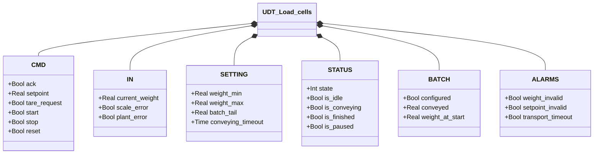
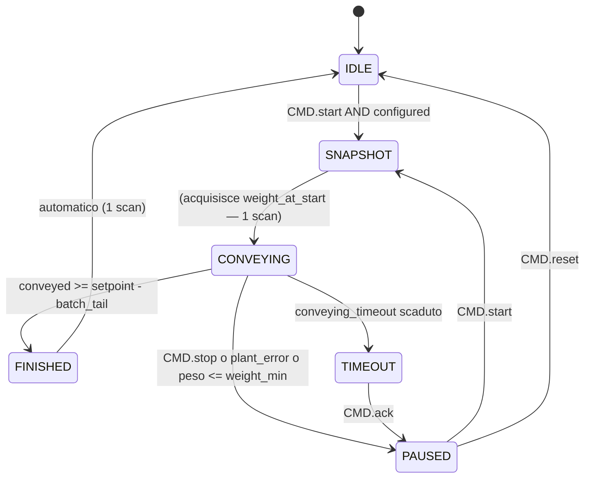

# Celle di Carico

## Panoramica

`Load_cells` controlla un ciclo di trasporto batch basato sul peso. Valida le condizioni di scala e setpoint, acquisisce un'istantanea del peso iniziale, poi monitora la quantità trasportata finché il batch è completo, fermato o in timeout. Supporta la pausa e la ripresa del batch senza perdere il conteggio già trasportato.

Il blocco espone `BATCH.configured` come flag di pronto: solo quando TRUE il ciclo di trasporto può partire.

La funzione `Pavone_DAT_1400` è un adattatore hardware facoltativo che converte i registri raw del trasmettitore Pavone DAT 1400 nel formato `IN` atteso da `UDT_Load_cells`.

---

## Componenti principali

- **Celle di carico** — sensori fisici che generano il segnale di peso grezzo
- **Trasmettitore** — converte il segnale in `IN.current_weight` [kg]; segnala guasti tramite `IN.scale_error` e `IN.plant_error`
- **`Pavone_DAT_1400`** — FC opzionale: scala `net_weight` e gestisce il comando tara per il trasmettitore Pavone DAT 1400
- **Orchestratore** — invia `CMD.start` / `CMD.stop` / `CMD.reset`; legge `BATCH.configured`

---

## Segnali I/O

### Comandi (`CMD`)

| Segnale | Tipo | Descrizione |
|---------|------|-------------|
| `CMD.ack` | Bool | Conferma per lo stato TIMEOUT |
| `CMD.setpoint` | Real | Peso da trasportare nel ciclo [kg] |
| `CMD.tare_request` | Bool | Richiesta tara al trasmettitore |
| `CMD.start` | Bool | Avvio o ripresa del batch |
| `CMD.stop` | Bool | Pausa immediata del trasporto |
| `CMD.reset` | Bool | Ritorno a IDLE da stato PAUSED |

### Ingressi (`IN` — dal trasmettitore)

| Segnale | Tipo | Descrizione |
|---------|------|-------------|
| `IN.current_weight` | Real | Peso corrente [kg] |
| `IN.scale_error` | Bool | Guasto hardware trasmettitore |
| `IN.plant_error` | Bool | Errore di impianto esterno (es. perdita di materiale) |

### Stato (`STATUS`)

| Segnale | Tipo | Descrizione |
|---------|------|-------------|
| `STATUS.state` | Int | Stato FSM: 1=IDLE, 2=SNAPSHOT, 3=CONVEYING, 4=PAUSED, 5=FINISHED, 0=TIMEOUT |
| `STATUS.is_idle` | Bool | TRUE in IDLE |
| `STATUS.is_conveying` | Bool | TRUE in CONVEYING |
| `STATUS.is_paused` | Bool | TRUE in PAUSED |
| `STATUS.is_finished` | Bool | TRUE in FINISHED (dura 1 scan, poi IDLE automatico) |

### Batch (`BATCH`)

| Segnale | Tipo | Descrizione |
|---------|------|-------------|
| `BATCH.configured` | Bool | TRUE quando peso e setpoint sono validi |
| `BATCH.conveyed` | Real | kg trasportati nel ciclo corrente |
| `BATCH.weight_at_start` | Real | Peso acquisito all'ingresso di CONVEYING [kg] |

### Allarmi (`ALARMS`)

| Segnale | Tipo | Descrizione |
|---------|------|-------------|
| `ALARMS.weight_invalid` | Bool | Peso fuori intervallo `[weight_min, weight_max]` |
| `ALARMS.setpoint_invalid` | Bool | Setpoint ≤ 0 |
| `ALARMS.transport_timeout` | Bool | TRUE quando state = TIMEOUT |

---

## Funzionamento

`BATCH.configured` è aggiornato ogni scan:

```
configured = NOT weight_invalid AND NOT setpoint_invalid
```

`weight_invalid` scatta se il peso è fuori `[weight_min, weight_max]`. `setpoint_invalid` scatta se il setpoint è ≤ 0. Finché uno dei due è attivo, il batch non può partire.

**IDLE** — Attesa di `CMD.start` con `BATCH.configured = TRUE`. Ogni volta che si rientra in IDLE, `BATCH.conveyed` viene azzerato.

**SNAPSHOT** — Stato transiente (dura 1 scan). Acquisisce `weight_at_start`. Al primo avvio: `weight_at_start := current_weight`. Alla ripresa dopo una pausa: `weight_at_start := current_weight + conveyed` — questo ancora il calcolo al peso già contabilizzato, così il contatore `conveyed` riprende dal valore corretto senza scatti.

**CONVEYING** — Il trasporto è attivo. Ogni scan calcola `conveyed := weight_at_start - current_weight` (clampato a 0). Il ciclo termina per una delle seguenti condizioni:
- `conveyed ≥ setpoint - batch_tail` → FINISHED
- `CMD.stop` OR `current_weight ≤ weight_min` OR `IN.plant_error` → PAUSED
- `conveying_timeout` scaduto → TIMEOUT

`batch_tail` permette di interrompere il trasporto leggermente prima del setpoint per compensare il materiale in volo.

**PAUSED** — Il trasporto è sospeso; `BATCH.conveyed` è congelato. `CMD.start` riprende il batch (→ SNAPSHOT). `CMD.reset` annulla e torna a IDLE.

**FINISHED** — Il batch ha raggiunto il setpoint. Lo stato è attivo per un solo scan, poi il sistema torna automaticamente a IDLE.

**TIMEOUT** — Il timer `conveying_timeout` è scaduto durante il trasporto. `ALARMS.transport_timeout = TRUE`. `CMD.ack` riporta il sistema in PAUSED (il batch può essere ripreso o cancellato).

---

## Allarmi

| ID | Condizione | Causa |
|----|------------|-------|
| LC-A01 | `ALARMS.weight_invalid` | Peso fuori scala — verificare celle, cablaggio, trasmettitore |
| LC-A02 | `ALARMS.setpoint_invalid` | Setpoint ≤ 0 — impostare un valore positivo |
| LC-W01 | `ALARMS.transport_timeout` | Ciclo CONVEYING durato oltre `conveying_timeout` — verificare impianto, valvola o materiale |

---

## Parametri

| Parametro | Default | Descrizione |
|-----------|---------|-------------|
| `SETTING.weight_min` | 10.0 | Soglia inferiore peso valido [kg] |
| `SETTING.weight_max` | 1000.0 | Soglia superiore peso valido [kg] |
| `SETTING.batch_tail` | — | Anticipazione fine batch rispetto al setpoint [kg] |
| `SETTING.conveying_timeout` | T#10M | Durata massima del ciclo CONVEYING prima di TIMEOUT |

---

## Struttura dati



---

## Macchina a stati (FSM)



### Tabella stati e uscite

| Stato | Valore | Descrizione |
|-------|--------|-------------|
| TIMEOUT | 0 | Timer scaduto; `transport_timeout=TRUE`; attende ACK |
| IDLE | 1 | In attesa di start e `configured=TRUE`; `conveyed=0` |
| SNAPSHOT | 2 | Acquisisce `weight_at_start` (transiente, 1 scan) |
| CONVEYING | 3 | Trasporto attivo; `conveyed` aggiornato ogni scan |
| PAUSED | 4 | Batch sospeso; `conveyed` congelato |
| FINISHED | 5 | Setpoint raggiunto; auto-transisce a IDLE |

### Tabella transizioni di stato

| Stato attuale | Condizione | Stato successivo |
|---------------|------------|-----------------|
| IDLE | `CMD.start` AND `BATCH.configured` | SNAPSHOT |
| SNAPSHOT | — (transiente) | CONVEYING |
| CONVEYING | `conveyed ≥ setpoint − batch_tail` | FINISHED |
| CONVEYING | `CMD.stop` OR `plant_error` OR `current_weight ≤ weight_min` | PAUSED |
| CONVEYING | `conveying_timeout` scaduto | TIMEOUT |
| FINISHED | — (automatico, 1 scan) | IDLE |
| PAUSED | `CMD.start` | SNAPSHOT |
| PAUSED | `CMD.reset` | IDLE |
| TIMEOUT | `CMD.ack` | PAUSED |
