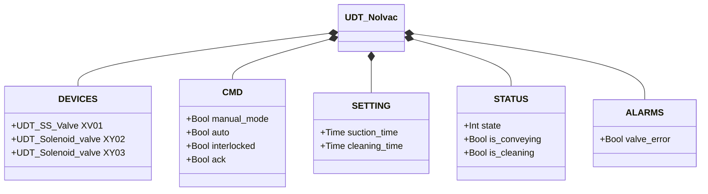
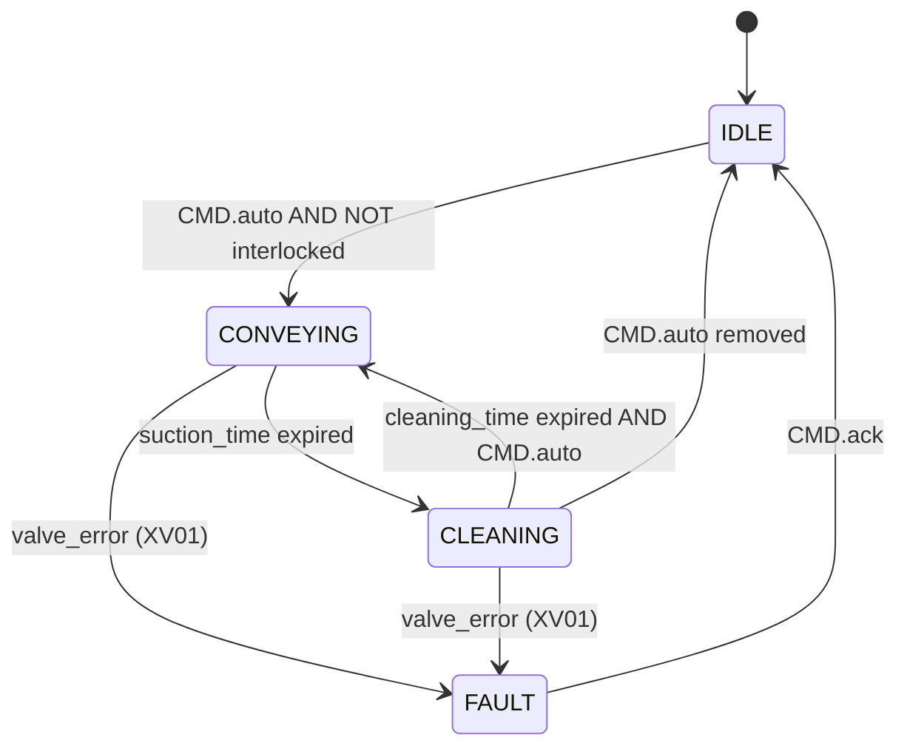

# Nolvac — Pneumatic Conveying Unit

## Overview

The Nolvac is a pneumatic conveying unit operating on a suction/cleaning cycle. `XV01` controls material inlet flow (SS butterfly valve), `XY02` activates the vacuum to convey material, and `XY03` sends a compressed air jet to clean the filter between cycles.

The cycle alternates two phases: **conveying** (`suction_time`) and **cleaning** (`cleaning_time`). The unit has no control FB in the library — the FSM logic resides in the application program that uses this UDT.

---

## Main Components

- **Inlet valve `XV01`** — SS butterfly valve controlling material entry into the suction chamber; see [SS Butterfly Valve](../valves/butterfly/single_solenoid/index.en.md)
- **Suction solenoid `XY02`** — creates the vacuum to convey material through the pipeline
- **Cleaning solenoid `XY03`** — emits a counter-flow compressed air pulse to regenerate the unit filter

---

## I/O Signals

| Signal | Type | Description |
|--------|------|-------------|
| `DEVICES.XV01` | UDT_SS_Valve | Material inlet valve |
| `DEVICES.XY02` | UDT_Solenoid_valve | Suction solenoid (open = suction active) |
| `DEVICES.XY03` | UDT_Solenoid_valve | Filter cleaning solenoid (open = cleaning jet) |
| `CMD.manual_mode` | Bool | TRUE = HMI manual mode |
| `CMD.auto` | Bool | Automation command: TRUE = start cycle |
| `CMD.interlocked` | Bool | TRUE = operation blocked by orchestrator |
| `CMD.ack` | Bool | Operator alarm acknowledgement |
| `STATUS.state` | Int | Current FSM state |
| `STATUS.is_conveying` | Bool | TRUE during the conveying phase |
| `STATUS.is_cleaning` | Bool | TRUE during the filter cleaning phase |
| `ALARMS.valve_error` | Bool | Fault detected on `XV01` |

---

## Operating Routine

The standard operating cycle alternates two phases for as long as the `auto` command is active:

**CONVEYING phase** — `XV01` open, `XY02` energised (suction active). Material is conveyed into the chamber for `suction_time`. When the timer expires, `XY02` is de-energised and `XV01` closes.

**CLEANING phase** — `XY03` energised for `cleaning_time`. The air jet removes material retained by the filter. When the timer expires, `XY03` is de-energised and the cycle restarts from CONVEYING.

If `CMD.interlocked = TRUE`, the cycle pauses in the current phase and resumes from the same phase when the interlock clears.

A fault on `XV01` (detected via `XV01.ALARMS.error`) sets `ALARMS.valve_error = TRUE` and halts the cycle. To resume, the operator must resolve the fault on the sub-valve and acknowledge with `CMD.ack`.

---

## Alarms

| ID | Condition | Cause |
|----|-----------|-------|
| NV-E01 | `ALARMS.valve_error` | Fault on `XV01` — see [SS valve alarms](../valves/butterfly/single_solenoid/index.en.md#alarms) |

---

## Settings

| Parameter | Default | Description |
|-----------|---------|-------------|
| `SETTING.suction_time` | T#30s | Conveying phase duration (suction active) |
| `SETTING.cleaning_time` | T#30s | Filter cleaning phase duration (air jet) |

---

## Data Structure

---

## Operating Cycle

### State and Output Table

| State | `XV01` | `XY02` | `XY03` | Description |
|-------|--------|--------|--------|-------------|
| IDLE | closed | off | off | Waiting for auto command |
| CONVEYING | open | energised | off | Suction active for `suction_time` |
| CLEANING | closed | off | energised | Cleaning jet for `cleaning_time` |
| FAULT | — | off | off | Valve fault; waits for operator acknowledgement |
