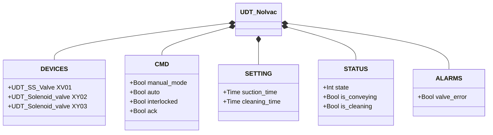
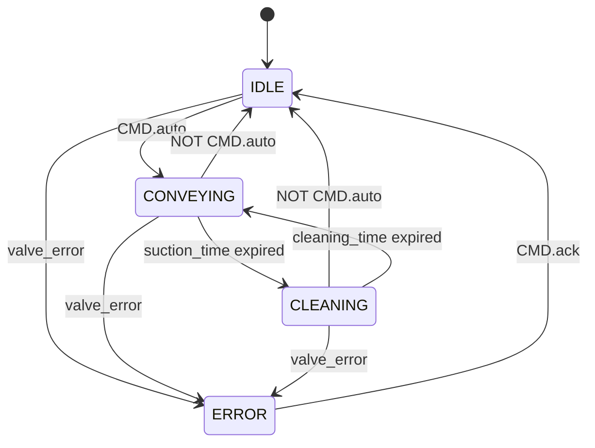

# Nolvac — Pneumatic Conveying Unit

## Overview

The Nolvac is a pneumatic conveying unit operating on a conveying/cleaning cycle. `XY03` activates the suction path to convey material during the conveying phase; `XV01` (SS butterfly valve) and `XY02` work together during the cleaning phase to regenerate the internal filter. The `Nolvac` function block manages the complete cycle via parameter `VC : UDT_Nolvac`.

The cycle alternates two phases: **conveying** (`suction_time`) and **cleaning** (`cleaning_time`). At the end of each phase the cycle restarts automatically as long as `CMD.auto` is active.

---

## Main Components

- **Conveying solenoid `XY03`** — activates the vacuum/air path for material conveying; energised throughout the CONVEYING phase
- **Inlet valve `XV01`** — SS butterfly valve that opens the inlet during the cleaning phase; see [SS Butterfly Valve](../valves/butterfly/single_solenoid/index.en.md)
- **Cleaning solenoid `XY02`** — provides compressed air for filter back-flush/regeneration during the CLEANING phase

---

## I/O Signals

| Signal | Type | Description |
|--------|------|-------------|
| `DEVICES.XV01` | UDT_SS_Valve | SS butterfly valve; open during CLEANING |
| `DEVICES.XY02` | UDT_Solenoid_valve | Cleaning solenoid; energised during CLEANING |
| `DEVICES.XY03` | UDT_Solenoid_valve | Conveying solenoid; energised during CONVEYING |
| `CMD.manual_mode` | Bool | TRUE = HMI manual mode |
| `CMD.auto` | Bool | Automation command: TRUE = start cycle |
| `CMD.ack` | Bool | Operator alarm acknowledgement |
| `STATUS.state` | Int | Current FSM state (0=ERROR, 1=IDLE, 2=CONVEYING, 3=CLEANING) |
| `STATUS.is_conveying` | Bool | TRUE during the conveying phase |
| `STATUS.is_cleaning` | Bool | TRUE during the filter cleaning phase |
| `ALARMS.valve_error` | Bool | Fault detected on `XV01` |

---

## Operating Routine

The standard operating cycle alternates two phases for as long as `CMD.auto` is active:

**CONVEYING phase** — `XY03` is energised for `suction_time`. The conveying path is active and material is transported. When the timer expires, the unit transitions to CLEANING.

**CLEANING phase** — `XV01` opens and `XY02` is energised for `cleaning_time`. Compressed air regenerates the filter via back-flush. When the timer expires, the unit returns to CONVEYING if `CMD.auto` is still active.

If `CMD.auto` is removed at any point during CONVEYING or CLEANING, the unit returns immediately to IDLE and all outputs are de-energised.

A fault on `XV01` (detected via `XV01.ALARMS.error`) sets `ALARMS.valve_error = TRUE` and drives the unit to ERROR regardless of the current phase. To resume, the operator must resolve the fault on the sub-valve and acknowledge with `CMD.ack`. After acknowledgement the unit returns to IDLE and can receive a new `auto` command.

---

## Alarms

| ID | Condition | Cause |
|----|-----------|-------|
| NV-E01 | `ALARMS.valve_error` | Fault on `XV01` — see [SS valve alarms](../valves/butterfly/single_solenoid/index.en.md#alarms) |

---

## Settings

| Parameter | Default | Description |
|-----------|---------|-------------|
| `SETTING.suction_time` | T#30s | Conveying phase duration |
| `SETTING.cleaning_time` | T#30s | Filter cleaning phase duration |

---

## Data Structure

---

## State Machine

### State and Output Table

| State | `XV01` | `XY02` | `XY03` | Description |
|-------|--------|--------|--------|-------------|
| IDLE | closed | off | off | Waiting for auto command |
| CONVEYING | closed | off | energised | Conveying active for `suction_time` |
| CLEANING | open | energised | off | Filter cleaning for `cleaning_time` |
| ERROR | — | off | off | Valve fault; waits for operator acknowledgement |

### State Transition Table

| Current State | Condition | Next State | Action |
|---------------|-----------|------------|--------|
| IDLE | CMD.auto = TRUE | CONVEYING | XY03 → energised; start suction_timer |
| IDLE | valve_error | ERROR | — |
| CONVEYING | NOT CMD.auto | IDLE | All outputs → de-energised |
| CONVEYING | suction_timer expired | CLEANING | XY03 → off; XV01 opens, XY02 → energised; start cleaning_timer |
| CONVEYING | valve_error | ERROR | All outputs → de-energised |
| CLEANING | NOT CMD.auto | IDLE | All outputs → de-energised |
| CLEANING | cleaning_timer expired | CONVEYING | XV01 closes, XY02 → off; XY03 → energised; start suction_timer |
| CLEANING | valve_error | ERROR | All outputs → de-energised |
| ERROR | CMD.ack = TRUE | IDLE | Clear alarms; awaits new CMD.auto |
