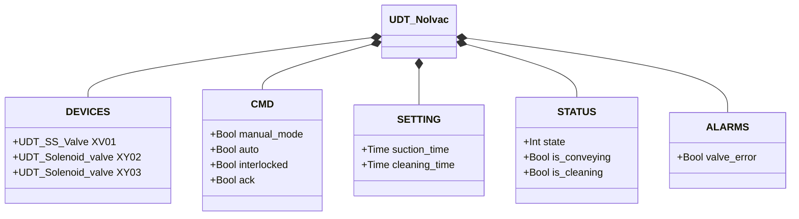
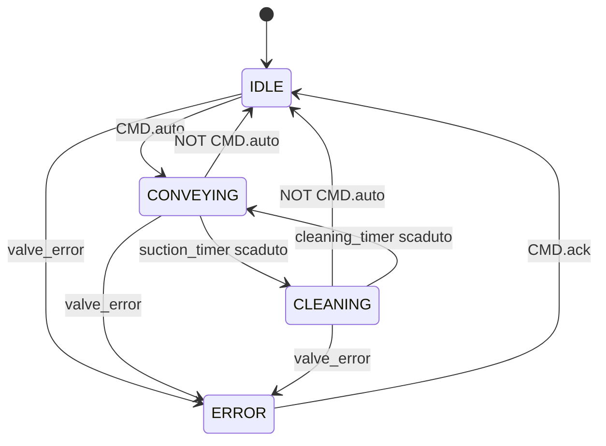

# Nolvac — Unità di Convogliamento Pneumatico

## Panoramica

Il Nolvac è un'unità di convogliamento pneumatico a ciclo aspirazione/pulizia. `XY03` attiva il percorso di aspirazione per convogliare il materiale; `XV01` (valvola a farfalla SS) e `XY02` agiscono in combinazione durante la fase di pulizia per rigenerare il filtro interno. Il blocco funzionale `Nolvac` gestisce il ciclo completo tramite il parametro `VC : UDT_Nolvac`.

Il ciclo alterna due fasi — **convogliamento** (`suction_time`) e **pulizia** (`cleaning_time`) — e riparte automaticamente finché `CMD.auto` è attivo.

---

## Componenti principali

- **Elettrovalvola convogliamento `XY03`** — attiva la depressione per il trasporto del materiale; eccitata per tutta la fase CONVEYING
- **Valvola a farfalla SS `XV01`** — apre l'ingresso durante la fase di pulizia; vedere [Valvola a Farfalla SS](../valves/butterfly/single_solenoid/index.it.md)
- **Elettrovalvola pulizia `XY02`** — fornisce aria compressa per il retrolavaggio del filtro durante CLEANING

---

## Segnali I/O

| Segnale | Tipo | Descrizione |
|---------|------|-------------|
| `DEVICES.XV01` | UDT_SS_Valve | Valvola farfalla SS; aperta durante CLEANING |
| `DEVICES.XY02` | UDT_Solenoid_valve | Solenoide pulizia; eccitato durante CLEANING |
| `DEVICES.XY03` | UDT_Solenoid_valve | Solenoide convogliamento; eccitato durante CONVEYING |
| `CMD.manual_mode` | Bool | TRUE = modalità manuale HMI |
| `CMD.auto` | Bool | Comando automazione: TRUE = avvia ciclo |
| `CMD.interlocked` | Bool | Interblocco (attualmente non utilizzato nella FSM) |
| `CMD.ack` | Bool | Conferma allarme operatore |
| `STATUS.state` | Int | Stato FSM: 0=ERROR, 1=IDLE, 2=CONVEYING, 3=CLEANING |
| `STATUS.is_conveying` | Bool | TRUE durante la fase di convogliamento |
| `STATUS.is_cleaning` | Bool | TRUE durante la fase di pulizia filtro |
| `ALARMS.valve_error` | Bool | Guasto rilevato su `XV01` |

---

## Funzionamento

Il ciclo operativo standard alterna due fasi mentre `CMD.auto` è attivo:

**Fase CONVEYING** — `XY03` viene eccitato per la durata `suction_time`. Il percorso di convogliamento è attivo. Al termine, il sistema transisce in CLEANING.

**Fase CLEANING** — `XV01` viene aperta e `XY02` eccitata per la durata `cleaning_time`. L'aria compressa rigenerava il filtro tramite retrolavaggio. Al termine, se `CMD.auto` è ancora attivo, il sistema torna in CONVEYING.

Se `CMD.auto` viene rimosso in qualsiasi momento durante CONVEYING o CLEANING, il sistema torna immediatamente a IDLE, disattivando tutte le uscite.

Un guasto su `XV01` (`XV01.ALARMS.error`) imposta `ALARMS.valve_error = TRUE` e porta il sistema in ERROR da qualsiasi stato. `CMD.ack` riporta il sistema a IDLE.

Il `manual_mode` viene propagato a `XV01`, `XY02` e `XY03` permettendo all'operatore di controllare manualmente i dispositivi dall'HMI.

---

## Allarmi

| ID | Condizione | Causa |
|----|------------|-------|
| NV-E01 | `ALARMS.valve_error` | Guasto su `XV01` — vedere [allarmi valvola SS](../valves/butterfly/single_solenoid/index.it.md#allarmi) |

---

## Parametri

| Parametro | Default | Descrizione |
|-----------|---------|-------------|
| `SETTING.suction_time` | T#30s | Durata della fase di convogliamento |
| `SETTING.cleaning_time` | T#30s | Durata della fase di pulizia filtro |

---

## Struttura dati

---

## Macchina a stati (FSM)

### Tabella stati e uscite

| Stato | `XV01` | `XY02` | `XY03` | Descrizione |
|-------|--------|--------|--------|-------------|
| IDLE | chiusa | spenta | spenta | In attesa del comando auto |
| CONVEYING | chiusa | spenta | eccitata | Convogliamento attivo per `suction_time` |
| CLEANING | aperta | eccitata | spenta | Pulizia filtro per `cleaning_time` |
| ERROR | — | spenta | spenta | Guasto valvola; attende conferma operatore |

### Tabella transizioni di stato

| Stato attuale | Condizione | Stato successivo | Azione |
|---------------|------------|-----------------|--------|
| IDLE | `CMD.auto` = TRUE | CONVEYING | XY03 → eccitata; avvia suction_timer |
| IDLE | `valve_error` | ERROR | — |
| CONVEYING | NOT `CMD.auto` | IDLE | Tutte uscite → diseccitate |
| CONVEYING | suction_timer scaduto | CLEANING | XY03 → spenta; XV01 apre, XY02 → eccitata; avvia cleaning_timer |
| CONVEYING | `valve_error` | ERROR | Tutte uscite → diseccitate |
| CLEANING | NOT `CMD.auto` | IDLE | Tutte uscite → diseccitate |
| CLEANING | cleaning_timer scaduto | CONVEYING | XV01 chiude, XY02 → spenta; XY03 → eccitata; avvia suction_timer |
| CLEANING | `valve_error` | ERROR | Tutte uscite → diseccitate |
| ERROR | `CMD.ack` = TRUE | IDLE | Azzera allarmi; attende nuovo `CMD.auto` |
