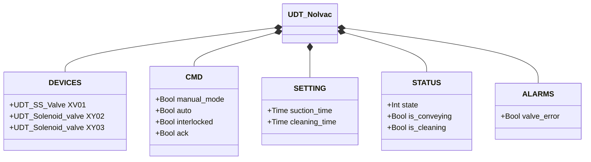
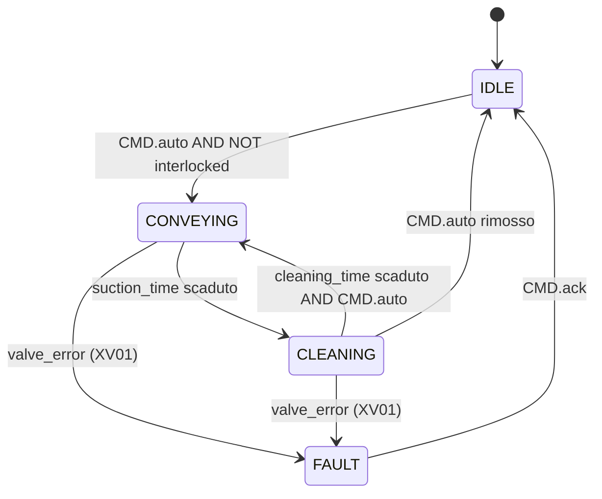

# Nolvac — Unità di Convogliamento Pneumatico

## Panoramica

Il Nolvac è un'unità di convogliamento pneumatico a ciclo aspirazione/pulizia. `XV01` controlla il flusso di materiale in ingresso (valvola a farfalla SS), `XY02` attiva la depressione per convogliare il materiale, e `XY03` invia un getto di aria compressa per pulire il filtro tra un ciclo e l'altro.

Il ciclo alterna due fasi: **convogliamento** (`suction_time`) e **pulizia** (`cleaning_time`). L'unità non dispone di FB di controllo nella libreria — la logica FSM risiede nel programma applicativo che utilizza questo UDT.

---

## Componenti principali

- **Valvola di ingresso `XV01`** — valvola a farfalla SS che controlla l'immissione di materiale nella camera di aspirazione; vedere [Valvola a Farfalla SS](../valves/butterfly/single_solenoid/index.it.md)
- **Elettrovalvola aspirazione `XY02`** — crea la depressione per convogliare il materiale attraverso la tubazione
- **Elettrovalvola pulizia `XY03`** — emette un impulso di aria compressa in controcorrente per rigenerare il filtro dell'unità

---

## Segnali I/O

| Segnale | Tipo | Descrizione |
|---------|------|-------------|
| `DEVICES.XV01` | UDT_SS_Valve | Valvola di ingresso materiale |
| `DEVICES.XY02` | UDT_Solenoid_valve | Elettrovalvola aspirazione (aperta = aspirazione attiva) |
| `DEVICES.XY03` | UDT_Solenoid_valve | Elettrovalvola pulizia filtro (aperta = getto pulizia) |
| `CMD.manual_mode` | Bool | TRUE = modalità manuale HMI |
| `CMD.auto` | Bool | Comando automazione: TRUE = avvia ciclo |
| `CMD.interlocked` | Bool | TRUE = operazione bloccata dall'orchestratore |
| `CMD.ack` | Bool | Conferma allarme operatore |
| `STATUS.state` | Int | Stato FSM corrente |
| `STATUS.is_conveying` | Bool | TRUE durante la fase di convogliamento |
| `STATUS.is_cleaning` | Bool | TRUE durante la fase di pulizia filtro |
| `ALARMS.valve_error` | Bool | Guasto rilevato su `XV01` |

---

## Funzionamento

Il ciclo operativo standard si articola in due fasi che si alternano fintanto che il comando `auto` è attivo:

**Fase CONVEYING** — `XV01` aperta, `XY02` eccitata (aspirazione attiva). Il materiale viene convogliato nella camera per la durata `suction_time`. Al termine, `XY02` viene diseccitata e `XV01` chiusa.

**Fase CLEANING** — `XY03` eccitata per la durata `cleaning_time`. Il getto d'aria rimuove il materiale trattenuto dal filtro. Al termine, `XY03` viene diseccitata e il ciclo ricomincia dalla fase CONVEYING.

Se `CMD.interlocked = TRUE`, il ciclo si interrompe nella fase corrente e riprende dalla stessa fase alla rimozione del blocco.

Un guasto su `XV01` (rilevato tramite `XV01.ALARMS.error`) imposta `ALARMS.valve_error = TRUE` e blocca il ciclo. Per riprendere, l'operatore deve risolvere il guasto sulla sotto-valvola e confermare con `CMD.ack`.

---

## Allarmi

| ID | Condizione | Causa |
|----|------------|-------|
| NV-E01 | `ALARMS.valve_error` | Guasto su `XV01` — vedere [allarmi valvola SS](../valves/butterfly/single_solenoid/index.it.md#allarmi) |

---

## Parametri

| Parametro | Default | Descrizione |
|-----------|---------|-------------|
| `SETTING.suction_time` | T#30s | Durata della fase di convogliamento (aspirazione attiva) |
| `SETTING.cleaning_time` | T#30s | Durata della fase di pulizia filtro (getto aria) |

---

## Struttura dati

---

## Ciclo operativo

### Tabella stati e uscite

| Stato | `XV01` | `XY02` | `XY03` | Descrizione |
|-------|--------|--------|--------|-------------|
| IDLE | chiusa | spenta | spenta | In attesa del comando auto |
| CONVEYING | aperta | eccitata | spenta | Aspirazione attiva per `suction_time` |
| CLEANING | chiusa | spenta | eccitata | Getto pulizia per `cleaning_time` |
| FAULT | — | spenta | spenta | Guasto valvola; attende conferma operatore |
