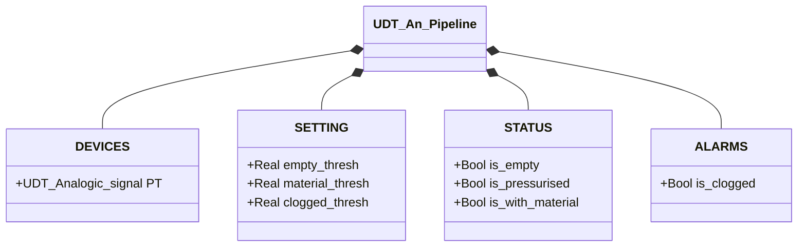

# Analogic Pipeline

## Overview

`An_Pipeline` derives the pipeline state from an analogue pressure transmitter reading (`PT.Scaled_value`). The logic is a lookup table: the PT value is compared sequentially against three configurable thresholds and the corresponding state flag is set. Exactly one flag is TRUE at any time.

Four states cover the full operating range: empty pipeline, pressurised (air, no material), with material, clogged.

---

## Main Components

- **Pressure transmitter `PT`** (`UDT_Analogic_signal`) — analogue pressure reading; exposes `PT.Scaled_value` in engineering units (typically bar)
- **Three configurable thresholds** — define the boundaries between the four states

---

## I/O Signals

| Signal | Type | Description |
|--------|------|-------------|
| `DEVICES.PT.Scaled_value` | Real | Pressure reading in engineering units |
| `STATUS.is_empty` | Bool | TRUE if PT < `empty_thresh` |
| `STATUS.is_pressurised` | Bool | TRUE if `empty_thresh` ≤ PT < `material_thresh` |
| `STATUS.is_with_material` | Bool | TRUE if `material_thresh` ≤ PT < `clogged_thresh` |
| `ALARMS.is_clogged` | Bool | TRUE if PT ≥ `clogged_thresh` |

---

## Operating Routine

Every PLC scan, the FB clears all flags then evaluates `PT.Scaled_value` against the thresholds in priority order:

```
IF PT < empty_thresh       → is_empty := TRUE
ELSIF PT < material_thresh → is_pressurised := TRUE
ELSIF PT < clogged_thresh  → is_with_material := TRUE
ELSE                       → is_clogged := TRUE
```

No state machine exists — the current state is a direct, instantaneous function of PT with no hysteresis.

`is_clogged` is placed in the `ALARMS` struct because it indicates an abnormal condition requiring intervention: excessive pressure suggests a blockage or an upstream valve is closed.

---

## Alarms

| ID | Condition | Cause |
|----|-----------|-------|
| PL-A01 | `ALARMS.is_clogged` | PT ≥ `clogged_thresh` — excessive pressure, blockage or upstream valve closed |

---

## Settings

| Parameter | Default | Description |
|-----------|---------|-------------|
| `SETTING.empty_thresh` | 0.1 | Lower threshold: below → pipeline empty |
| `SETTING.material_thresh` | 0.4 | Material threshold: above → material present |
| `SETTING.clogged_thresh` | 0.8 | Clog threshold: above → abnormal pressure |

Calibrate with actual commissioning data for the system.

---

## Data Structure



---

## State Logic

The block implements no FSM. Evaluation is purely combinatorial:

| PT condition | Active flag | Description |
|--------------|-------------|-------------|
| `PT < 0.1` | `STATUS.is_empty` | Empty pipeline, no pressure |
| `0.1 ≤ PT < 0.4` | `STATUS.is_pressurised` | Pipeline pressurised, no material |
| `0.4 ≤ PT < 0.8` | `STATUS.is_with_material` | Material present in pipeline |
| `PT ≥ 0.8` | `ALARMS.is_clogged` | Abnormal pressure — possible blockage |
