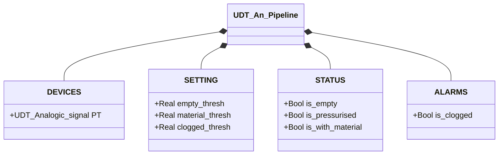

# Pipeline Analogica

## Panoramica

`An_Pipeline` ricava lo stato della pipeline dalla lettura del trasmettitore di pressione analogico (`PT.Scaled_value`). La logica è una tabella di lookup: il valore PT viene confrontato sequenzialmente con tre soglie configurabili e viene impostato il flag di stato corrispondente. Un solo flag è TRUE in qualsiasi momento.

Quattro stati coprono l'intera escursione operativa: pipeline vuota, pressurizzata (aria senza materiale), con materiale, intasata.

---

## Componenti principali

- **Trasmettitore di pressione `PT`** (`UDT_Analogic_signal`) — lettura analogica della pressione nella pipeline; espone `PT.Scaled_value` in unità ingegneristiche (tipicamente bar)
- **Tre soglie configurabili** — definiscono i confini tra i quattro stati

---

## Segnali I/O

| Segnale | Tipo | Descrizione |
|---------|------|-------------|
| `DEVICES.PT.Scaled_value` | Real | Lettura pressione in unità ingegneristiche |
| `STATUS.is_empty` | Bool | TRUE se PT < `empty_thresh` |
| `STATUS.is_pressurised` | Bool | TRUE se `empty_thresh` ≤ PT < `material_thresh` |
| `STATUS.is_with_material` | Bool | TRUE se `material_thresh` ≤ PT < `clogged_thresh` |
| `ALARMS.is_clogged` | Bool | TRUE se PT ≥ `clogged_thresh` |

---

## Funzionamento

Ad ogni ciclo PLC, il FB azzera tutti i flag poi valuta `PT.Scaled_value` contro le soglie in sequenza prioritaria:

```
IF PT < empty_thresh       → is_empty := TRUE
ELSIF PT < material_thresh → is_pressurised := TRUE
ELSIF PT < clogged_thresh  → is_with_material := TRUE
ELSE                       → is_clogged := TRUE
```

Non esiste una macchina a stati — lo stato corrente è una funzione diretta e istantanea del valore PT senza isteresi.

`is_clogged` è nella struttura `ALARMS` perché indica una condizione anomala che richiede intervento: pressione eccessiva suggerisce un'ostruzione o una valvola chiusa a monte.

---

## Allarmi

| ID | Condizione | Causa |
|----|------------|-------|
| PL-A01 | `ALARMS.is_clogged` | PT ≥ `clogged_thresh` — pressione eccessiva, ostruzione o valvola chiusa a monte |

---

## Parametri

| Parametro | Default | Descrizione |
|-----------|---------|-------------|
| `SETTING.empty_thresh` | 0.1 | Soglia inferiore: sotto → pipeline vuota |
| `SETTING.material_thresh` | 0.4 | Soglia materiale: sopra → presenza materiale |
| `SETTING.clogged_thresh` | 0.8 | Soglia ostruzione: sopra → pressione anomala |

Calibrare con i dati di commissioning reali del sistema.

---

## Struttura dati



---

## Logica di stato

Il blocco non implementa una FSM. La valutazione è puramente combinatoria:

| Condizione PT | Flag attivo | Descrizione |
|---------------|-------------|-------------|
| `PT < 0.1` | `STATUS.is_empty` | Pipeline vuota, nessuna pressione |
| `0.1 ≤ PT < 0.4` | `STATUS.is_pressurised` | Pipeline in pressione, nessun materiale |
| `0.4 ≤ PT < 0.8` | `STATUS.is_with_material` | Materiale presente nella pipeline |
| `PT ≥ 0.8` | `ALARMS.is_clogged` | Pressione anomala — possibile ostruzione |
