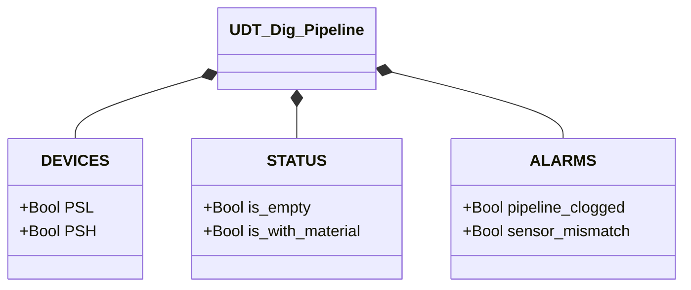

# Digital Pipeline

## Overview

**FC, stateless.** `Dig_pipeline` determines pipeline state using two digital pressure switches (`PSL` low-set, `PSH` high-set). The logic is a two-input truth table: the four binary combinations map to states and alarms. No `CMD`, no `ack` — with no state to keep, there's nothing to acknowledge.

The low-set switch (`PSL`) trips when pressure exceeds the minimum threshold indicating material presence. The high-set switch (`PSH`) trips at a higher pressure indicating excessive pressure or a blockage. Under normal conditions `PSH` cannot trip without `PSL`.

---

## Main Components

- **Low-set switch `PSL`** — TRUE = pressure ≥ low threshold (material detected)
- **High-set switch `PSH`** — TRUE = pressure ≥ high threshold (possible blockage)

---

## Control Signals

| Signal | Type | Description |
|--------|------|-------------|
| `DEVICES.PSL` | Bool | Low-set pressure switch: TRUE = pressure ≥ low threshold |
| `DEVICES.PSH` | Bool | High-set pressure switch: TRUE = pressure ≥ high threshold |
| `STATUS.is_empty` | Bool | TRUE if `PSL=0` and `PSH=0` |
| `STATUS.is_with_material` | Bool | TRUE if `PSL=1` and `PSH=0` |
| `ALARMS.pipeline_clogged` | Bool | TRUE if `PSL=1` and `PSH=1` |
| `ALARMS.sensor_mismatch` | Bool | TRUE if `PSL=0` and `PSH=1` (physically impossible combination) |

---

## Decode Table

| `PSL` | `PSH` | Outcome | Category |
|-------|-------|---------|----------|
| 0 | 0 | `is_empty` | State |
| 1 | 0 | `is_with_material` | State |
| 0 | 1 | `sensor_mismatch` | Alarm (`PL-E02`) |
| 1 | 1 | `pipeline_clogged` | Alarm (`PL-E01`) |

`is_empty`/`is_with_material` are normal conditions the process continuously passes through. `pipeline_clogged` isn't a third variant of the same cycle: it physically indicates material has accumulated enough to also engage the high sensor, a condition that should never persist. `sensor_mismatch` flags a physically inconsistent combination (the high sensor can't trip without the low one having already tripped) — a likely fault or wiring error rather than a real process condition.

---

## Logic

```Pascal
ALARMS.sensor_mismatch := NOT PSL AND PSH;
ALARMS.pipeline_clogged := PSL AND PSH;

STATUS.is_empty := NOT PSL AND NOT PSH;
STATUS.is_with_material := PSL AND NOT PSH;
```

There's no state machine: evaluation is purely combinatorial and recomputed from scratch every scan, with no hysteresis.

---

## Alarms

| ID | Device-specific condition |
|----|----------------------------|
| [`PL-E01`](../index.en.md#pipeline-alarms) | `PSL AND PSH` |
| [`PL-E02`](../index.en.md#pipeline-alarms) | `NOT PSL AND PSH` |

Being a stateless FC, neither condition automatically feeds into an `internal_error` — this device has no FSM of its own to fault. If the caller wants `pipeline_clogged`/`sensor_mismatch` to contribute to its own fault aggregate, it's the caller's responsibility to include them explicitly (the same pattern the Nolvac uses to embed `XV01.STATUS.is_fault`).

---

## Data Structure


