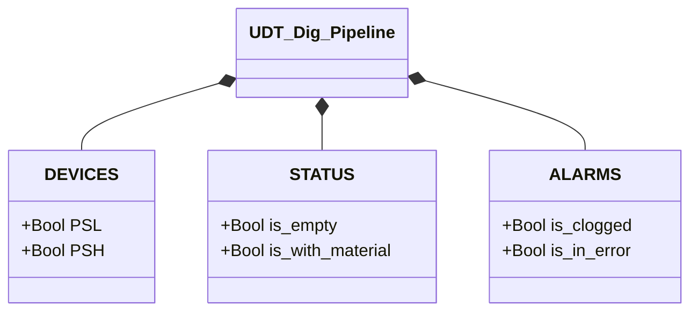

# Digital Pipeline

## Overview

`Dig_Pipeline` determines pipeline state using two digital pressure switches (`PSL` low-set, `PSH` high-set). The logic is a two-input truth table: the four binary combinations of PSL and PSH map to four operating states. State is updated every scan with no hysteresis.

The low-set switch (`PSL`) trips when pressure exceeds the minimum threshold indicating material presence. The high-set switch (`PSH`) trips at a higher pressure indicating excessive pressure or a blockage. Under normal conditions `PSH` cannot trip without `PSL`.

---

## Main Components

- **Low-set switch `PSL`** — TRUE = pressure ≥ low threshold (material detected)
- **High-set switch `PSH`** — TRUE = pressure ≥ high threshold (possible blockage)

---

## I/O Signals

| Signal | Type | Description |
|--------|------|-------------|
| `DEVICES.PSL` | Bool | Low-set pressure switch: TRUE = pressure ≥ low threshold |
| `DEVICES.PSH` | Bool | High-set pressure switch: TRUE = pressure ≥ high threshold |
| `STATUS.is_empty` | Bool | TRUE if PSL=0 and PSH=0 |
| `STATUS.is_with_material` | Bool | TRUE if PSL=1 and PSH=0 |
| `ALARMS.is_clogged` | Bool | TRUE if PSL=1 and PSH=1 |
| `ALARMS.is_in_error` | Bool | TRUE if PSL=0 and PSH=1 (physically impossible state) |

---

## Operating Routine

Every scan the FB clears all flags then evaluates the PSL/PSH combination:

| PSL | PSH | Active flag | Description |
|-----|-----|-------------|-------------|
| 0 | 0 | `STATUS.is_empty` | No pressure detected — pipeline empty |
| 1 | 0 | `STATUS.is_with_material` | Normal pressure — material present |
| 1 | 1 | `ALARMS.is_clogged` | Excessive pressure — likely blockage |
| 0 | 1 | `ALARMS.is_in_error` | Impossible state — sensor or wiring fault |

The PSL=0, PSH=1 combination is physically impossible (PSH requires a pressure already past PSL's threshold): it indicates a hardware fault and activates `is_in_error`.

There is no state machine and no acknowledgement mechanism. All states update directly every scan.

---

## Alarms

| ID | Condition | Cause |
|----|-----------|-------|
| DP-A01 | `ALARMS.is_clogged` | PSL=1 and PSH=1 — blockage or excessive upstream pressure |
| DP-E01 | `ALARMS.is_in_error` | PSL=0 and PSH=1 — PSL switch fault, short circuit, or swapped wiring |

---

## Settings

No configurable parameters in `UDT_Dig_Pipeline`. Pressure thresholds are determined by the mechanical calibration of the physical pressure switches.

---

## Data Structure

---

## State Logic

The block implements no FSM. Evaluation is purely combinatorial (truth table):

| PSL | PSH | Active flag | Type |
|-----|-----|-------------|------|
| FALSE | FALSE | `STATUS.is_empty` | Normal |
| TRUE | FALSE | `STATUS.is_with_material` | Normal |
| TRUE | TRUE | `ALARMS.is_clogged` | Alarm |
| FALSE | TRUE | `ALARMS.is_in_error` | Hardware error |
