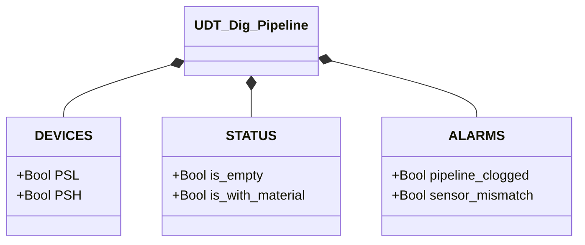

# Pipeline Digitale

## Panoramica

**FC, stateless.** `Dig_pipeline` determina lo stato della pipeline tramite due pressostati digitali (`PSL` bassa soglia, `PSH` alta soglia). La logica è una tabella di verità a due ingressi: le quattro combinazioni binarie mappano su stati e allarmi. Nessun `CMD`, nessun `ack` — non essendoci stato da conservare, non c'è nulla da confermare.

Il pressostato bassa soglia (`PSL`) si attiva quando la pressione supera la soglia minima per rilevare la presenza di materiale. Il pressostato alta soglia (`PSH`) si attiva a una pressione superiore, che indica pressione eccessiva o ostruzione. In condizioni normali `PSH` non può attivarsi senza `PSL`.

---

## Componenti principali

- **Pressostato bassa soglia `PSL`** — TRUE = pressione ≥ soglia bassa (materiale rilevato)
- **Pressostato alta soglia `PSH`** — TRUE = pressione ≥ soglia alta (possibile ostruzione)

---

## Segnali di controllo

| Segnale | Tipo | Descrizione |
|---------|------|-------------|
| `DEVICES.PSL` | Bool | Pressostato bassa soglia: TRUE = pressione ≥ soglia bassa |
| `DEVICES.PSH` | Bool | Pressostato alta soglia: TRUE = pressione ≥ soglia alta |
| `STATUS.is_empty` | Bool | TRUE se `PSL=0` e `PSH=0` |
| `STATUS.is_with_material` | Bool | TRUE se `PSL=1` e `PSH=0` |
| `ALARMS.pipeline_clogged` | Bool | TRUE se `PSL=1` e `PSH=1` |
| `ALARMS.sensor_mismatch` | Bool | TRUE se `PSL=0` e `PSH=1` (combinazione fisicamente impossibile) |

---

## Tabella di decodifica

| `PSL` | `PSH` | Esito | Categoria |
|-------|-------|-------|-----------|
| 0 | 0 | `is_empty` | Stato |
| 1 | 0 | `is_with_material` | Stato |
| 0 | 1 | `sensor_mismatch` | Allarme (`PL-E02`) |
| 1 | 1 | `pipeline_clogged` | Allarme (`PL-E01`) |

`is_empty`/`is_with_material` sono condizioni normali che il processo attraversa continuamente. `pipeline_clogged` non è una terza variante dello stesso ciclo: fisicamente indica che il materiale si è accumulato al punto da impegnare anche il sensore alto, condizione che non dovrebbe mai persistere. `sensor_mismatch` segnala una combinazione fisicamente incoerente (il sensore alto non può attivarsi senza che il basso lo abbia già fatto) — un probabile guasto o errore di cablaggio piuttosto che una condizione di processo reale.

---

## Logica

```Pascal
ALARMS.sensor_mismatch := NOT PSL AND PSH;
ALARMS.pipeline_clogged := PSL AND PSH;

STATUS.is_empty := NOT PSL AND NOT PSH;
STATUS.is_with_material := PSL AND NOT PSH;
```

Non esiste una macchina a stati: la valutazione è puramente combinatoria e ricalcolata da zero ogni scan, senza isteresi.

---

## Allarmi

| ID | Condizione specifica |
|----|----------------------|
| [`PL-E01`](../index.it.md#allarmi-delle-pipeline) | `PSL AND PSH` |
| [`PL-E02`](../index.it.md#allarmi-delle-pipeline) | `NOT PSL AND PSH` |

Essendo un FC privo di stato proprio, nessuna delle due condizioni confluisce automaticamente in un `internal_error` — questo dispositivo non ha una propria FSM da portare in fault. Se il chiamante vuole che `pipeline_clogged`/`sensor_mismatch` contribuiscano al proprio aggregato di guasto, è responsabilità del blocco chiamante includerli esplicitamente (stesso schema con cui il Nolvac incorpora `XV01.STATUS.is_fault`).

---

## Struttura dati


