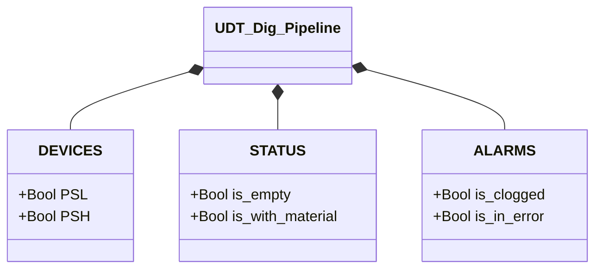

# Pipeline Digitale

## Panoramica

`Dig_Pipeline` determina lo stato della pipeline tramite due pressostati digitali (`PSL` bassa soglia, `PSH` alta soglia). La logica è una tabella di verità a due ingressi: le quattro combinazioni binarie di PSL e PSH mappano su quattro stati operativi. Lo stato è aggiornato ogni scan senza isteresi.

Il pressostato bassa soglia (`PSL`) si attiva quando la pressione supera la soglia minima per rilevare la presenza di materiale. Il pressostato alta soglia (`PSH`) si attiva a una pressione superiore, che indica pressione eccessiva o ostruzione. In condizioni normali `PSH` non può attivarsi senza `PSL`.

---

## Componenti principali

- **Pressostato bassa soglia `PSL`** — TRUE = pressione ≥ soglia bassa (materiale rilevato)
- **Pressostato alta soglia `PSH`** — TRUE = pressione ≥ soglia alta (possibile ostruzione)

---

## Segnali I/O

| Segnale | Tipo | Descrizione |
|---------|------|-------------|
| `DEVICES.PSL` | Bool | Pressostato bassa soglia: TRUE = pressione ≥ soglia bassa |
| `DEVICES.PSH` | Bool | Pressostato alta soglia: TRUE = pressione ≥ soglia alta |
| `STATUS.is_empty` | Bool | TRUE se PSL=0 e PSH=0 |
| `STATUS.is_with_material` | Bool | TRUE se PSL=1 e PSH=0 |
| `ALARMS.is_clogged` | Bool | TRUE se PSL=1 e PSH=1 |
| `ALARMS.is_in_error` | Bool | TRUE se PSL=0 e PSH=1 (stato fisicamente impossibile) |

---

## Funzionamento

Ad ogni scan il FB azzera tutti i flag e valuta la combinazione PSL/PSH:

| PSL | PSH | Flag attivo | Descrizione |
|-----|-----|-------------|-------------|
| 0 | 0 | `STATUS.is_empty` | Nessuna pressione rilevata — pipeline vuota |
| 1 | 0 | `STATUS.is_with_material` | Pressione normale — materiale presente |
| 1 | 1 | `ALARMS.is_clogged` | Pressione eccessiva — ostruzione probabile |
| 0 | 1 | `ALARMS.is_in_error` | Stato impossibile — guasto sensore o cablaggio |

La combinazione PSL=0, PSH=1 è fisicamente impossibile (PSH richiederebbe una pressione già oltre la soglia di PSL): indica un guasto hardware e attiva `is_in_error`.

Non esiste una macchina a stati né un meccanismo di conferma (ack). Tutti gli stati si aggiornano direttamente ogni scan.

---

## Allarmi

| ID | Condizione | Causa |
|----|------------|-------|
| DP-A01 | `ALARMS.is_clogged` | PSL=1 e PSH=1 — ostruzione o pressione eccessiva a monte |
| DP-E01 | `ALARMS.is_in_error` | PSL=0 e PSH=1 — guasto pressostato PSL, cortocircuito, cablaggio invertito |

---

## Parametri

Nessun parametro configurabile in `UDT_Dig_Pipeline`. Le soglie di pressione sono determinate dalla taratura meccanica dei pressostati fisici.

---

## Struttura dati

---

## Logica di stato

Il blocco non implementa una FSM. La valutazione è puramente combinatoria (tabella di verità):

| PSL | PSH | Flag attivo | Tipo |
|-----|-----|-------------|------|
| FALSE | FALSE | `STATUS.is_empty` | Normale |
| TRUE | FALSE | `STATUS.is_with_material` | Normale |
| TRUE | TRUE | `ALARMS.is_clogged` | Allarme |
| FALSE | TRUE | `ALARMS.is_in_error` | Errore hardware |
