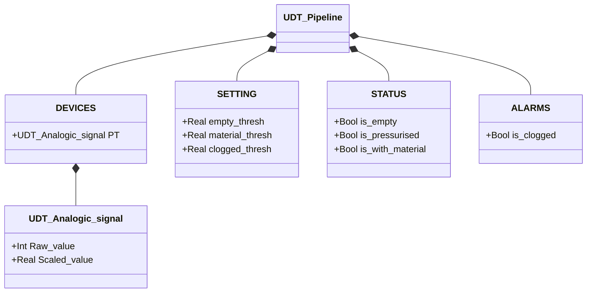

# Pipeline — Pressure State Supervision

## Overview

`Pipeline` derives the pipeline state from the pressure transmitter reading (`PT.Scaled_value`). The logic is a simple lookup table: the PT value is compared sequentially against three thresholds and the corresponding state flag is set. Exactly one flag is TRUE at any time.

Four states cover the full operating range: empty pipeline, pressurised (no material), with material, clogged.

---

## Main Components

- **Pressure transmitter `PT`** — analogue pressure reading from the pipeline; exposes `PT.Raw_value` (raw ADC) and `PT.Scaled_value` (in engineering units, typically bar)
- **Configurable thresholds** — three values defining boundaries between the four states

---

## I/O Signals

| Signal | Type | Description |
|--------|------|-------------|
| `DEVICES.PT.Scaled_value` | Real | Pressure reading in engineering units [bar] |
| `DEVICES.PT.Raw_value` | Int | Raw ADC value from transmitter |
| `STATUS.is_empty` | Bool | TRUE if PT < `empty_thresh` |
| `STATUS.is_pressurised` | Bool | TRUE if `empty_thresh` ≤ PT < `material_thresh` |
| `STATUS.is_with_material` | Bool | TRUE if `material_thresh` ≤ PT < `clogged_thresh` |
| `ALARMS.is_clogged` | Bool | TRUE if PT ≥ `clogged_thresh` |

---

## Operating Routine

Each PLC scan, the FB evaluates `PT.Scaled_value` against the three thresholds in sequence:

```
IF PT < empty_thresh       → is_empty := TRUE
ELSIF PT < material_thresh → is_pressurised := TRUE
ELSIF PT < clogged_thresh  → is_with_material := TRUE
ELSE                       → is_clogged := TRUE
```

State flags are cleared at the start of each scan before evaluation. There is no hysteresis and no state machine — the current state is a direct, instantaneous function of the PT value.

`is_clogged` is placed in the `ALARMS` structure rather than `STATUS` because it indicates an abnormal condition requiring intervention. A clogged event should typically halt any active transport and generate an alarm in the orchestrator.

---

## Alarms

| ID | Condition | Cause |
|----|-----------|-------|
| PL-A01 | `ALARMS.is_clogged` | PT ≥ `clogged_thresh` — excessive pressure, possible obstruction or upstream valve closed |

---

## Settings

| Parameter | Default | Description |
|-----------|---------|-------------|
| `SETTING.empty_thresh` | 0.5 | Lower threshold: below this value the pipeline is empty |
| `SETTING.material_thresh` | 1.0 | Material threshold: above indicates material present in pipeline |
| `SETTING.clogged_thresh` | 1.5 | Clog threshold: above indicates abnormal pressure |

Default values are indicative — calibrate against actual system commissioning data.

---

## Data Structure



---

## State Logic

The block does not implement an FSM — state is determined by a priority-ordered evaluation:

| PT Condition | Active Flag | Description |
|--------------|-------------|-------------|
| `PT < empty_thresh` | `STATUS.is_empty` | Pipeline empty, no pressure |
| `empty_thresh ≤ PT < material_thresh` | `STATUS.is_pressurised` | Pipeline pressurised, no material |
| `material_thresh ≤ PT < clogged_thresh` | `STATUS.is_with_material` | Material present in pipeline |
| `PT ≥ clogged_thresh` | `ALARMS.is_clogged` | Abnormal pressure — possible obstruction |
