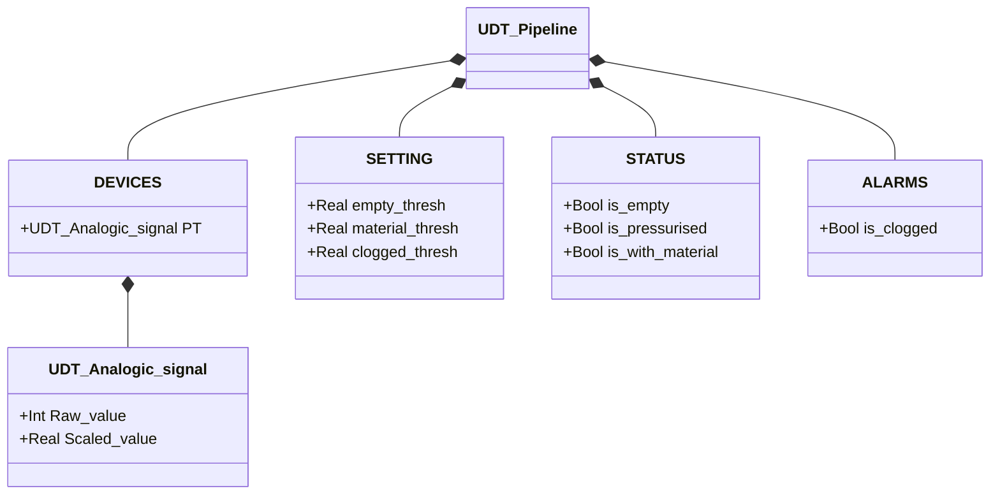

# Pipeline — Supervisione Stato di Pressione

## Panoramica

`Pipeline` deriva lo stato della pipeline dalla lettura del trasmettitore di pressione (`PT.Scaled_value`). La logica è una semplice tabella di lookup: il valore PT viene confrontato sequenzialmente con tre soglie e viene impostato il flag di stato corrispondente. Un solo flag è TRUE in qualsiasi momento.

Quattro stati coprono l'intera escursione operativa: pipeline vuota, in pressione (senza materiale), con materiale, otturata.

---

## Componenti principali

- **Trasmettitore di pressione `PT`** — lettura analogica della pressione nella pipeline; espone `PT.Raw_value` (grezzo) e `PT.Scaled_value` (in unità ingegneristiche, tipicamente bar)
- **Soglie configurabili** — tre valori che definiscono i confini tra i quattro stati

---

## Segnali I/O

| Segnale | Tipo | Descrizione |
|---------|------|-------------|
| `DEVICES.PT.Scaled_value` | Real | Lettura pressione in unità ingegneristiche [bar] |
| `DEVICES.PT.Raw_value` | Int | Valore grezzo ADC del trasmettitore |
| `STATUS.is_empty` | Bool | TRUE se PT < `empty_thresh` |
| `STATUS.is_pressurised` | Bool | TRUE se `empty_thresh` ≤ PT < `material_thresh` |
| `STATUS.is_with_material` | Bool | TRUE se `material_thresh` ≤ PT < `clogged_thresh` |
| `ALARMS.is_clogged` | Bool | TRUE se PT ≥ `clogged_thresh` |

---

## Funzionamento

Ad ogni ciclo PLC, il FB valuta `PT.Scaled_value` contro le tre soglie in sequenza:

```
IF PT < empty_thresh       → is_empty := TRUE
ELSIF PT < material_thresh → is_pressurised := TRUE
ELSIF PT < clogged_thresh  → is_with_material := TRUE
ELSE                       → is_clogged := TRUE
```

I flag di stato vengono azzerati all'inizio di ogni scan prima della valutazione. Non c'è isteresi e non c'è macchina a stati — lo stato corrente è una funzione diretta e istantanea del valore PT.

`is_clogged` è collocato nella struttura `ALARMS` invece di `STATUS` perché indica una condizione anomala che richiede intervento. Un evento di ostruzione deve tipicamente interrompere qualsiasi trasporto attivo e generare un allarme nell'orchestratore.

---

## Allarmi

| ID | Condizione | Causa |
|----|------------|-------|
| PL-A01 | `ALARMS.is_clogged` | PT ≥ `clogged_thresh` — pressione eccessiva, possibile ostruzione o valvola chiusa a monte |

---

## Parametri

| Parametro | Default | Descrizione |
|-----------|---------|-------------|
| `SETTING.empty_thresh` | 0.5 | Soglia inferiore: sotto questo valore la pipeline è vuota |
| `SETTING.material_thresh` | 1.0 | Soglia materiale: sopra indica presenza di materiale nella pipeline |
| `SETTING.clogged_thresh` | 1.5 | Soglia ostruzione: sopra indica pressione anomala |

I valori di default sono indicativi — calibrare con i dati di commissioning reali del sistema.

---

## Struttura dati



---

## Logica di stato

Il blocco non implementa una FSM — lo stato è determinato da una valutazione prioritaria:

| Condizione PT | Flag attivo | Descrizione |
|---------------|-------------|-------------|
| `PT < empty_thresh` | `STATUS.is_empty` | Pipeline vuota, nessuna pressione |
| `empty_thresh ≤ PT < material_thresh` | `STATUS.is_pressurised` | Pipeline in pressione, no materiale |
| `material_thresh ≤ PT < clogged_thresh` | `STATUS.is_with_material` | Materiale presente nella pipeline |
| `PT ≥ clogged_thresh` | `ALARMS.is_clogged` | Pressione anomala — possibile ostruzione |
