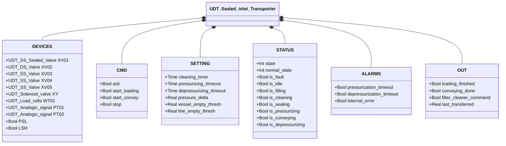
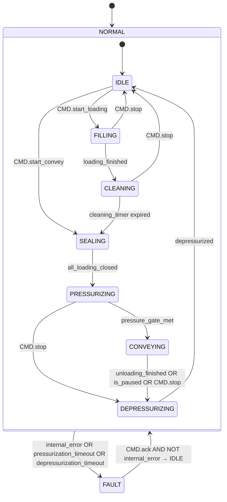

# Sealed Inlet Transporter

## Overview

`Sealed_inlet_Transporter` orchestrates a complete pressurised pneumatic conveying cycle: it loads material into a vessel, seals it, pressurises it above line pressure, conveys the material into the process line, then depressurises the vessel before the next cycle.

The block coordinates five valves (`XV01`–`XV05`), a pressurisation solenoid (`XY`), a load cell assembly (`WT01`), and two analogue pressure transmitters (`PT01` vessel, `PT02` line). Two digital pressure switches (`PSL`, `LSH`) enforce safety constraints.

The FSM is two-level: `NORMAL`/`FAULT` at the top; `IDLE`→`FILLING`→`CLEANING`→`SEALING`→`PRESSURIZING`→`CONVEYING`→`DEPRESSURIZING` at the operating level.

---

## Main Components

| Device | Type | Role |
|--------|------|------|
| `XV01` | UDT_SS_Sealed_Valve | Inlet valve; sealed at rest |
| `XV02` | UDT_DS_Valve | Vent valve; open in IDLE, FILLING, FAULT |
| `XV03` | UDT_SS_Valve | Orifice valve; open during FILLING |
| `XV04` | UDT_SS_Valve | Discharge valve; open during PRESSURIZING and CONVEYING |
| `XV05` | UDT_SS_Valve | Line valve; open during CONVEYING |
| `XY` | UDT_Solenoid_valve | Pressurisation solenoid; energised during PRESSURIZING and CONVEYING |
| `WT01` | UDT_Load_cells | Load cell assembly; driven by internal `Loading` and `Unloading` |
| `PT01` | UDT_Analogic_signal | Vessel pressure transmitter |
| `PT02` | UDT_Analogic_signal | Line pressure transmitter |
| `PSL` | Bool | Safety pressure switch: TRUE = pressure within safe limits |
| `LSH` | Bool | High-level sensor: TRUE = vessel over-filled (fault condition) |

---

## I/O Signals

### Commands (`CMD`)

| Signal | Type | Description |
|--------|------|-------------|
| `CMD.ack` | Bool | Acknowledge alarms; propagated to all sub-devices |
| `CMD.start_loading` | Bool | Start the loading sequence (IDLE → FILLING) |
| `CMD.start_convey` | Bool | Start conveying without loading (IDLE → SEALING) |
| `CMD.stop` | Bool | Operator stop; drives toward DEPRESSURIZING or IDLE |

### Settings (`SETTING`)

| Signal | Type | Description |
|--------|------|-------------|
| `SETTING.cleaning_timer` | Time | Duration of the CLEANING phase |
| `SETTING.pressurizing_timeout` | Time | Maximum time to reach conveying pressure |
| `SETTING.depressurizing_timeout` | Time | Maximum time to return to atmospheric pressure |
| `SETTING.pressure_delta` | Real | Minimum vessel overpressure above line pressure to open XV05 [bar] |
| `SETTING.vessel_empty_thresh` | Real | PT01 threshold to consider vessel at atmospheric pressure [bar] |
| `SETTING.line_empty_thresh` | Real | PT02 threshold to consider line at atmospheric pressure [bar] |

### Status (`STATUS`)

| Signal | Type | Description |
|--------|------|-------------|
| `STATUS.state` | Int | 0=FAULT, 1=NORMAL |
| `STATUS.normal_state` | Int | 10=IDLE, 20=FILLING, 30=CLEANING, 40=SEALING, 50=PRESSURIZING, 60=CONVEYING, 70=DEPRESSURIZING |
| `STATUS.is_fault` | Bool | TRUE in FAULT |
| `STATUS.is_idle` | Bool | TRUE in IDLE |
| `STATUS.is_filling` | Bool | TRUE in FILLING |
| `STATUS.is_cleaning` | Bool | TRUE in CLEANING |
| `STATUS.is_sealing` | Bool | TRUE in SEALING |
| `STATUS.is_pressurizing` | Bool | TRUE in PRESSURIZING |
| `STATUS.is_conveying` | Bool | TRUE in CONVEYING |
| `STATUS.is_depressurizing` | Bool | TRUE in DEPRESSURIZING |

### Outputs (`OUT`)

| Signal | Type | Description |
|--------|------|-------------|
| `OUT.loading_finished` | Bool | 1-scan pulse on entering SEALING from CLEANING (load complete) |
| `OUT.conveying_done` | Bool | 1-scan pulse on entering IDLE (full cycle complete) |
| `OUT.filter_cleaner_command` | Bool | TRUE during CLEANING — enables external filter cleaning system |
| `OUT.last_transferred` | Real | Quantity conveyed in the last CONVEYING phase [kg] |

### Alarms (`ALARMS`)

| Signal | Type | Description |
|--------|------|-------------|
| `ALARMS.pressurization_timeout` | Bool | Pressurisation not completed within `pressurizing_timeout` |
| `ALARMS.depressurization_timeout` | Bool | Depressurisation not completed within `depressurizing_timeout` |
| `ALARMS.internal_error` | Bool | OR of all internal faults: valves, load cell, PSL, LSH |

---

## Operating Routine

### Derived conditions (every scan)

- **`all_loading_closed`** — XV01, XV02, XV03 all confirmed closed (prerequisite for SEALING → PRESSURIZING)
- **`pressure_gate_met`** — `PT01 ≥ PT02 + pressure_delta` (vessel sufficiently over-pressured above line)
- **`depressurized`** — `PT01 ≤ vessel_empty_thresh AND PT02 ≤ line_empty_thresh`
- **`internal_error`** — fault on XV01–05, load cell timeout, `NOT PSL` (safety pressure lost), or `LSH` (high level)

### Loading sequence

1. **IDLE** → `CMD.start_loading` → **FILLING**: XV01 (inlet), XV02 (vent), XV03 (orifice) open; internal `Loading` FB manages the scale.
2. **FILLING** → scale reaches setpoint (`loading_finished`) → **CLEANING**: inlet filter regenerated for `cleaning_timer`.
3. **CLEANING** → timer expires → **SEALING**: all inlet valves close.
4. **SEALING** → `all_loading_closed` → **PRESSURIZING**: XY energised + XV04 (discharge) open to pressurise vessel.
5. **PRESSURIZING** → `pressure_gate_met` → **CONVEYING**: XV05 (line) opens; internal `Unloading` FB manages the scale.
6. **CONVEYING** → scale empty or `CMD.stop` → **DEPRESSURIZING**: XV02 (vent) opens to relieve pressure.
7. **DEPRESSURIZING** → `depressurized` → **IDLE**: `OUT.conveying_done` 1-scan pulse.

### Direct conveying sequence

`CMD.start_convey` in IDLE jumps directly to SEALING (skipping FILLING and CLEANING), for conveying material already present in the vessel.

### FAULT behaviour

In FAULT: XV02 (vent) opens for passive safety; scale stopped and reset. `CMD.ack` with `NOT internal_error` returns to NORMAL/IDLE.

---

## Alarms

| ID | Condition | Cause |
|----|-----------|-------|
| TR-E01 | `ALARMS.pressurization_timeout` | Pressure not reached within timeout — check air supply, XV04, PT01/02 |
| TR-E02 | `ALARMS.depressurization_timeout` | Vent not completed within timeout — check XV02, PT01/02 |
| TR-E03 | `ALARMS.internal_error` (valve) | Fault on an internal valve — check specific alarms on XV01–05 |
| TR-E04 | `ALARMS.internal_error` (scale) | Loading or Unloading timeout — check load cells and plant |
| TR-E05 | `ALARMS.internal_error` (NOT PSL) | Safety pressure lost — emergency condition |
| TR-E06 | `ALARMS.internal_error` (LSH) | High level in vessel — obstruction or sensor fault |

---

## Settings

| Parameter | Default | Description |
|-----------|---------|-------------|
| `SETTING.cleaning_timer` | — | Duration of the CLEANING phase |
| `SETTING.pressurizing_timeout` | — | Maximum duration of PRESSURIZING phase |
| `SETTING.depressurizing_timeout` | — | Maximum duration of DEPRESSURIZING phase |
| `SETTING.pressure_delta` | — | Minimum vessel-to-line overpressure [bar] |
| `SETTING.vessel_empty_thresh` | — | PT01 threshold for `depressurized` condition [bar] |
| `SETTING.line_empty_thresh` | — | PT02 threshold for `depressurized` condition [bar] |

---

## Data Structure

---

## State Machine (FSM)

### Output table by operating state

| State | XV01 | XV02 | XV03 | XV04 | XV05 | XY | WT01 | OUT.filter_cleaner |
|-------|------|------|------|------|------|----|------|--------------------|
| IDLE | — | open | — | — | — | — | — | FALSE |
| FILLING | open | open | open | — | — | — | Loading | FALSE |
| CLEANING | — | — | — | — | — | — | — | TRUE |
| SEALING | — | — | — | — | — | — | — | FALSE |
| PRESSURIZING | — | — | — | open | — | energised | — | FALSE |
| CONVEYING | — | — | — | open | open | energised | Unloading | FALSE |
| DEPRESSURIZING | — | open | — | — | — | — | — | FALSE |
| FAULT | — | open | — | — | — | — | stop+reset | FALSE |

Valves not listed for a given state are closed (CMD.auto = FALSE). XV01–05 and XY each have their own sub-FB running continuously; the orchestrator writes only `CMD.auto`.
