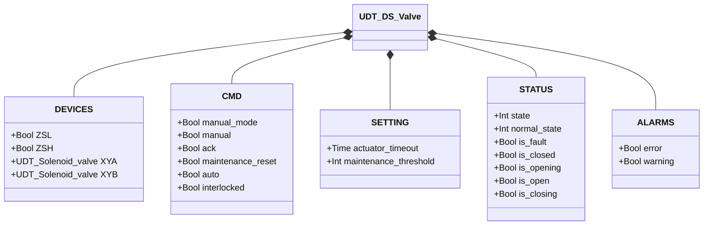
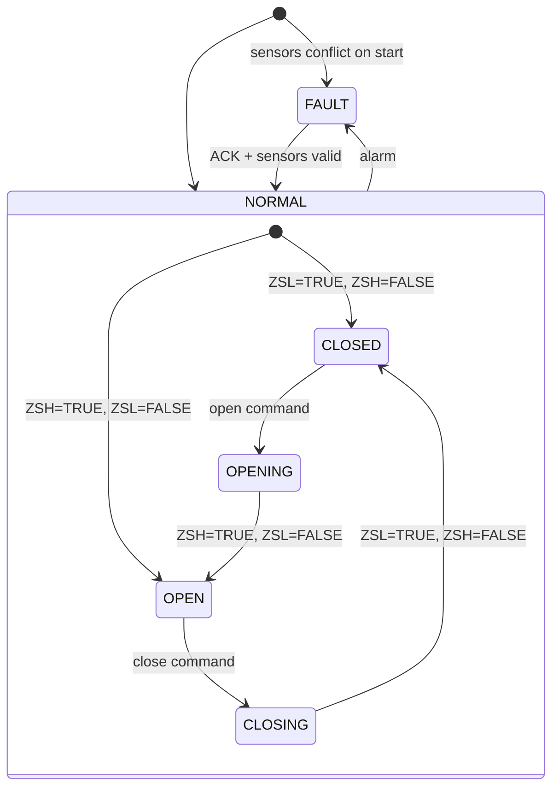

# Butterfly Valve — Double Solenoid (DS)

## Overview

The DS butterfly valve is a pneumatic rotary valve with two independent solenoids. `XYA` drives the actuator to open; `XYB` drives it to close. Because the actuator is double-acting (bistable), both solenoids are held energized in their respective stable positions. Two limit switches (`ZSL` closed, `ZSH` open) provide position feedback. A movement counter triggers a maintenance warning at the configured threshold.

---

## Main Components

- **Valve body** — flanged inlet/outlet, disc mounted on shaft
- **Double-acting pneumatic actuator** — no spring return; holds position when solenoids de-energized
- **Solenoid valve `XYA`** — drives actuator to open position (energized = opening/holding open)
- **Solenoid valve `XYB`** — drives actuator to close position (energized = closing/holding closed)
- **Limit switch `ZSL`** — TRUE when disc is fully closed
- **Limit switch `ZSH`** — TRUE when disc is fully open

---

## I/O Signals

| Signal | Type | Description |
|--------|------|-------------|
| `ZSL` | Input — Bool | Limit switch: TRUE = valve fully closed |
| `ZSH` | Input — Bool | Limit switch: TRUE = valve fully open |
| `XYA` | Output — Bool | Open solenoid: TRUE = drive/hold open |
| `XYB` | Output — Bool | Close solenoid: TRUE = drive/hold closed |

---

## Operating Routine

On an **open command**, `XYA` is energized and `XYB` is de-energized. The actuator rotates the disc to open. The valve confirms when `ZSH = TRUE` and `ZSL = FALSE`. `XYA` remains energized to hold the disc open.

On a **close command**, `XYB` is energized and `XYA` is de-energized. The actuator rotates the disc to closed. The valve confirms when `ZSL = TRUE` and `ZSH = FALSE`. `XYB` remains energized to hold the disc closed.

In **fault state**, both solenoids are de-energized. The disc holds its last physical position (bistable actuator).

In **manual mode** (`manual_mode = TRUE`), the operator commands from HMI via `manual`. In **automatic mode**, the command comes from the process via `auto`. If `interlocked = TRUE`, the valve holds position.

Each completed movement increments `movement_counter`. Reset with `maintenance_reset = TRUE`.

---

## Alarms

| ID | Condition | Cause |
|----|-----------|-------|
| DS-E01 | ZSL = TRUE and ZSH = TRUE simultaneously | Sensor fault, misalignment, wiring short |
| DS-E02 | Valve in CLOSED state but ZSL = FALSE | ZSL fault, mechanical obstruction |
| DS-E03 | Valve in OPEN state but ZSH = FALSE | ZSH fault, solenoid fault, no air supply |
| DS-E04 | Movement did not complete within `actuator_timeout` | Mechanical obstruction, solenoid fault, insufficient air |
| DS-W01 | `movement_counter` ≥ `maintenance_threshold` | Inspection interval reached — reset with `maintenance_reset` |

---

## Settings

| Parameter | Default | Description |
|-----------|---------|-------------|
| `actuator_timeout` | T#2s | Maximum time for actuator to reach target position |
| `maintenance_threshold` | 10000 | Movement count before maintenance warning |

---

## Data Structure

---

## State Machine

### State and Output Table

| State | `XYA` | `XYB` | `ZSL` expected | `ZSH` expected | Description |
|-------|-------|-------|---------------|---------------|-------------|
| CLOSED | FALSE | TRUE | TRUE | FALSE | Disc closed, XYB holds position |
| OPENING | TRUE | FALSE | (transitioning) | (transitioning) | XYA driving disc open |
| OPEN | TRUE | FALSE | FALSE | TRUE | Disc fully open, XYA holds position |
| CLOSING | FALSE | TRUE | (transitioning) | (transitioning) | XYB driving disc closed |
| FAULT | FALSE | FALSE | — | — | Both de-energized; disc holds last position |

### State Transition Table

| Current State | Condition | Next State | Action |
|---------------|-----------|------------|--------|
| CLOSED | open command | OPENING | `XYA` → TRUE, `XYB` → FALSE; start timeout timer |
| OPENING | ZSH=TRUE, ZSL=FALSE | OPEN | Stop timeout timer; increment counter |
| OPENING | Timeout elapsed | FAULT | Raise DS-E04 |
| OPEN | close command | CLOSING | `XYA` → FALSE, `XYB` → TRUE; start timeout timer |
| CLOSING | ZSL=TRUE, ZSH=FALSE | CLOSED | Stop timeout timer; increment counter |
| CLOSING | Timeout elapsed | FAULT | Raise DS-E04 |
| CLOSED | ZSL=FALSE | FAULT | Raise DS-E02 |
| OPEN | ZSH=FALSE | FAULT | Raise DS-E03 |
| Any | ZSL=TRUE AND ZSH=TRUE | FAULT | Raise DS-E01 |
| FAULT | ACK=TRUE, sensors valid | CLOSED or OPEN | Re-read sensors; clear alarms |
