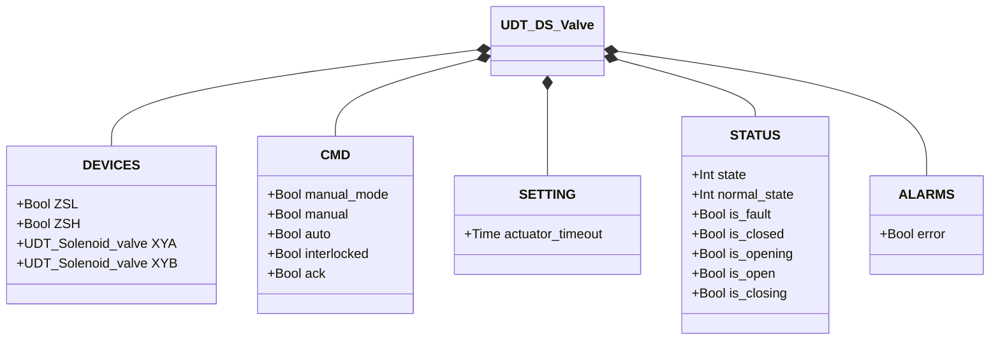
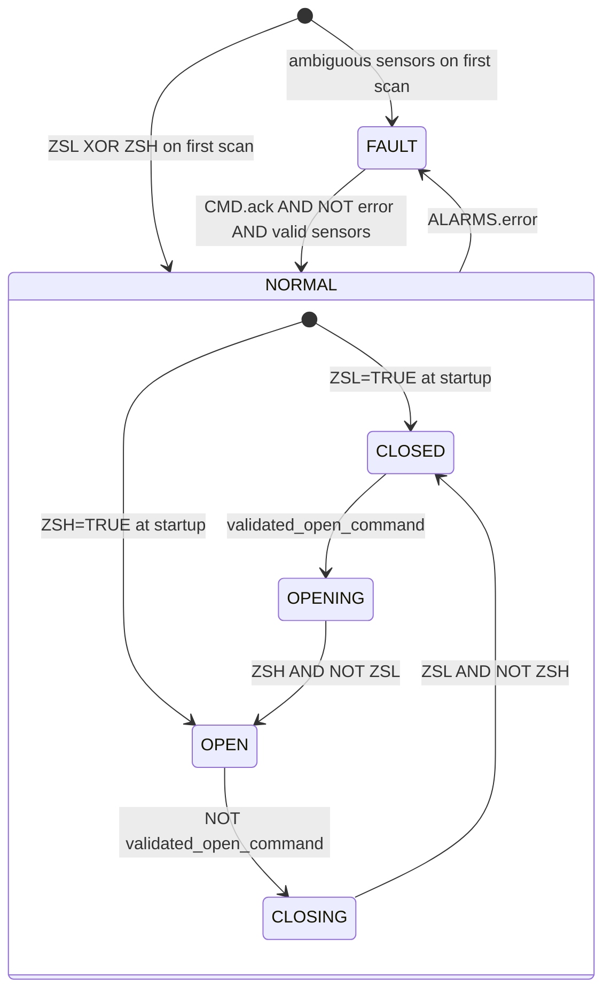

# Double-Solenoid Butterfly Valve (DS)

## Overview

`DS_valve` controls a pneumatic butterfly valve with two independent solenoids. `XYA` drives the actuator toward the open position; `XYB` drives it toward closed. The actuator is double-acting (bistable): it holds position even when both solenoids are de-energised. Two limit switches (`ZSL` closed, `ZSH` open) provide position feedback.

On the first PLC scan, the block reads `ZSL` and `ZSH` to establish the initial state: ZSL active → NORMAL/CLOSED, ZSH active → NORMAL/OPEN, ambiguous → FAULT.

---

## Main Components

- **Double-acting pneumatic actuator** — bistable; no spring return
- **Solenoid valve `XYA`** — drives and holds the actuator in the open position
- **Solenoid valve `XYB`** — drives and holds the actuator in the closed position
- **Limit switch `ZSL`** — TRUE = disc fully closed
- **Limit switch `ZSH`** — TRUE = disc fully open

---

## I/O Signals

| Signal | Type | Description |
|--------|------|-------------|
| `DEVICES.ZSL` | Bool | INPUT — Closed-position limit switch |
| `DEVICES.ZSH` | Bool | INPUT — Open-position limit switch |
| `DEVICES.XYA` | UDT_Solenoid_valve | OUTPUT — Opening solenoid valve |
| `DEVICES.XYB` | UDT_Solenoid_valve | OUTPUT — Closing solenoid valve |
| `CMD.manual_mode` | Bool | COMMAND — TRUE = HMI manual mode |
| `CMD.manual` | Bool | COMMAND — Open command in manual mode |
| `CMD.auto` | Bool | COMMAND — Open command from automation (ReadOnly external) |
| `CMD.interlocked` | Bool | GUARD — TRUE = freezes the validated command (ReadOnly external) |
| `CMD.ack` | Bool | COMMAND — Acknowledges alarms and clears FAULT |
| `SETTING.actuator_timeout` | Time | Actuator movement timeout (default T#2s) |
| `STATUS.state` | Int | STATE — 0=FAULT, 1=NORMAL |
| `STATUS.normal_state` | Int | SUB-STATE — 1=CLOSED, 2=OPENING, 3=OPEN, 4=CLOSING |
| `STATUS.is_fault` | Bool | STATE — Block in fault condition |
| `STATUS.is_closed` | Bool | STATE — Valve at rest in closed position |
| `STATUS.is_opening` | Bool | STATE — Actuator moving toward open |
| `STATUS.is_open` | Bool | STATE — Valve fully open |
| `STATUS.is_closing` | Bool | STATE — Actuator moving toward closed |
| `ALARMS.error` | Bool | ALARM — One or more faults active |

---

## Operating Routine

The block resolves the desired command each scan identically to `SS_valve` (manual/automatic/interlock). The validated command drives all state transitions.

**CLOSED** — `XYB` energised to hold disc in closed position; `XYA` de-energised. When `validated_open_command = TRUE`, transition to OPENING.

**OPENING** — `XYA` energised; `XYB` de-energised. Actuator drives disc toward open. When `ZSH = TRUE AND ZSL = FALSE` → OPEN. If `actuator_timeout` expires → `movement_timeout`.

**OPEN** — `XYA` energised to hold disc open; `XYB` de-energised. When `validated_open_command = FALSE`, transition to CLOSING.

**CLOSING** — `XYB` energised; `XYA` de-energised. Actuator drives disc toward closed. When `ZSL = TRUE AND ZSH = FALSE` → CLOSED. If timer expires → `movement_timeout`.

**FAULT** — Both solenoids de-energised; bistable actuator holds the last physical position. `CMD.ack` clears alarms; if sensors show a valid position, the block returns to NORMAL.

---

## Alarms

Four internal alarms are ORed into `ALARMS.error`. All clear on `CMD.ack`.

| Alarm | Condition | Typical cause |
|-------|-----------|---------------|
| `sensor_conflict` | `ZSL = TRUE AND ZSH = TRUE` | Short circuit, limit switch out of position |
| `failed_to_close` | NORMAL/CLOSED but `ZSL = FALSE` | ZSL signal lost, mechanical obstruction |
| `failed_to_open` | NORMAL/OPEN but `ZSH = FALSE` | ZSH signal lost, solenoid fault, air supply lost |
| `movement_timeout` | OPENING or CLOSING beyond `actuator_timeout` | Obstruction, insufficient air, solenoid fault |

---

## Settings

| Parameter | Default | Description |
|-----------|---------|-------------|
| `SETTING.actuator_timeout` | T#2s | Maximum time allowed for OPENING and CLOSING before `movement_timeout` is raised |

---

## Data Structure

---

## State Machine (FSM)

### State and Output Table

| State | Sub-state | `XYA.CMD.auto` | `XYB.CMD.auto` | Description |
|-------|-----------|----------------|----------------|-------------|
| FAULT | — | FALSE | FALSE | Fault; disc holds last physical position |
| NORMAL | CLOSED | FALSE | TRUE | Disc closed; XYB holds position |
| NORMAL | OPENING | TRUE | FALSE | XYA driving disc toward open |
| NORMAL | OPEN | TRUE | FALSE | Disc open; XYA holds position |
| NORMAL | CLOSING | FALSE | TRUE | XYB driving disc toward closed |

### State Transition Table

| Current state | Condition | Next state |
|---------------|-----------|------------|
| NORMAL/CLOSED | `validated_open_command` | NORMAL/OPENING |
| NORMAL/OPENING | `ZSH AND NOT ZSL` | NORMAL/OPEN |
| NORMAL/OPEN | `NOT validated_open_command` | NORMAL/CLOSING |
| NORMAL/CLOSING | `ZSL AND NOT ZSH` | NORMAL/CLOSED |
| NORMAL (any) | `ALARMS.error` | FAULT |
| FAULT | `CMD.ack AND NOT error AND ZSL XOR ZSH` | NORMAL/CLOSED or NORMAL/OPEN |
