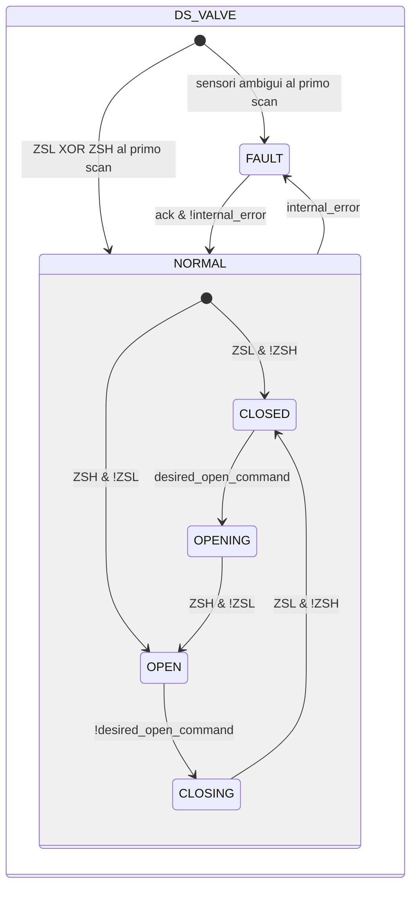
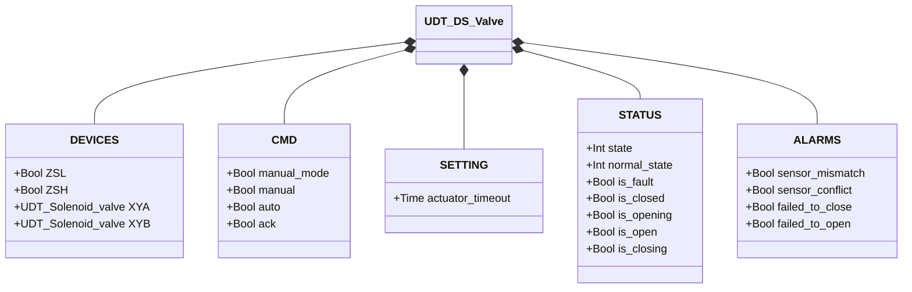

# Valvola a Farfalla — Bisolenoide (DS)

## Panoramica

**Tier 3 — composito.** `DS_valve` gestisce una valvola a farfalla pneumatica con due solenoidi indipendenti, incorporando due istanze di Valvola a Solenoide (Tier 1). `XYA` aziona l'attuatore verso l'apertura; `XYB` verso la chiusura. L'attuatore è a doppio effetto (bistabile): mantiene la posizione anche a entrambi i solenoidi diseccitati — nessun ritorno a molla. Due finecorsa (`ZSL` chiuso, `ZSH` aperto) forniscono il feedback di posizione.

Al primo ciclo PLC, il blocco legge `ZSL`/`ZSH` per lo stato iniziale, con la stessa logica di `SS_valve`.

---

## Composizione

| Tag | Tipo | Ruolo |
|-----|------|-------|
| `XYA` | Valvola a Solenoide (Tier 1) | Aziona verso l'apertura |
| `XYB` | Valvola a Solenoide (Tier 1) | Aziona verso la chiusura |

Un'unica decisione manuale/automatica (`manual_mode`/`manual`/`auto`, risolta in `desired_open_command`) pilota quale dei due solenoidi va eccitato — le due istanze non arbitrano mai in autonomia.

---

## Segnali di controllo

| Segnale | Tipo | Descrizione |
|---------|------|-------------|
| `DEVICES.ZSL` | Bool | INPUT — Finecorsa posizione chiusa |
| `DEVICES.ZSH` | Bool | INPUT — Finecorsa posizione aperta |
| `DEVICES.XYA` | UDT_Solenoid_valve | OUTPUT — Elettrovalvola apertura |
| `DEVICES.XYB` | UDT_Solenoid_valve | OUTPUT — Elettrovalvola chiusura |
| `CMD.manual_mode` | Bool | TRUE = modalità manuale HMI |
| `CMD.manual` | Bool | Comando di apertura in modalità manuale |
| `CMD.auto` | Bool | Comando di apertura dall'automazione (ReadOnly external) |
| `CMD.ack` | Bool | Conferma allarmi e ripristino da FAULT |

---

## Parametri di regolazione

| Parametro | Default | Descrizione |
|-----------|---------|-------------|
| `SETTING.actuator_timeout` | T#2s | Tempo massimo ammesso per OPENING e CLOSING |

---

## Stati e output

| Stato | `XYA` | `XYB` | Descrizione |
|-------|-------|-------|-------------|
| CLOSED | FALSE | FALSE | Disco chiuso; nessuna eccitazione necessaria (bistabile) |
| OPENING | TRUE | FALSE | `XYA` spinge il disco verso apertura |
| OPEN | FALSE | FALSE | Disco aperto; nessuna eccitazione necessaria |
| CLOSING | FALSE | TRUE | `XYB` riporta il disco in chiusura |
| FAULT | FALSE | FALSE | Guasto; disco bistabile mantiene l'ultima posizione fisica |

`XYA`/`XYB` sono eccitati solo durante il movimento (`OPENING`/`CLOSING`) — l'attuatore bistabile non richiede eccitazione di mantenimento in `CLOSED`/`OPEN`.

---

## Diagramma di stato



```Pascal
internal_error := sensor_mismatch OR sensor_conflict OR failed_to_close OR failed_to_open;
```

---

## Allarmi

| ID | Condizione specifica |
|----|----------------------|
| [`XV-E01`](../../index.it.md#allarmi-delle-valvole) | Stato stabile corrente non confermato dal finecorsa atteso |
| [`XV-E02`](../../index.it.md#allarmi-delle-valvole) | `ZSL AND ZSH` contemporaneamente TRUE |
| [`XV-E03`](../../index.it.md#allarmi-delle-valvole) | `CLOSING` non confermato entro `actuator_timeout` |
| [`XV-E04`](../../index.it.md#allarmi-delle-valvole) | `OPENING` non confermato entro `actuator_timeout` |

---

## Struttura dati



`internal_error` è interno al blocco funzionale, non esposto tramite l'UDT.
