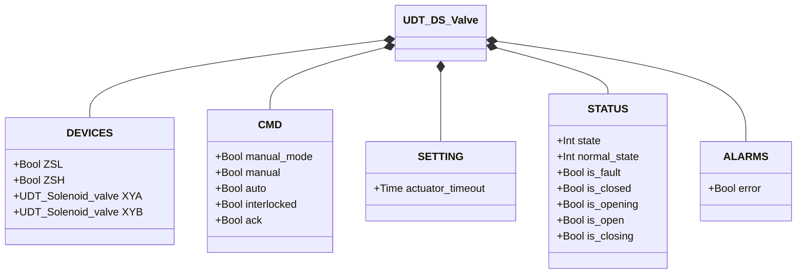
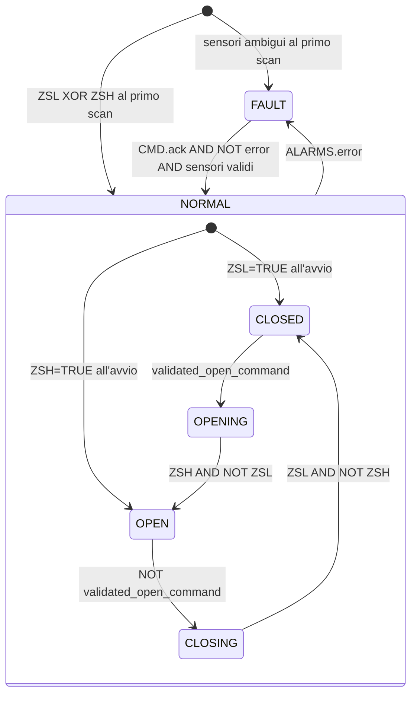

# Valvola a Farfalla — Doppio Solenoide (DS)

## Panoramica

`DS_valve` gestisce una valvola a farfalla pneumatica con due solenoidi indipendenti. `XYA` aziona l'attuatore verso l'apertura; `XYB` lo aziona verso la chiusura. L'attuatore è a doppio effetto (bistabile): mantiene la posizione anche a solenoidi diseccitati. Due finecorsa (`ZSL` chiuso, `ZSH` aperto) forniscono il feedback di posizione.

Al primo ciclo PLC, il simulatore inizializza `ZSL = TRUE`, `ZSH = FALSE` (stato chiuso). Il blocco di controllo legge i sensori per determinare lo stato iniziale: ZSL attivo → NORMAL/CLOSED, ZSH attivo → NORMAL/OPEN, condizione ambigua → FAULT.

---

## Componenti principali

- **Attuatore pneumatico a doppio effetto** — bistabile; nessun ritorno a molla
- **Elettrovalvola `XYA`** — aziona e mantiene l'attuatore in posizione aperta
- **Elettrovalvola `XYB`** — aziona e mantiene l'attuatore in posizione chiusa
- **Finecorsa `ZSL`** — TRUE = disco completamente chiuso
- **Finecorsa `ZSH`** — TRUE = disco completamente aperto

---

## Segnali I/O

| Segnale | Tipo | Descrizione |
|---------|------|-------------|
| `DEVICES.ZSL` | Bool | INPUT — Finecorsa posizione chiusa |
| `DEVICES.ZSH` | Bool | INPUT — Finecorsa posizione aperta |
| `DEVICES.XYA` | UDT_Solenoid_valve | OUTPUT — Elettrovalvola apertura |
| `DEVICES.XYB` | UDT_Solenoid_valve | OUTPUT — Elettrovalvola chiusura |
| `CMD.manual_mode` | Bool | COMANDO — TRUE = modalità manuale HMI |
| `CMD.manual` | Bool | COMANDO — Comando apertura in modalità manuale |
| `CMD.auto` | Bool | COMANDO — Comando apertura dall'automazione (ReadOnly external) |
| `CMD.interlocked` | Bool | GUARDIA — TRUE = blocca aggiornamento del comando validato (ReadOnly external) |
| `CMD.ack` | Bool | COMANDO — Conferma allarmi e ripristino da FAULT |
| `SETTING.actuator_timeout` | Time | Timeout movimento attuatore (default T#2s) |
| `STATUS.state` | Int | STATO — 0=FAULT, 1=NORMAL |
| `STATUS.normal_state` | Int | SOTTOSTATO — 1=CLOSED, 2=OPENING, 3=OPEN, 4=CLOSING |
| `STATUS.is_fault` | Bool | STATO — Blocco in condizione di guasto |
| `STATUS.is_closed` | Bool | STATO — Valvola ferma in posizione chiusa |
| `STATUS.is_opening` | Bool | STATO — Attuatore in movimento verso apertura |
| `STATUS.is_open` | Bool | STATO — Valvola completamente aperta |
| `STATUS.is_closing` | Bool | STATO — Attuatore in movimento verso chiusura |
| `ALARMS.error` | Bool | ALLARME — Uno o più guasti attivi |

---

## Funzionamento

Il blocco risolve il comando desiderato ogni scan esattamente come `SS_valve` (manuale/automatico/interblocco). Il comando validato controlla le transizioni di stato.

**CLOSED** — `XYB` eccitata per mantenere il disco in posizione chiusa; `XYA` diseccitata. Se `validated_open_command = TRUE`, transizione verso OPENING.

**OPENING** — `XYA` eccitata; `XYB` diseccitata. L'attuatore spinge il disco verso l'apertura. Quando `ZSH = TRUE AND ZSL = FALSE` → OPEN. Se `actuator_timeout` scade → `movement_timeout`.

**OPEN** — `XYA` eccitata per mantenere il disco aperto; `XYB` diseccitata. Se `validated_open_command = FALSE`, transizione verso CLOSING.

**CLOSING** — `XYB` eccitata; `XYA` diseccitata. L'attuatore porta il disco in chiusura. Quando `ZSL = TRUE AND ZSH = FALSE` → CLOSED. Se il timer scade → `movement_timeout`.

**FAULT** — Entrambi i solenoidi diseccitati; il disco bistabile mantiene l'ultima posizione fisica. `CMD.ack` azzera gli allarmi e, se i sensori mostrano una posizione valida, il blocco ritorna in NORMAL.

---

## Allarmi

Quattro allarmi interni si sommano in `ALARMS.error`. Tutti si azzerano con `CMD.ack`.

| Allarme | Condizione | Causa tipica |
|---------|------------|--------------|
| `sensor_conflict` | `ZSL = TRUE AND ZSH = TRUE` | Cortocircuito, finecorsa fuori sede |
| `failed_to_close` | NORMAL/CLOSED ma `ZSL = FALSE` | Perdita segnale ZSL, ostruzione meccanica |
| `failed_to_open` | NORMAL/OPEN ma `ZSH = FALSE` | Perdita segnale ZSH, guasto solenoide, assenza aria |
| `movement_timeout` | OPENING o CLOSING oltre `actuator_timeout` | Ostruzione, aria insufficiente, solenoide guasto |

---

## Parametri

| Parametro | Default | Descrizione |
|-----------|---------|-------------|
| `SETTING.actuator_timeout` | T#2s | Tempo massimo ammesso per OPENING e CLOSING prima di generare `movement_timeout` |

---

## Struttura dati

---

## Macchina a stati (FSM)

### Tabella stati e uscite

| Stato | Sottostato | `XYA.CMD.auto` | `XYB.CMD.auto` | Descrizione |
|-------|------------|----------------|----------------|-------------|
| FAULT | — | FALSE | FALSE | Guasto; disco mantiene ultima posizione |
| NORMAL | CLOSED | FALSE | TRUE | Disco chiuso; XYB mantiene posizione |
| NORMAL | OPENING | TRUE | FALSE | XYA spinge il disco verso apertura |
| NORMAL | OPEN | TRUE | FALSE | Disco aperto; XYA mantiene posizione |
| NORMAL | CLOSING | FALSE | TRUE | XYB riporta il disco in chiusura |

### Tabella transizioni di stato

| Stato attuale | Condizione | Stato successivo |
|---------------|------------|-----------------|
| NORMAL/CLOSED | `validated_open_command` | NORMAL/OPENING |
| NORMAL/OPENING | `ZSH AND NOT ZSL` | NORMAL/OPEN |
| NORMAL/OPEN | `NOT validated_open_command` | NORMAL/CLOSING |
| NORMAL/CLOSING | `ZSL AND NOT ZSH` | NORMAL/CLOSED |
| NORMAL (qualsiasi) | `ALARMS.error` | FAULT |
| FAULT | `CMD.ack AND NOT error AND ZSL XOR ZSH` | NORMAL/CLOSED o NORMAL/OPEN |
