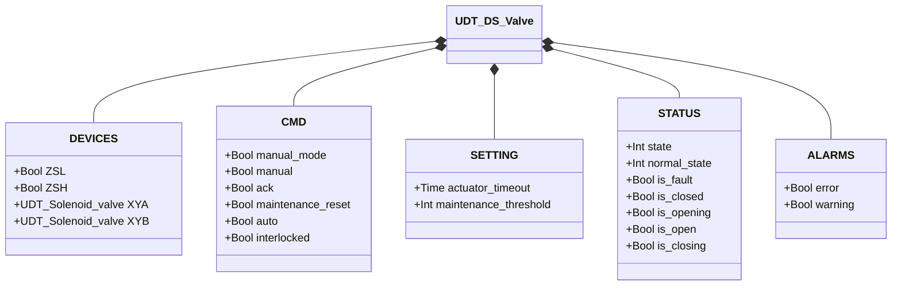
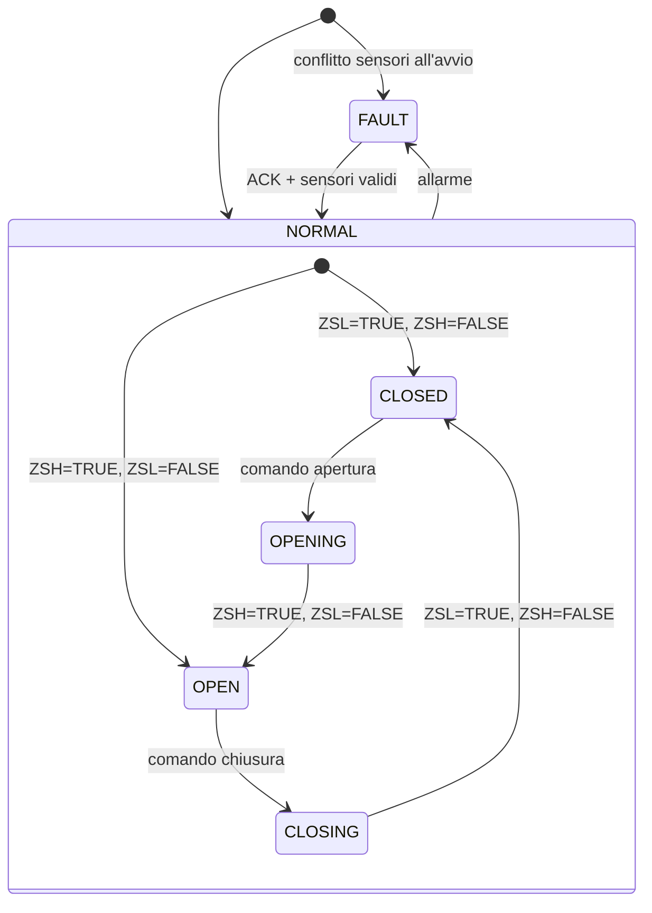

# Valvola a Farfalla — Doppio Solenoide (DS)

## Panoramica

La valvola a farfalla DS è una valvola rotativa pneumatica con due solenoidi indipendenti. `XYA` aziona l'attuatore in apertura; `XYB` lo aziona in chiusura. Poiché l'attuatore è a doppio effetto (bistabile), entrambi i solenoidi rimangono eccitati nelle rispettive posizioni stabili. Due finecorsa (`ZSL` chiuso, `ZSH` aperto) forniscono il feedback di posizione. Un contatore di movimenti genera un avviso di manutenzione al raggiungimento della soglia configurata.

---

## Componenti principali

- **Corpo valvola** — flangiato con ingresso/uscita, disco montato su albero
- **Attuatore pneumatico a doppio effetto** — nessun ritorno a molla; mantiene la posizione a solenoidi diseccitati
- **Elettrovalvola `XYA`** — aziona l'attuatore in apertura (eccitata = apertura/mantenimento aperto)
- **Elettrovalvola `XYB`** — aziona l'attuatore in chiusura (eccitata = chiusura/mantenimento chiuso)
- **Finecorsa `ZSL`** — TRUE quando il disco è completamente chiuso
- **Finecorsa `ZSH`** — TRUE quando il disco è completamente aperto

---

## Segnali I/O

| Segnale | Tipo | Descrizione |
|---------|------|-------------|
| `ZSL` | Ingresso — Bool | Finecorsa: TRUE = valvola completamente chiusa |
| `ZSH` | Ingresso — Bool | Finecorsa: TRUE = valvola completamente aperta |
| `XYA` | Uscita — Bool | Solenoide apertura: TRUE = aziona/mantiene aperta |
| `XYB` | Uscita — Bool | Solenoide chiusura: TRUE = aziona/mantiene chiusa |

---

## Funzionamento

Con un **comando di apertura**, `XYA` viene eccitato e `XYB` diseccitato. L'attuatore ruota il disco verso l'apertura. La valvola conferma quando `ZSH = TRUE` e `ZSL = FALSE`. `XYA` rimane eccitato per mantenere il disco aperto.

Con un **comando di chiusura**, `XYB` viene eccitato e `XYA` diseccitato. L'attuatore ruota il disco verso la chiusura. La valvola conferma quando `ZSL = TRUE` e `ZSH = FALSE`. `XYB` rimane eccitato per mantenere il disco chiuso.

In **stato di guasto**, entrambi i solenoidi vengono diseccitati. Il disco mantiene l'ultima posizione fisica (attuatore bistabile).

In **modalità manuale** (`manual_mode = TRUE`), l'operatore comanda dall'HMI tramite `manual`. In **modalità automatica**, il comando arriva dal processo tramite `auto`. Se `interlocked = TRUE`, la valvola mantiene la posizione.

Ogni movimento completato incrementa `movement_counter`. Si azzera con `maintenance_reset = TRUE`.

---

## Allarmi

| ID | Condizione | Causa |
|----|------------|-------|
| DS-E01 | ZSL = TRUE e ZSH = TRUE simultaneamente | Guasto sensore, disallineamento, cortocircuito |
| DS-E02 | Valvola in stato CLOSED ma ZSL = FALSE | Guasto ZSL, ostruzione meccanica |
| DS-E03 | Valvola in stato OPEN ma ZSH = FALSE | Guasto ZSH, guasto solenoide, assenza aria |
| DS-E04 | Movimento non completato entro `actuator_timeout` | Ostruzione meccanica, guasto solenoide, aria insufficiente |
| DS-W01 | `movement_counter` ≥ `maintenance_threshold` | Intervallo ispezione raggiunto — azzerare con `maintenance_reset` |

---

## Parametri

| Parametro | Default | Descrizione |
|-----------|---------|-------------|
| `actuator_timeout` | T#2s | Tempo massimo per raggiungere la posizione target |
| `maintenance_threshold` | 10000 | Numero di movimenti prima dell'avviso di manutenzione |

---

## Struttura dati

---

## Macchina a stati (FSM)

### Tabella stati e uscite

| Stato | `XYA` | `XYB` | `ZSL` atteso | `ZSH` atteso | Descrizione |
|-------|-------|-------|-------------|-------------|-------------|
| CLOSED | FALSE | TRUE | TRUE | FALSE | Disco chiuso, XYB mantiene posizione |
| OPENING | TRUE | FALSE | (in transizione) | (in transizione) | XYA aziona il disco in apertura |
| OPEN | TRUE | FALSE | FALSE | TRUE | Disco completamente aperto, XYA mantiene posizione |
| CLOSING | FALSE | TRUE | (in transizione) | (in transizione) | XYB aziona il disco in chiusura |
| FAULT | FALSE | FALSE | — | — | Entrambi diseccitati; disco mantiene ultima posizione |

### Tabella transizioni di stato

| Stato attuale | Condizione | Stato successivo | Azione |
|---------------|------------|-----------------|--------|
| CLOSED | Comando apertura | OPENING | `XYA` → TRUE, `XYB` → FALSE; avvia timer timeout |
| OPENING | ZSH=TRUE, ZSL=FALSE | OPEN | Ferma timer; incrementa contatore |
| OPENING | Timeout scaduto | FAULT | Genera DS-E04 |
| OPEN | Comando chiusura | CLOSING | `XYA` → FALSE, `XYB` → TRUE; avvia timer timeout |
| CLOSING | ZSL=TRUE, ZSH=FALSE | CLOSED | Ferma timer; incrementa contatore |
| CLOSING | Timeout scaduto | FAULT | Genera DS-E04 |
| CLOSED | ZSL=FALSE | FAULT | Genera DS-E02 |
| OPEN | ZSH=FALSE | FAULT | Genera DS-E03 |
| Qualsiasi | ZSL=TRUE E ZSH=TRUE | FAULT | Genera DS-E01 |
| FAULT | ACK=TRUE, sensori validi | CLOSED o OPEN | Rilegge sensori; azzera allarmi |
