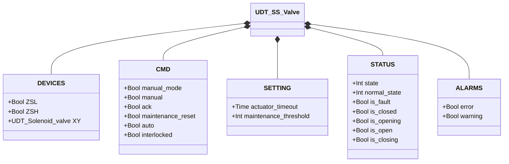
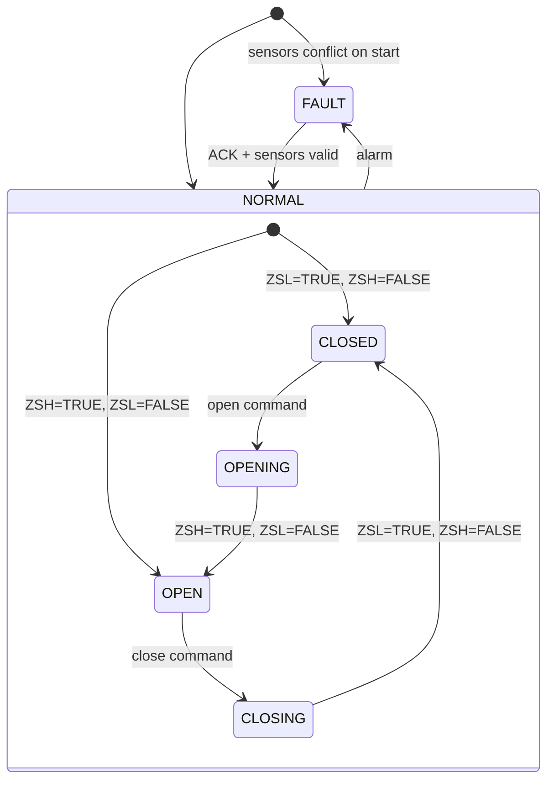

# Butterfly Valve — Single Solenoid (SS)

## Overview

The SS butterfly valve is a pneumatic rotary valve with a single solenoid. Energizing `XY` drives the actuator to open the disc; de-energizing allows the spring to close it. Two limit switches (`ZSL` closed, `ZSH` open) provide position feedback. A movement cycle counter triggers a maintenance warning when the configured threshold is reached.

---

## Main Components

- **Valve body** — flanged inlet/outlet, disc mounted on shaft
- **Pneumatic actuator** — single-acting, spring-return to closed
- **Solenoid valve `XY`** — controls air to actuator (energized = open)
- **Limit switch `ZSL`** — TRUE when disc is fully closed
- **Limit switch `ZSH`** — TRUE when disc is fully open

---

## I/O Signals

| Signal | Type | Description |
|--------|------|-------------|
| `ZSL` | Input — Bool | Limit switch: TRUE = valve fully closed |
| `ZSH` | Input — Bool | Limit switch: TRUE = valve fully open |
| `XY` | Output — Bool | Solenoid command: TRUE = energize (open valve) |

---

## Operating Routine

On an **open command**, `XY` is energized and the actuator rotates the disc toward open. The valve confirms the open position when `ZSH = TRUE` and `ZSL = FALSE`.

On a **close command**, `XY` is de-energized and the spring returns the disc to closed. The valve confirms the closed position when `ZSL = TRUE` and `ZSH = FALSE`.

In **manual mode** (`manual_mode = TRUE`), the operator commands the valve from HMI via `manual`. In **automatic mode**, the command comes from the process via `auto`. If `interlocked = TRUE`, the valve holds position.

Each completed movement (OPENING→OPEN or CLOSING→CLOSED) increments `movement_counter`. When it reaches `maintenance_threshold`, `ALARMS.warning` is raised. Reset with `maintenance_reset = TRUE`.

All errors must be acknowledged via `ack`. After acknowledgment, the FB re-reads both sensors to determine actual position.

---

## Alarms

| ID | Condition | Cause |
|----|-----------|-------|
| SS-E01 | ZSL = TRUE and ZSH = TRUE simultaneously | Sensor fault, misalignment, wiring short |
| SS-E02 | Valve in CLOSED state but ZSL = FALSE | ZSL fault, mechanical obstruction, spring fault |
| SS-E03 | Valve in OPEN state but ZSH = FALSE | ZSH fault, solenoid fault, no air supply |
| SS-E04 | Movement did not complete within `actuator_timeout` | Mechanical obstruction, solenoid fault, insufficient air |
| SS-W01 | `movement_counter` ≥ `maintenance_threshold` | Inspection interval reached — reset with `maintenance_reset` |

---

## Settings

| Parameter | Default | Description |
|-----------|---------|-------------|
| `actuator_timeout` | T#2s | Maximum time for actuator to reach target position |
| `maintenance_threshold` | 10000 | Movement count before maintenance warning |

---

## Data Structure

---

## State Machine

### State and Output Table

| State | `XY` | `ZSL` expected | `ZSH` expected | Description |
|-------|------|---------------|---------------|-------------|
| CLOSED | FALSE | TRUE | FALSE | Disc closed, flow blocked |
| OPENING | TRUE | (transitioning) | (transitioning) | Actuator rotating disc toward open |
| OPEN | TRUE | FALSE | TRUE | Disc fully open, flow permitted |
| CLOSING | FALSE | (transitioning) | (transitioning) | Spring returning disc to closed |
| FAULT | — | — | — | Outputs frozen; operator ACK required |

### State Transition Table

| Current State | Condition | Next State | Action |
|---------------|-----------|------------|--------|
| CLOSED | open command | OPENING | `XY` → TRUE; start timeout timer |
| OPENING | ZSH=TRUE, ZSL=FALSE | OPEN | Stop timeout timer; increment counter |
| OPENING | Timeout elapsed | FAULT | Raise SS-E04 |
| OPEN | close command | CLOSING | `XY` → FALSE; start timeout timer |
| CLOSING | ZSL=TRUE, ZSH=FALSE | CLOSED | Stop timeout timer; increment counter |
| CLOSING | Timeout elapsed | FAULT | Raise SS-E04 |
| CLOSED | ZSL=FALSE | FAULT | Raise SS-E02 |
| OPEN | ZSH=FALSE | FAULT | Raise SS-E03 |
| Any | ZSL=TRUE AND ZSH=TRUE | FAULT | Raise SS-E01 |
| FAULT | ACK=TRUE, sensors valid | CLOSED or OPEN | Re-read sensors; clear alarms |
