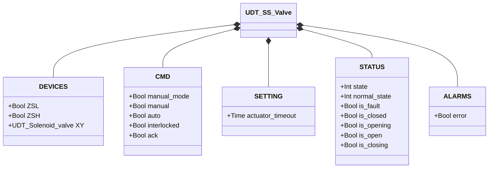
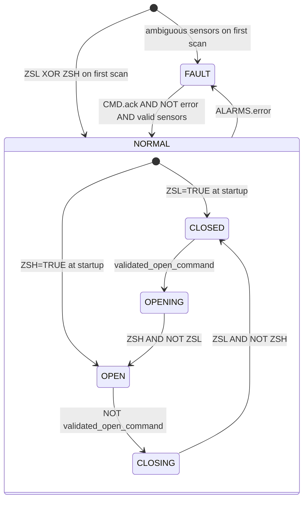

# Single-Solenoid Butterfly Valve (SS)

## Overview

`SS_valve` controls a pneumatic butterfly valve with a single solenoid. Energising `XY` drives the actuator toward the open position; de-energising it lets the return spring close the disc. Two limit switches (`ZSL` closed, `ZSH` open) provide position feedback. The state machine operates on two levels: a fault state (`FAULT`) and a normal state (`NORMAL`) with four sub-states.

On the first PLC scan, the block reads `ZSL` and `ZSH` to establish the initial state: ZSL active → NORMAL/CLOSED, ZSH active → NORMAL/OPEN, ambiguous → FAULT.

---

## Main Components

- **Pneumatic actuator** — single-acting, spring-return to closed
- **Solenoid valve `XY`** — controls air to the actuator: energised = opening or holding open
- **Limit switch `ZSL`** — TRUE = disc fully closed
- **Limit switch `ZSH`** — TRUE = disc fully open

---

## I/O Signals

| Signal | Type | Description |
|--------|------|-------------|
| `DEVICES.ZSL` | Bool | INPUT — Closed-position limit switch |
| `DEVICES.ZSH` | Bool | INPUT — Open-position limit switch |
| `DEVICES.XY` | UDT_Solenoid_valve | OUTPUT — Actuator solenoid valve |
| `CMD.manual_mode` | Bool | COMMAND — TRUE = HMI manual mode |
| `CMD.manual` | Bool | COMMAND — Open command in manual mode |
| `CMD.auto` | Bool | COMMAND — Open command from automation (ReadOnly external) |
| `CMD.interlocked` | Bool | GUARD — TRUE = freezes the validated command (ReadOnly external) |
| `CMD.ack` | Bool | COMMAND — Acknowledges alarms and clears FAULT |
| `SETTING.actuator_timeout` | Time | Actuator movement timeout (default T#2s) |
| `STATUS.state` | Int | STATE — 0=FAULT, 1=NORMAL |
| `STATUS.normal_state` | Int | SUB-STATE — 1=CLOSED, 2=OPENING, 3=OPEN, 4=CLOSING |
| `STATUS.is_fault` | Bool | STATE — Block in fault condition |
| `STATUS.is_closed` | Bool | STATE — Valve at rest in closed position |
| `STATUS.is_opening` | Bool | STATE — Actuator moving toward open |
| `STATUS.is_open` | Bool | STATE — Valve fully open |
| `STATUS.is_closing` | Bool | STATE — Spring returning disc to closed |
| `ALARMS.error` | Bool | ALARM — One or more faults active |

---

## Operating Routine

Each scan, the block resolves the desired command:
- If `manual_mode = TRUE`: `desired_open_command := CMD.manual`
- Otherwise: `desired_open_command := CMD.auto`

The command is validated only when `NOT CMD.interlocked`: while the interlock is active, `validated_open_command` holds its last value — the valve is neither forced open nor closed.

**CLOSED** — `XY` de-energised; spring holds disc closed. When `validated_open_command = TRUE`, transition to OPENING.

**OPENING** — `XY` energised; actuator pushes disc. When `ZSH = TRUE AND ZSL = FALSE`, disc has reached open position → OPEN. If the `actuator_timeout` timer expires first, `movement_timeout` is raised.

**OPEN** — `XY` remains energised to hold the disc against the spring. When `validated_open_command = FALSE`, transition to CLOSING.

**CLOSING** — `XY` de-energised; spring returns disc. When `ZSL = TRUE AND ZSH = FALSE` → CLOSED. If timer expires → `movement_timeout`.

Any fault (`ALARMS.error = TRUE`) pushes the block into FAULT. `CMD.ack` clears all internal alarms; if the fault conditions have cleared and sensors show a valid position, the block returns to NORMAL with state derived from the limit switches.

---

## Alarms

Four internal alarms are ORed into `ALARMS.error`. All clear on `CMD.ack`.

| Alarm | Condition | Typical cause |
|-------|-----------|---------------|
| `sensor_conflict` | `ZSL = TRUE AND ZSH = TRUE` | Short circuit, limit switch out of position |
| `failed_to_close` | NORMAL/CLOSED but `ZSL = FALSE` | ZSL signal lost, mechanical obstruction |
| `failed_to_open` | NORMAL/OPEN but `ZSH = FALSE` | ZSH signal lost, solenoid fault, air supply lost |
| `movement_timeout` | OPENING or CLOSING beyond `actuator_timeout` | Obstruction, insufficient air, solenoid fault |

---

## Settings

| Parameter | Default | Description |
|-----------|---------|-------------|
| `SETTING.actuator_timeout` | T#2s | Maximum time allowed for OPENING and CLOSING before `movement_timeout` is raised |

---

## Data Structure

---

## State Machine (FSM)

### State and Output Table

| State | Sub-state | `XY.CMD.auto` | Description |
|-------|-----------|---------------|-------------|
| FAULT | — | FALSE | Fault; awaits CMD.ack with valid sensors |
| NORMAL | CLOSED | FALSE | Disc closed; spring at rest |
| NORMAL | OPENING | TRUE | Actuator pushing disc toward open |
| NORMAL | OPEN | TRUE | Disc open; solenoid holding against spring |
| NORMAL | CLOSING | FALSE | Spring returning disc to closed |

### State Transition Table

| Current state | Condition | Next state |
|---------------|-----------|------------|
| NORMAL/CLOSED | `validated_open_command` | NORMAL/OPENING |
| NORMAL/OPENING | `ZSH AND NOT ZSL` | NORMAL/OPEN |
| NORMAL/OPEN | `NOT validated_open_command` | NORMAL/CLOSING |
| NORMAL/CLOSING | `ZSL AND NOT ZSH` | NORMAL/CLOSED |
| NORMAL (any) | `ALARMS.error` | FAULT |
| FAULT | `CMD.ack AND NOT error AND ZSL XOR ZSH` | NORMAL/CLOSED or NORMAL/OPEN |
